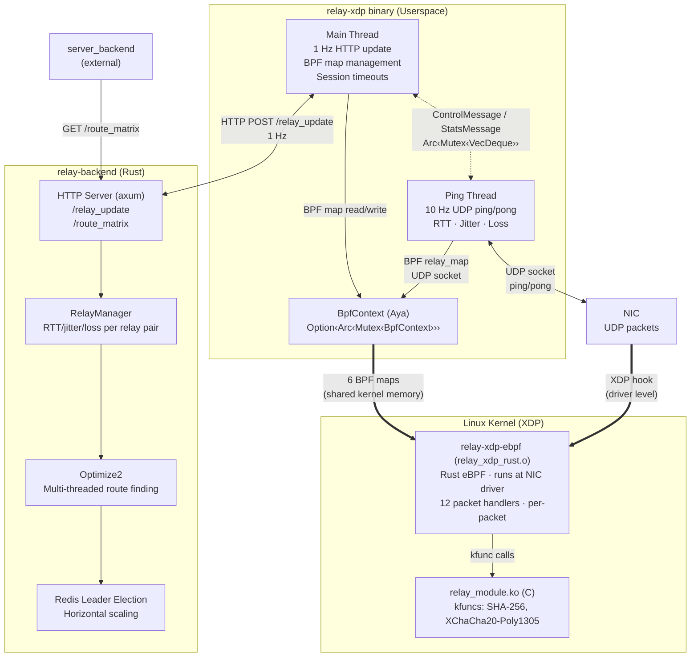
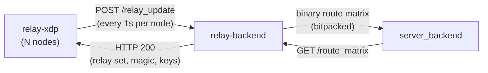

# RELAY-XDP

A high-performance UDP game relay that processes packets at the NIC driver level using Linux XDP (eXpress Data Path),
written in Rust + eBPF + C.

## Overview

`relay-xdp` routes UDP game traffic between clients, servers, and other relays with sub-microsecond per-packet latency.
The eBPF data plane runs inside the kernel at the NIC driver level, forwarding, reflecting, or dropping packets **before
** the kernel even allocates a socket buffer. A userspace control plane handles relay registration, health reporting,
and session management at 1 Hz.

This is a complete Rust + eBPF implementation. The only C code is a small kernel module that exposes SHA-256 and
XChaCha20-Poly1305 as eBPF kfuncs.

## Features

- **XDP Packet Processing**: Process, forward, and drop packets at the NIC driver level, before the kernel network stack
- **Sub-Microsecond Latency**: Full packet forward path (parse → filter → session lookup → crypto → rewrite) under 1μs
- **DDoS Filtering**: FNV-1a based pittle/chonkle filter rejects garbage packets in nanoseconds, before any map lookup
  or crypto
- **200K Concurrent Sessions**: LRU hash maps with O(1) lookup, kernel-managed eviction
- **Zero-Copy Pipeline**: Packets are never copied between kernel and userspace. eBPF operates directly on the NIC's DMA
  ring buffer
- **Per-CPU Counters**: 150 stats counters with zero locking overhead
- **In-Kernel Crypto**: SHA-256 header verification and XChaCha20-Poly1305 token decryption via kernel module kfuncs
- **Pure Rust Userspace**: No C dependencies in userspace. Crypto uses `sha2`, `crypto_box`, `x25519-dalek`, `blake2`
- **14 Packet Types**: Route request/response, client-to-server/server-to-client, session ping/pong, continue
  request/response, client/server/relay ping/pong
- **Clean Shutdown**: SIGTERM/SIGHUP trigger a 60-second graceful drain

## Architecture



Two planes, strictly separated:

| Plane                  | Language    | Runs               | Rate       | Purpose                                        |
|------------------------|-------------|--------------------|------------|------------------------------------------------|
| **Data plane**         | Rust (eBPF) | Kernel, NIC driver | Per-packet | Forward, reflect, drop packets                 |
| **Control plane**      | Rust        | Userspace          | 1-10 Hz    | HTTP health, UDP ping, session timeouts        |
| **Route optimization** | Rust        | Separate binary    | 1 Hz       | Compute optimal relay routes from latency data |

They communicate exclusively through 6 BPF maps (shared memory in the kernel).

### Relay Backend

`relay-backend` is the route computation brain for the entire relay network. It runs as a separate async binary (tokio +
axum) and:

1. **Ingests latency data** from all relay nodes via `POST /relay_update` (1 Hz per node)
2. **Builds a cost matrix** from relay-to-relay RTT, jitter, and packet loss
3. **Computes optimal routes** through the relay mesh (multi-threaded Optimize2 algorithm)
4. **Serves the route matrix** to `server_backend` via `GET /route_matrix` (bitpacked binary)



Key components:

- **RelayManager** - In-memory 2-level state tracker: per-relay-pair RTT/jitter/loss with 300-entry ring buffer history
- **Cost Matrix** - Triangular matrix (N*(N-1)/2 entries) serialized with bitpacked encoding
- **Optimize2** - Multi-threaded route finder using `std::thread::scope`, tries 5 route patterns (direct + 1-3
  intermediates), keeps top 16 routes per pair
- **Redis Leader Election** - Multiple instances run concurrently; leader writes to Redis, all instances serve
  consistent data

For detailed architecture, wire format specs, and the full relay-xdp interaction protocol,
see [relay-backend/ARCHITECTURE.md](relay-backend/ARCHITECTURE.md).

## Workspace Layout

```
relay-xdp/
├── relay-xdp-common/     Shared types (#[repr(C)], #![no_std])
├── relay-xdp/            Userspace control plane (pure Rust)
├── relay-xdp-ebpf/       eBPF data plane (bpfel-unknown-none, NOT in workspace)
├── relay-backend/        Route optimization backend (tokio + axum)
├── module/               Linux kernel module (C, GPL)
└── xtask/                Build helper
```

## Requirements

- Linux 6.5+ (BTF, kfunc support)
- x86_64
- Rust stable (userspace) + nightly (eBPF)
- Root access (XDP attachment)
- Kernel headers (for kernel module build)

## Build

```bash
# Userspace binary
cargo build --release

# eBPF data plane (requires nightly)
cargo xtask build-ebpf-rust

# Kernel module
cd module && make

# Run tests
cargo test
```

## Configuration

All configuration is via environment variables, read once at startup:

```bash
# Required
export RELAY_NAME="us-east-1"
export RELAY_PUBLIC_ADDRESS="203.0.113.1:40000"
export RELAY_PUBLIC_KEY="<base64>"
export RELAY_PRIVATE_KEY="<base64>"
export RELAY_BACKEND_PUBLIC_KEY="<base64>"
export RELAY_BACKEND_URL="https://backend.example.com"

# Optional
export RELAY_INTERNAL_ADDRESS="10.0.0.1:40000"   # Datacenter-internal address
export RELAY_GATEWAY_ETHERNET_ADDRESS="aa:bb:cc:dd:ee:ff"
export RELAY_XDP_OBJ="relay_xdp_rust.o"          # Path to eBPF object
export RELAY_NO_BPF=1                             # Run without BPF (testing)

# Run
sudo ./target/release/relay-xdp
```

## How It Works

### Packet Processing Pipeline

Every UDP packet hitting the relay port goes through this pipeline in eBPF:

```
NIC receives packet
  │
  ├─ Parse ETH/IP/UDP headers          ← reject non-UDP, wrong destination
  ├─ Size check (18–1400 bytes)        ← reject oversized/undersized
  ├─ DDoS filter (pittle/chonkle)      ← reject garbage (nanoseconds)
  ├─ Packet type dispatch              ← ping types skip whitelist
  ├─ Whitelist check                   ← reject unknown senders
  ├─ Session lookup                    ← reject unknown sessions
  ├─ Crypto verify (SHA-256 kfunc)     ← reject tampered packets
  └─ Forward / Reflect / Drop          ← actual work
```

The cheapest rejection always comes first. DDoS garbage is dropped before touching any BPF map or crypto. Most valid
packets never leave the NIC.

### XDP Actions

| Action     | Cost      | When                                                |
|------------|-----------|-----------------------------------------------------|
| `XDP_DROP` | Cheapest  | Invalid packets, DDoS, expired sessions             |
| `XDP_TX`   | Moderate  | Forward to next/prev hop, reflect ping → pong       |
| `XDP_PASS` | Expensive | Only relay pong packets (need userspace processing) |

### BPF Maps

| Map             | Type           | Key → Value                   | Writer                |
|-----------------|----------------|-------------------------------|-----------------------|
| `config_map`    | Array[1]       | u32 → RelayConfig (88B)       | Userspace (once)      |
| `state_map`     | Array[1]       | u32 → RelayState (64B)        | Userspace (1 Hz)      |
| `stats_map`     | PerCpuArray[1] | u32 → RelayStats (1200B)      | eBPF (per-packet)     |
| `relay_map`     | HashMap[2048]  | u64 → u64                     | Userspace (on change) |
| `session_map`   | LruHash[200K]  | SessionKey → SessionData      | eBPF + Userspace      |
| `whitelist_map` | LruHash[200K]  | WhitelistKey → WhitelistValue | eBPF + Userspace      |

### Crypto Stack

| Layer     | Operation                        | Library                                        |
|-----------|----------------------------------|------------------------------------------------|
| eBPF      | SHA-256 header verify            | Kernel `crypto_shash` via kfunc                |
| eBPF      | XChaCha20-Poly1305 token decrypt | Kernel `chacha20_crypt` + `poly1305` via kfunc |
| Userspace | SHA-256 ping tokens              | `sha2` (pure Rust)                             |
| Userspace | Crypto box (relay ↔ backend)     | `crypto_box` + `x25519-dalek`                  |
| Userspace | Key derivation                   | `blake2` (X25519 + BLAKE2B)                    |

## Performance

### Per-Packet Budget (eBPF Data Plane)

| Step                               | Budget    |
|------------------------------------|-----------|
| ETH/IP/UDP parse                   | < 50ns    |
| DDoS filter (pittle/chonkle)       | < 20ns    |
| Map lookup (session/whitelist)     | < 100ns   |
| Crypto verify (SHA-256 kfunc)      | < 500ns   |
| Header rewrite + checksum          | < 50ns    |
| **Total (session packet forward)** | **< 1μs** |

### Design Principles

- **Kernel bypass first**: Every packet that can be handled in eBPF stays in eBPF. `XDP_PASS` is the slow path.
- **Zero-copy pipeline**: Packets are never copied. eBPF operates directly on the NIC's DMA ring buffer.
- **Allocation-free data plane**: No heap in eBPF. Every variable lives on the 512-byte stack or in a BPF map.
- **Per-CPU counters**: 150 u64 counters with zero locking. Each CPU writes to its own copy.
- **Crypto never runs if the packet is already invalid**: Size → expiry → map lookup → crypto verify.
- **DDoS filter as first gate**: Byte-range checks reject garbage before any map lookup or crypto.

For detailed performance design principles and optimization guidelines,
see [docs/performance_design.md](docs/performance_design.md).

## Testing

```bash
# Unit tests + wire compatibility tests (struct sizes, offsets, crypto)
cargo test

# Functional parity tests (no root/BPF required)
cargo xtask func-test
```

Wire compatibility tests verify that every `#[repr(C)]` struct has identical layout across userspace and eBPF targets.
This ensures the Rust eBPF program is drop-in compatible with existing relay infrastructure.

## Documentation

- [Architecture](docs/architecture.md): system diagram, crate structure, data flows, BPF map schema, packet handlers
- [Performance Design](docs/performance_design.md): core design principles, performance budgets, optimization guidelines
- [Relay Backend Architecture](relay-backend/ARCHITECTURE.md): route optimization, wire format, encoding, relay-xdp
  interaction protocol

## Credits

Inspired by the networking libraries of [Glenn Fiedler](https://mas-bandwidth.com/):

- [netcode](https://github.com/mas-bandwidth/netcode) - Secure UDP connections
- [reliable](https://github.com/mas-bandwidth/reliable) - Reliable UDP protocol
- [yojimbo](https://github.com/mas-bandwidth/yojimbo) - Game networking library

