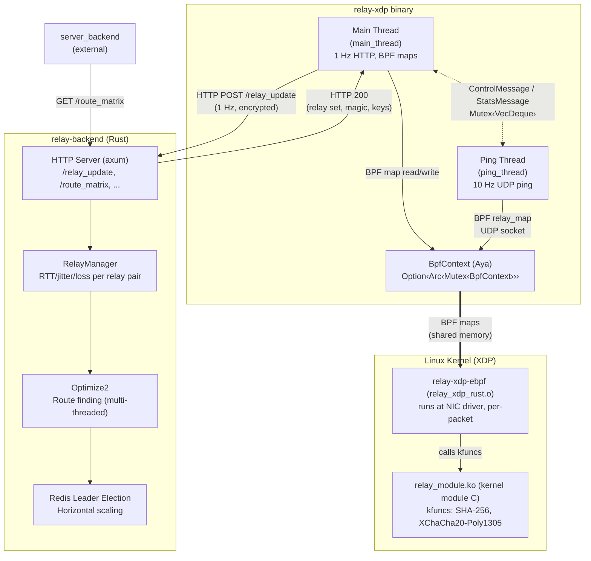
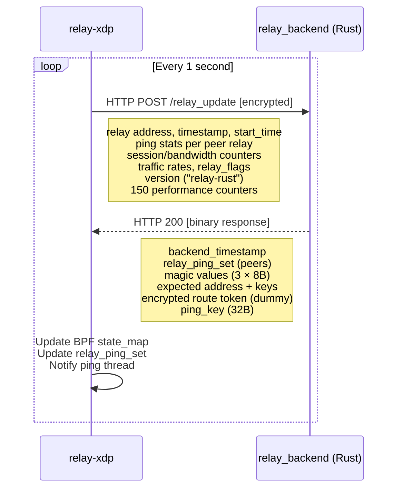
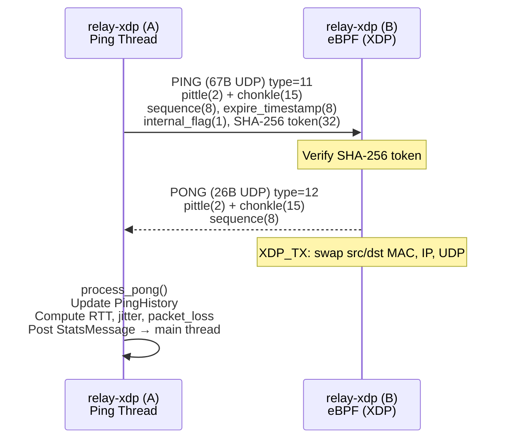
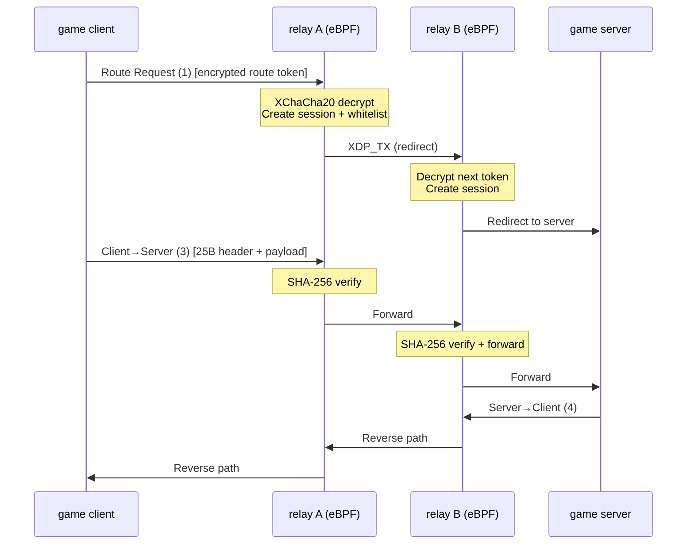
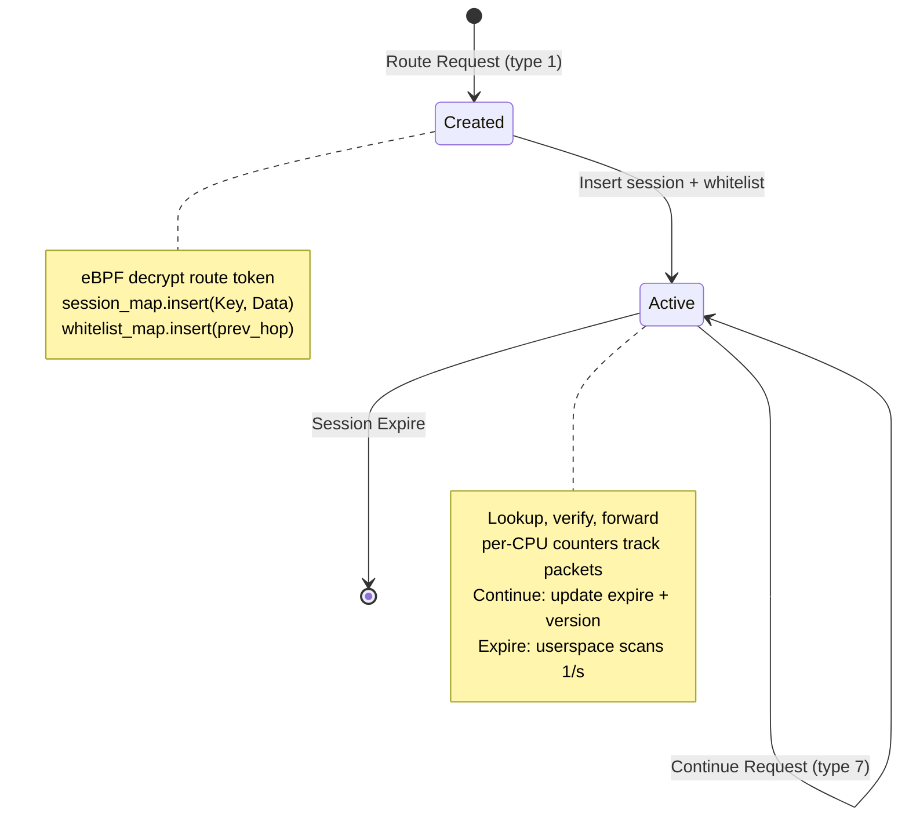
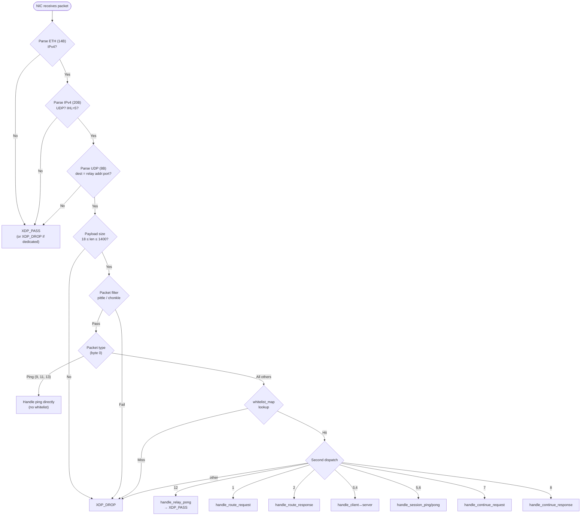
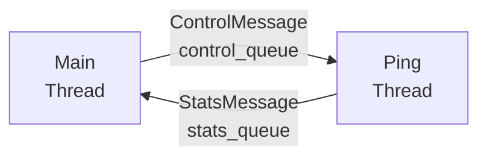
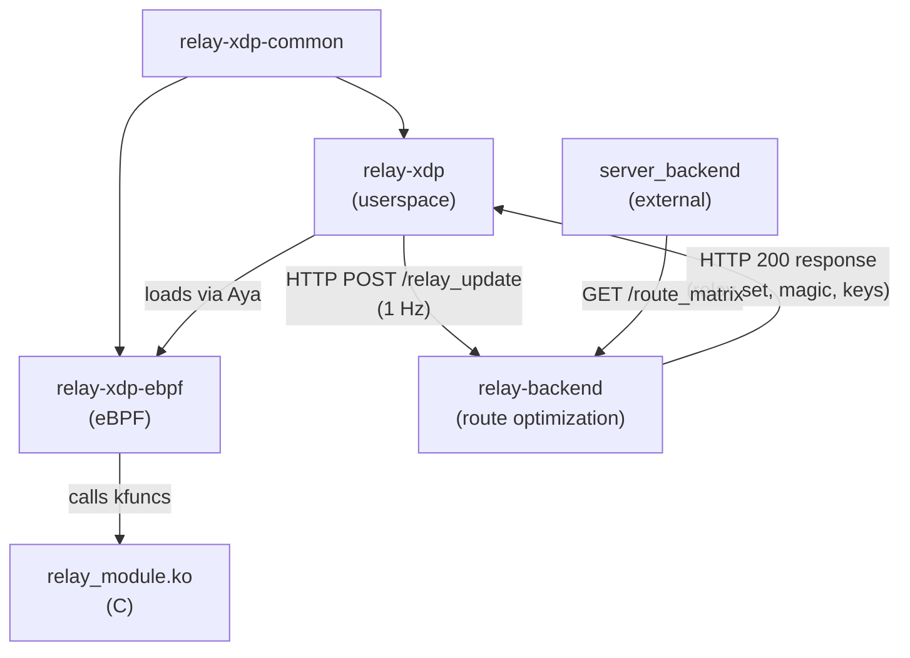

# Architecture

> **High-performance UDP game relay processing packets at the NIC driver level
> using Linux XDP (eXpress Data Path), written in Rust + eBPF.**

---

## Table of Contents

- [Overview](#overview)
- [Workspace Layout](#workspace-layout)
- [System Diagram](#system-diagram)
- [Crate Structure](#crate-structure)
    - [relay-xdp-common - Shared Types](#relay-xdp-common---shared-types)
    - [relay-xdp - Userspace Control Plane](#relay-xdp---userspace-control-plane)
    - [relay-xdp-ebpf - eBPF Data Plane](#relay-xdp-ebpf---ebpf-data-plane)
    - [relay-backend - Route Optimization Backend](#relay-backend---route-optimization-backend)
    - [module - Kernel Module (C)](#module---kernel-module-c)
    - [xtask - Build Helper](#xtask---build-helper)
- [BPF Maps](#bpf-maps)
    - [Map Overview](#map-overview)
    - [Map Lifecycle](#map-lifecycle)
    - [BPF Map Schema](#bpf-map-schema)
- [Data Flows](#data-flows)
    - [Flow 1 - Relay Registration and Health](#flow-1---relay-registration-and-health)
    - [Flow 2 - Relay-to-Relay Ping](#flow-2---relay-to-relay-ping)
    - [Flow 3 - Game Traffic Routing](#flow-3---game-traffic-routing)
    - [Flow 4 - Session Lifecycle](#flow-4---session-lifecycle)
- [Packet Processing Pipeline](#packet-processing-pipeline)
    - [XDP Entry Point](#xdp-entry-point)
    - [DDoS Filter](#ddos-filter)
    - [Packet Handlers](#packet-handlers)
    - [XDP Actions](#xdp-actions)
- [Crypto Stack](#crypto-stack)
- [Inter-Thread Communication](#inter-thread-communication)
- [Configuration](#configuration)
- [Test Coverage](#test-coverage)
- [Build and Deploy](#build-and-deploy)

---

## Overview

UDP game relay that processes packets at the NIC driver level (XDP) for
minimal latency, while running a userspace control plane for state management.
The only C code is a Linux kernel module that exposes crypto primitives to eBPF.

Two planes, strictly separated:

- **Data plane** (eBPF) - per-packet processing at the NIC, sub-microsecond
- **Control plane** (userspace) - HTTP health updates at 1 Hz, UDP ping at 10 Hz

They communicate exclusively through 6 BPF maps (shared memory in the kernel).

---

## Workspace Layout

```
relay-xdp/
|-- Cargo.toml                     Workspace root (resolver v2)
|
|-- relay-xdp-common/              Shared types (#[repr(C)], #![no_std])
|   +-- src/lib.rs                 ~384 lines
|
|-- relay-xdp/                     Userspace binary + lib (relay node)
|   |-- Cargo.toml                 Pure-Rust deps (sha2, crypto_box, x25519-dalek, blake2)
|   |-- src/
|   |   |-- lib.rs                 Re-exports for integration tests (~16 lines)
|   |   |-- main.rs                Entry point, signal handling (~111 lines)
|   |   |-- config.rs              Env vars, key derivation (~178 lines)
|   |   |-- bpf.rs                 XDP loader, 6 BPF maps via Aya (~227 lines)
|   |   |-- main_thread.rs         HTTP update loop 1 Hz (~666 lines)
|   |   |-- ping_thread.rs         UDP ping/pong 10 Hz (~279 lines)
|   |   |-- manager.rs             Relay set tracking (~180 lines)
|   |   |-- ping_history.rs        Circular buffer 64 entries (~214 lines)
|   |   |-- encoding.rs            Little-endian binary read/write (~306 lines)
|   |   |-- packet_filter.rs       Pittle/chonkle DDoS filter (~149 lines)
|   |   +-- platform.rs            Time, sleep, UDP socket (~106 lines)
|   +-- tests/
|       |-- wire_compat.rs         Struct layout + crypto tests (~319 lines)
|       |-- backend_response_integration.rs  Cross-crate response parsing (~422 lines)
|       +-- func_parity.rs         Functional parity tests (~791 lines)
|
|-- relay-backend/                 Route optimization backend
|   |-- Cargo.toml                 axum, tokio, redis, serde, uuid
|   |-- ARCHITECTURE.md            Detailed backend architecture + wire format docs
|   |-- src/
|   |   |-- lib.rs                 Re-exports for integration tests (~16 lines)
|   |   |-- main.rs                Entry point, background tasks, axum server (~334 lines)
|   |   |-- config.rs              Env vars -> Config struct (~110 lines)
|   |   |-- constants.rs           Relay protocol constants + counter name arrays (~289 lines)
|   |   |-- state.rs               AppState - shared state (~27 lines)
|   |   |-- handlers.rs            HTTP handlers (axum Router, 16 routes) (~626 lines)
|   |   |-- encoding.rs            Bitpacked + Simple LE encoding (~867 lines)
|   |   |-- relay_update.rs        Parse RelayUpdateRequest, build response (~218 lines)
|   |   |-- relay_manager.rs       In-memory relay pair state tracker (~435 lines)
|   |   |-- cost_matrix.rs         Cost matrix bitpacked serialization (~136 lines)
|   |   |-- route_matrix.rs        Route matrix bitpacked serialization (~348 lines)
|   |   |-- optimizer.rs           Optimize2 - multi-threaded route finding (~455 lines)
|   |   |-- database.rs            RelayData loaded from JSON file, validation (~555 lines)
|   |   |-- redis_client.rs        Redis leader election + data store (~230 lines)
|   |   |-- metrics.rs             Prometheus metrics rendering (~224 lines)
|   |   +-- magic.rs               Magic bytes + ping key rotation (~98 lines)
|   +-- tests/
|       |-- integration_xdp.rs     30 integration tests (~1333 lines)
|       |-- cross_crate_wire.rs    10 cross-crate wire format tests (~630 lines)
|       |-- e2e_encrypted.rs       11 end-to-end crypto tests (~627 lines)
|       |-- http_handler_integration.rs  6 HTTP handler tests (~333 lines)
|       |-- json_loader_integration.rs   6 JSON loader tests (~548 lines)
|       |-- pipeline_integration.rs      3 full pipeline tests (~433 lines)
|       +-- helpers/mod.rs         Test helpers (~548 lines)
|
|-- relay-xdp-ebpf/               eBPF kernel program (NOT a workspace member)
|   |-- Cargo.toml                 target: bpfel-unknown-none
|   |-- rust-toolchain.toml        nightly + rust-src
|   +-- src/main.rs                12 packet handlers (~1773 lines)
|
|-- module/                        Linux kernel module (C)
|   |-- relay_module.c             SHA-256 + XChaCha20-Poly1305 kfuncs (~249 lines)
|   +-- Makefile                   kbuild + auto-load
|
+-- xtask/                         Build helper
    +-- src/main.rs                build-ebpf-rust, func-test (~145 lines)
```

`relay-xdp-ebpf` targets `bpfel-unknown-none` (bare-metal BPF) and is excluded
from the workspace. It must be built separately with nightly Rust.

---

## System Diagram



---

## Crate Structure

### relay-xdp-common - Shared Types

`#![no_std]` crate compiled for both userspace (`x86_64-unknown-linux-gnu`)
and eBPF (`bpfel-unknown-none`). All structs are `#[repr(C)]` to guarantee
binary layout compatibility across userspace and eBPF targets.

| Struct                   | Size  | Repr              | BPF Map                    | Purpose                                        |
|--------------------------|-------|-------------------|----------------------------|------------------------------------------------|
| `RelayConfig`            | 88B   | `repr(C)`         | `config_map` Array[1]      | Relay address, secret key, backend public key  |
| `RelayState`             | 64B   | `repr(C)`         | `state_map` Array[1]       | Timestamp, 3 magic values, ping key            |
| `RelayStats`             | 1200B | `repr(C)`         | `stats_map` PerCpuArray[1] | 150 counters (per-CPU, summed in userspace)    |
| `SessionData`            | 104B  | `repr(C)`         | `session_map` value        | Session key, addresses, sequence numbers       |
| `SessionKey`             | 16B   | `repr(C)`         | `session_map` key          | session_id(u64) + session_version(u64)         |
| `WhitelistKey`           | 8B    | `repr(C)`         | `whitelist_map` key        | IPv4 address(u32) + port(u32), both big-endian |
| `WhitelistValue`         | 24B   | `repr(C)`         | `whitelist_map` value      | Expire timestamp, ethernet MAC pair            |
| `PingTokenData`          | 52B   | `repr(C, packed)` | -                          | SHA-256 input for ping token verify            |
| `HeaderData`             | 50B   | `repr(C, packed)` | -                          | SHA-256 input for header verify                |
| `RouteToken`             | 71B   | `repr(C, packed)` | -                          | Decrypted route token fields                   |
| `ContinueToken`          | 17B   | `repr(C, packed)` | -                          | Decrypted continue token fields                |
| `Chacha20Poly1305Crypto` | 56B   | `repr(C)`         | -                          | Nonce + key passed to kfunc                    |

The `user` feature gate enables `aya::Pod` impls for userspace BPF map access.
eBPF code uses default features (none).

14 packet types are defined as constants (1-14):
route request/response, client-to-server/server-to-client, session ping/pong,
continue request/response, client/server/relay ping/pong.

150 counter indices (`RELAY_COUNTER_*`) track every event category.

### relay-xdp - Userspace Control Plane

Pure Rust binary with no C dependencies. Crypto uses `sha2`, `crypto_box`,
`x25519-dalek`, `blake2`, `getrandom`.

| Module             | Lines | Purpose                                                                    |
|--------------------|-------|----------------------------------------------------------------------------|
| `main.rs`          | ~111  | Entry point, signal handling (SIGINT/SIGTERM/SIGHUP), thread orchestration |
| `config.rs`        | ~178  | Read environment variables, derive secret key (X25519 + BLAKE2B)           |
| `bpf.rs`           | ~227  | Load XDP program via Aya, attach to NIC, manage 6 BPF maps                 |
| `main_thread.rs`   | ~666  | 1 Hz HTTP update loop, BPF map management, session timeouts                |
| `ping_thread.rs`   | ~279  | 10 Hz UDP relay-to-relay ping/pong                                         |
| `manager.rs`       | ~180  | Relay set tracking, ping history aggregation                               |
| `ping_history.rs`  | ~214  | Circular buffer (64 entries), RTT/jitter/packet loss computation           |
| `encoding.rs`      | ~306  | Little-endian binary `Writer`/`Reader` matching C wire format              |
| `packet_filter.rs` | ~149  | Pittle/chonkle DDoS filter generation (FNV-1a)                             |
| `platform.rs`      | ~106  | Monotonic time, sleep, UDP socket creation, random bytes                   |

#### Startup flow

```
main()
  +-- platform::init()                    Initialize monotonic clock
  +-- Signal handlers                     SIGINT -> quit, SIGTERM/SIGHUP -> clean_shutdown
  +-- config::read_config()               Env vars -> Config struct
  +-- BpfContext::init() or None          RELAY_NO_BPF=1 for testing
  +-- spawn PingThread                    Separate thread for UDP ping
  +-- MainThread::run()                   Blocks until quit signal
       +-- ping_handle.join()             Wait for ping thread
```

#### BPF loader (bpf.rs)

```
BpfContext::init(xdp_obj_path, relay_address, internal_address)
  +-- Check root (geteuid)
  +-- Find NIC matching relay address (getifaddrs)
  +-- Cleanup existing XDP (xdp-loader unload)
  +-- Cleanup BPF pins (/sys/fs/bpf/*)
  +-- Ebpf::load_file(relay_xdp_rust.o)
  +-- Xdp::attach(native mode)
  |   +-- fallback to SKB mode
  +-- Return BpfContext { bpf, interface_index }
```

### relay-xdp-ebpf - eBPF Data Plane

~1773 lines of Rust targeting `bpfel-unknown-none`. Runs at NIC driver level
via the XDP hook. Built separately with nightly Rust.

Constraints:

- `#![no_std]` `#![no_main]`
- No heap allocation, stack limit 512 bytes
- No external crates beyond `aya-ebpf` and `relay-xdp-common`
- All functions `#[inline(always)]`
- All loops bounded (BPF verifier must prove termination)
- Crypto via kfuncs from `relay_module.ko`

Key helpers:

- `read_u64_le()` - byte-by-byte little-endian decode from raw pointer
- `bytes_equal()` - bounded loop comparison
- `copy_bytes()` - bounded loop memcpy
- `ip_checksum()` - unrolled IPv4 header checksum
- `compute_pittle()` / `compute_chonkle()` - FNV-1a DDoS filter
- `relay_reflect_packet()` - swap ETH/IP/UDP headers for ping-to-pong
- `relay_redirect_packet()` - rewrite headers for hop forwarding
- `decrypt_route_token()` / `decrypt_continue_token()` - kfunc wrappers
- `verify_ping_token()` / `verify_session_header()` - SHA-256 kfunc wrappers
- `increment_counter()` / `add_counter()` - per-CPU stats updates

### relay-backend - Route Optimization Backend

Route optimization backend. Receives latency data from all
relay nodes, builds cost matrices, computes optimal routes, and serves results
to `server_backend`. Runs as a separate async binary (tokio + axum).

> **Detailed architecture**: see [`relay-backend/ARCHITECTURE.md`](../relay-backend/ARCHITECTURE.md)
> for wire format specs, encoding details, and full interaction protocol with relay-xdp.

| Module             | Lines | Purpose                                                                     |
|--------------------|-------|-----------------------------------------------------------------------------|
| `main.rs`          | ~334  | Entry point, 4 background tasks (tokio), axum web server                    |
| `config.rs`        | ~110  | Environment variables → Config struct                                       |
| `constants.rs`     | ~289  | Relay protocol constants, counter name arrays for Prometheus/HTML           |
| `state.rs`         | ~27   | AppState - shared state between handlers + background tasks                 |
| `handlers.rs`      | ~626  | HTTP handlers (16 routes: relay_update, route_matrix, costs, metrics, etc.) |
| `encoding.rs`      | ~867  | Bitpacked (WriteStream/ReadStream) + Simple LE (SimpleWriter/SimpleReader)  |
| `relay_update.rs`  | ~218  | Parse RelayUpdateRequest, build RelayUpdateResponse, FNV-1a relay ID        |
| `relay_manager.rs` | ~435  | In-memory 2-level state: SourceEntry → DestEntry (RTT/jitter/loss per pair) |
| `cost_matrix.rs`   | ~136  | Triangular cost matrix bitpacked serialization (version 2)                  |
| `route_matrix.rs`  | ~348  | Route matrix bitpacked serialization (version 4) + analysis                 |
| `optimizer.rs`     | ~455  | Optimize2 - multi-threaded route finding via `std::thread::scope`           |
| `database.rs`      | ~555  | RelayData loaded from JSON file, validation, public keys, internal addrs    |
| `redis_client.rs`  | ~230  | Redis leader election + data store/load for horizontal scaling              |
| `metrics.rs`       | ~224  | Prometheus metrics rendering (per-relay counters + backend internals)       |
| `magic.rs`         | ~98   | Magic bytes + ping key rotation (3-value window, 10s interval)              |

Key design decisions:

- **Parallelism**: Optimizer uses `std::thread::scope` with manual segment slicing
  (not rayon) for Phase 1 (indirect matrix) and Phase 2 (route building).
- **Encoding**: Two separate systems - Simple LE for relay update packets (relay-xdp
  ↔ relay-backend), Bitpacked for cost/route matrices (relay-backend → server_backend).
- **Leader election**: Multiple instances can run simultaneously; leader writes to
  Redis, all instances read from leader's data to serve consistent route matrices.

### module - Kernel Module (C)

249 lines of GPL-licensed C. The only non-Rust code in the project. Provides
two `__bpf_kfunc` functions registered via `BTF_SET8`:

```c
// SHA-256 hash (kernel crypto_shash API)
__bpf_kfunc int bpf_relay_sha256(
    void *data, int data__sz, void *output, int output__sz);

// XChaCha20-Poly1305 authenticated decryption (kernel chacha20 + poly1305)
__bpf_kfunc int bpf_relay_xchacha20poly1305_decrypt(
    void *data, int data__sz, struct chacha20poly1305_crypto *crypto);
```

Internals:

- `sha256_hash()` - wraps `crypto_shash_digest` with a pre-allocated `crypto_shash`
- `xchacha20poly1305_decrypt()` - manual XChaCha20 init + Poly1305 verify + decrypt
- `relay_init()` - allocates SHA-256 tfm, runs self-test, registers kfuncs
- `relay_exit()` - frees SHA-256 tfm

Requires: Linux kernel 6.5+, loaded modules `chacha20` and `poly1305`.

### xtask - Build Helper

145 lines. Three commands:

| Command                       | Action                                                                                          |
|-------------------------------|-------------------------------------------------------------------------------------------------|
| `cargo xtask build-ebpf`      | Build eBPF from C source (legacy)                                                               |
| `cargo xtask build-ebpf-rust` | Build Rust eBPF: `cargo +nightly build --target bpfel-unknown-none -Z build-std=core --release` |
| `cargo xtask func-test`       | Run functional parity tests: `cargo test --test func_parity -- --ignored --test-threads=1`      |

---

## BPF Maps

### Map Overview

| Map             | Type        | Max Entries | Key               | Value                | Writer                | Reader               |
|-----------------|-------------|-------------|-------------------|----------------------|-----------------------|----------------------|
| `config_map`    | Array       | 1           | u32               | RelayConfig (88B)    | Userspace (once)      | eBPF                 |
| `state_map`     | Array       | 1           | u32               | RelayState (64B)     | Userspace (1 Hz)      | eBPF                 |
| `stats_map`     | PerCpuArray | 1           | u32               | RelayStats (1200B)   | eBPF (per-packet)     | Userspace (1 Hz)     |
| `relay_map`     | LruHashMap  | 2048        | u64               | u64                  | Userspace (on change) | eBPF (ping/pong)     |
| `session_map`   | LruHashMap  | 200,000     | SessionKey (16B)  | SessionData (104B)   | eBPF (create)         | Both (lookup/expire) |
| `whitelist_map` | LruHashMap  | 200,000     | WhitelistKey (8B) | WhitelistValue (24B) | eBPF (create)         | Both (lookup/expire) |

### Map Lifecycle

```
Startup:
  config_map  <-- MainThread::new() writes RelayConfig once

Every 1 second (userspace):
  state_map      <-- MainThread::update() writes RelayState
  stats_map      --> MainThread::update() reads PerCpuArray, sums across CPUs
  session_map    <-- MainThread::update_timeouts() deletes expired entries
  whitelist_map  <-- MainThread::update_timeouts() deletes expired entries

On relay set change (userspace):
  relay_map  <-- PingThread adds/removes relay entries via ControlMessage

Every packet (eBPF):
  config_map     --> Read relay config
  state_map      --> Read current magic, timestamp, ping_key
  stats_map      <-- Increment per-CPU counters
  session_map    --> Lookup/insert sessions
  relay_map      --> Check if sender is known relay
  whitelist_map  --> Check if sender is whitelisted
```

### BPF Map Schema

All structs live in `relay-xdp-common/src/lib.rs`. Sizes include alignment
padding - the `wire_compat` tests assert exact byte counts.

#### `config_map` - `RelayConfig` (88 bytes, `#[repr(C)]`)

| Offset | Field                          | Type       | Byte order     |
|--------|--------------------------------|------------|----------------|
| 0      | `dedicated`                    | `u32`      | native         |
| 4      | `relay_public_address`         | `u32`      | **big-endian** |
| 8      | `relay_internal_address`       | `u32`      | **big-endian** |
| 12     | `relay_port`                   | `u16`      | **big-endian** |
| 14     | `relay_secret_key`             | `[u8; 32]` | -              |
| 46     | `relay_backend_public_key`     | `[u8; 32]` | -              |
| 78     | `gateway_ethernet_address`     | `[u8; 6]`  | -              |
| 84     | `use_gateway_ethernet_address` | `u8`       | -              |

#### `state_map` - `RelayState` (64 bytes, `#[repr(C)]`)

| Offset | Field               | Type       | Notes                     |
|--------|---------------------|------------|---------------------------|
| 0      | `current_timestamp` | `u64`      | from backend              |
| 8      | `current_magic`     | `[u8; 8]`  | pittle/chonkle generation |
| 16     | `previous_magic`    | `[u8; 8]`  | -                         |
| 24     | `next_magic`        | `[u8; 8]`  | -                         |
| 32     | `ping_key`          | `[u8; 32]` | SHA-256 ping token key    |

#### `stats_map` - `RelayStats` (1200 bytes, `#[repr(C)]`)

Single field: `counters: [u64; 150]`. Per-CPU array - userspace sums across
CPUs. Counter indices are `RELAY_COUNTER_*` constants (0–149).

#### `session_map` - `SessionKey` (16B) → `SessionData` (104B)

**Key** (`#[repr(C)]`):

| Field             | Type  | Notes                                             |
|-------------------|-------|---------------------------------------------------|
| `session_id`      | `u64` | -                                                 |
| `session_version` | `u64` | must be `u64` not `u8` (alignment, per C comment) |

**Value** (`#[repr(C)]`, 104 bytes):

| Offset | Field                               | Type       | Byte order     |
|--------|-------------------------------------|------------|----------------|
| 0      | `session_private_key`               | `[u8; 32]` | -              |
| 32     | `expire_timestamp`                  | `u64`      | native         |
| 40     | `session_id`                        | `u64`      | native         |
| 48     | `payload_client_to_server_sequence` | `u64`      | native         |
| 56     | `payload_server_to_client_sequence` | `u64`      | native         |
| 64     | `special_client_to_server_sequence` | `u64`      | native         |
| 72     | `special_server_to_client_sequence` | `u64`      | native         |
| 80     | `envelope_kbps_up`                  | `u32`      | native         |
| 84     | `envelope_kbps_down`                | `u32`      | native         |
| 88     | `next_address`                      | `u32`      | **big-endian** |
| 92     | `prev_address`                      | `u32`      | **big-endian** |
| 96     | `next_port`                         | `u16`      | **big-endian** |
| 98     | `prev_port`                         | `u16`      | **big-endian** |
| 100    | `session_version`                   | `u8`       | -              |
| 101    | `next_internal`                     | `u8`       | -              |
| 102    | `prev_internal`                     | `u8`       | -              |
| 103    | `first_hop`                         | `u8`       | -              |

#### `relay_map` - `u64` → `u64`

Key and value are both opaque `u64` relay identifiers. Used to check whether a
sender is a known peer relay (for pong handling).

#### `whitelist_map` - `WhitelistKey` (8B) → `WhitelistValue` (24B)

**Key** (`#[repr(C)]`):

| Field     | Type  | Byte order     | Notes                                              |
|-----------|-------|----------------|----------------------------------------------------|
| `address` | `u32` | **big-endian** | IPv4 address                                       |
| `port`    | `u32` | **big-endian** | must be `u32` not `u16` (alignment, per C comment) |

**Value** (`#[repr(C)]`, 24 bytes including padding):

| Offset | Field              | Type      | Notes        |
|--------|--------------------|-----------|--------------|
| 0      | `expire_timestamp` | `u64`     | native       |
| 8      | `source_address`   | `[u8; 6]` | ethernet MAC |
| 14     | `dest_address`     | `[u8; 6]` | ethernet MAC |

#### Packed crypto/wire structs (not map values, but shared between planes)

| Struct                   | Size | Repr              | Used for                            |
|--------------------------|------|-------------------|-------------------------------------|
| `PingTokenData`          | 52B  | `repr(C, packed)` | SHA-256 input for ping token verify |
| `HeaderData`             | 50B  | `repr(C, packed)` | SHA-256 input for header verify     |
| `RouteToken`             | 71B  | `repr(C, packed)` | Decrypted route token fields        |
| `ContinueToken`          | 17B  | `repr(C, packed)` | Decrypted continue token fields     |
| `Chacha20Poly1305Crypto` | 56B  | `repr(C)`         | Nonce + key passed to kfunc         |

---

## Data Flows

### Flow 1 - Relay Registration and Health



Update payload is encrypted with NaCl crypto_box (SalsaBox: X25519 + XSalsa20-Poly1305).
Format: MAC(16) + ciphertext + nonce(24).

**Clean shutdown** (SIGTERM/SIGHUP): continues updating for 60 seconds with
`relay_flags=1` so the backend knows the relay is shutting down, then sleeps
30 more seconds for safety.

### Flow 2 - Relay-to-Relay Ping



### Flow 3 - Game Traffic Routing



All routing happens in eBPF. Packets go directly from NIC in -> XDP program ->
header rewrite -> NIC out. No kernel network stack, no userspace involvement.

### Flow 4 - Session Lifecycle



---

## Packet Processing Pipeline

### XDP Entry Point

The main entry point is `relay_xdp_filter`, attached to the NIC via XDP.
Every incoming packet passes through this function.



### DDoS Filter

Every inbound packet must pass the basic packet filter before type dispatch.
The filter uses only byte-range checks on the first 18 payload bytes:

- **Pittle** (2 bytes at offset 1-2): checksum of source/dest IP + packet length.
  Byte 2 must satisfy `1 | ((255 - byte1) ^ 113)`.
- **Chonkle** (15 bytes at offset 3-17): FNV-1a hash of magic value + addresses +
  packet length. Each byte must fall in a specific range.

The filter is implemented in both eBPF (kernel, inline byte-range checks) and
userspace (`packet_filter.rs`, used by ping thread to generate valid packets).
Both implementations must produce identical output.

### Packet Handlers

| Handler                    | Type | Action                                          | Crypto                   | XDP Result |
|----------------------------|------|-------------------------------------------------|--------------------------|------------|
| `handle_relay_ping`        | 11   | Verify SHA-256 token, reflect as pong (12)      | SHA-256 kfunc            | XDP_TX     |
| `handle_relay_pong`        | 12   | Pass to userspace ping thread                   | none                     | XDP_PASS   |
| `handle_client_ping`       | 9    | Verify SHA-256 token, reflect as pong (10)      | SHA-256 kfunc            | XDP_TX     |
| `handle_server_ping`       | 13   | Verify SHA-256 token, reflect as pong (14)      | SHA-256 kfunc            | XDP_TX     |
| `handle_route_request`     | 1    | Decrypt route token, create session, forward    | XChaCha20-Poly1305 kfunc | XDP_TX     |
| `handle_route_response`    | 2    | Lookup session, verify header, forward to prev  | SHA-256 kfunc            | XDP_TX     |
| `handle_client_to_server`  | 3    | Lookup session, verify header, forward to next  | SHA-256 kfunc            | XDP_TX     |
| `handle_server_to_client`  | 4    | Lookup session, verify header, forward to prev  | SHA-256 kfunc            | XDP_TX     |
| `handle_continue_request`  | 7    | Decrypt continue token, update session, forward | XChaCha20-Poly1305 kfunc | XDP_TX     |
| `handle_continue_response` | 8    | Lookup session, verify header, forward to prev  | SHA-256 kfunc            | XDP_TX     |
| `handle_session_ping`      | 5    | Lookup session, verify header, forward to next  | SHA-256 kfunc            | XDP_TX     |
| `handle_session_pong`      | 6    | Lookup session, verify header, forward to prev  | SHA-256 kfunc            | XDP_TX     |

Every handler follows the same pattern:

1. Increment received counter
2. Validate packet size
3. Check expiry / sequence
4. Map lookup (session or relay)
5. Crypto verify (SHA-256 or XChaCha20-Poly1305)
6. Rewrite headers (reflect or redirect)
7. Increment sent counters
8. Return XDP action

### XDP Actions

| Action     | When                                               | Cost                            |
|------------|----------------------------------------------------|---------------------------------|
| `XDP_PASS` | Pong to userspace, non-UDP, non-relay traffic      | Expensive (enters kernel stack) |
| `XDP_DROP` | DDoS filter fail, expired sessions, invalid crypto | Cheapest (packet freed at NIC)  |
| `XDP_TX`   | Ping-to-pong reflection, packet forwarding         | Cheap (out same NIC)            |

---

## Crypto Stack

| Operation             | Where            | Implementation                              | C Equivalent                              |
|-----------------------|------------------|---------------------------------------------|-------------------------------------------|
| Key exchange          | `config.rs`      | `x25519-dalek` + `blake2`                   | libsodium `crypto_kx_client_session_keys` |
| Update encryption     | `main_thread.rs` | `crypto_box` (SalsaBox)                     | libsodium `crypto_box_easy`               |
| Ping token generation | `ping_thread.rs` | `sha2` (SHA-256)                            | libsodium `crypto_hash_sha256`            |
| Random bytes          | `platform.rs`    | `getrandom`                                 | libsodium `randombytes_buf`               |
| Header verify (eBPF)  | `relay-xdp-ebpf` | `bpf_relay_sha256` kfunc                    | kernel `crypto_shash` SHA-256             |
| Token decrypt (eBPF)  | `relay-xdp-ebpf` | `bpf_relay_xchacha20poly1305_decrypt` kfunc | kernel `chacha20_crypt` + `poly1305`      |

Key derivation (pure Rust, compatible with libsodium `crypto_kx`):

```
secret_key = BLAKE2B-512(X25519(relay_sk, backend_pk) || relay_pk || backend_pk)[0..32]
```

Userspace is 100% pure Rust. eBPF crypto uses the kernel crypto API via kfuncs
because eBPF cannot link external libraries.

---

## Inter-Thread Communication

Two threads communicate via `Arc<Mutex<VecDeque<T>>>` queues (no channels):



**ControlMessage** (main -> ping):

| Field               | Type     | Purpose                       |
|---------------------|----------|-------------------------------|
| `current_timestamp` | u64      | Backend timestamp             |
| `current_magic`     | [u8; 8]  | For pittle/chonkle generation |
| `ping_key`          | [u8; 32] | For SHA-256 ping token        |
| `new_relays`        | RelaySet | Relays to start pinging       |
| `delete_relays`     | RelaySet | Relays to stop pinging        |

**StatsMessage** (ping -> main):

| Field        | Type      | Purpose                            |
|--------------|-----------|------------------------------------|
| `pings_sent` | u64       | Total pings sent                   |
| `bytes_sent` | u64       | Total bytes sent                   |
| `ping_stats` | PingStats | Per-relay RTT, jitter, packet loss |

---

## Configuration

All configuration via environment variables (read once at startup):

| Env Var                          | Type       | Required | Purpose                                        |
|----------------------------------|------------|----------|------------------------------------------------|
| `RELAY_NAME`                     | string     | yes      | Relay identifier (e.g. `akamai.tokyo.1`)       |
| `RELAY_PUBLIC_ADDRESS`           | `ip:port`  | yes      | Public address (e.g. `1.2.3.4:40000`)          |
| `RELAY_INTERNAL_ADDRESS`         | `ip:port`  | no       | Internal address (default = public)            |
| `RELAY_PUBLIC_KEY`               | base64     | yes      | X25519 public key (32 bytes)                   |
| `RELAY_PRIVATE_KEY`              | base64     | yes      | X25519 private key (32 bytes)                  |
| `RELAY_BACKEND_PUBLIC_KEY`       | base64     | yes      | Backend public key (32 bytes)                  |
| `RELAY_BACKEND_URL`              | URL        | yes      | HTTP endpoint (e.g. `http://10.0.0.5:30000`)   |
| `RELAY_GATEWAY_ETHERNET_ADDRESS` | MAC        | no       | Gateway MAC for XDP redirect                   |
| `RELAY_XDP_OBJ`                  | path       | no       | eBPF object file (default: `relay_xdp_rust.o`) |
| `RELAY_NO_BPF`                   | `1`/`true` | no       | Run without BPF (for testing)                  |
| `RELAY_DEDICATED`                | `1`/`true` | no       | Dedicated mode: XDP_DROP non-relay traffic     |

---

## Test Coverage

### relay-xdp tests

59 tests total (44 run with `cargo test`, 15 functional tests require `--ignored`):

| Test File                          | Count | Type        | What It Covers                                                        |
|------------------------------------|-------|-------------|-----------------------------------------------------------------------|
| `encoding` (unit)                  | 11    | Unit        | LE encoding roundtrip, string, address format, bounds checks          |
| `packet_filter` (unit)             | 2     | Unit        | Pittle symmetry, chonkle byte ranges                                  |
| `ping_history` (unit)              | 6     | Unit        | RTT/jitter/loss, circular buffer, wraparound                          |
| `wire_compat.rs`                   | 20    | Integration | Struct sizes, field offsets, SHA-256, crypto_box, crypto_kx           |
| `backend_response_integration.rs`  | 5     | Integration | Cross-crate response parsing, relay set deltas, internal address      |
| `func_parity.rs`                   | 15    | Integration | Config errors, update protocol, mock backend, crypto roundtrip        |

### relay-backend tests

88 tests total (22 unit + 66 integration):

| Test File                      | Count | Type        | What It Covers                                                     |
|--------------------------------|-------|-------------|--------------------------------------------------------------------|
| `encoding` (unit)              | 3     | Unit        | bits_required, tri_matrix, WriteStream/ReadStream roundtrip        |
| `database` (unit)              | 16    | Unit        | JSON loading, validation, sort order, public keys, internal addrs  |
| `metrics` (unit)               | 3     | Unit        | Counter name arrays, label escaping                                |
| `integration_xdp.rs`           | 30    | Integration | Wire format, optimizer, relay manager, cost/route matrix           |
| `cross_crate_wire.rs`          | 10    | Integration | relay-xdp Writer <-> relay-backend SimpleReader wire compatibility |
| `e2e_encrypted.rs`             | 11    | Integration | NaCl crypto_box encrypt/decrypt, tampered payloads, wrong keys     |
| `http_handler_integration.rs`  | 6     | Integration | HTTP handler validation, error responses, relay manager updates    |
| `json_loader_integration.rs`   | 6     | Integration | JSON relay data -> encrypted request -> response pipeline          |
| `pipeline_integration.rs`      | 3     | Integration | Multi-relay update -> cost matrix -> optimizer pipeline             |

The 30 integration tests in `integration_xdp.rs` are organized in 18 test groups
covering: FNV-1a compatibility, relay update request/response wire format, cost
matrix roundtrip, route matrix roundtrip, relay manager (costs, timeout, history,
jitter/loss filtering), optimizer (direct, indirect, stress), tri matrix helpers,
CSV generation, bitpacked encoding, end-to-end pipeline, route hash determinism,
SimpleWriter address encoding, and max samples stress test.

```bash
# Unit + wire compatibility (no root required)
cargo test

# Functional parity (no root, uses RELAY_NO_BPF=1)
cargo xtask func-test
# or:
cargo test --test func_parity -- --ignored --test-threads=1

# relay-backend tests only
cargo test -p relay-backend
```

---

## Build and Deploy

```bash
# Build userspace binaries (pure Rust, no C deps)
cargo build --release                # builds relay-xdp + relay-backend

# Build eBPF kernel program (requires nightly)
cargo xtask build-ebpf-rust

# Build kernel module (requires kernel headers + root)
cd module && make

# Run all tests
cargo test                           # relay-xdp + relay-backend unit + integration
cargo test -p relay-backend          # relay-backend only
cargo xtask func-test                # functional parity (RELAY_NO_BPF=1)

# Deploy relay node (requires root + kernel module loaded)
sudo insmod module/relay_module.ko
sudo ./target/release/relay-xdp

# Deploy relay backend (no root required)
./target/release/relay-backend
```

Requirements: Linux kernel 6.5+, Ubuntu 22.04+, `relay_module.ko` loaded
(for relay-xdp only; relay-backend has no kernel requirements).

Dependency chain for changes:



Any change to shared types or kfunc signatures requires rebuilding across
all affected layers.

