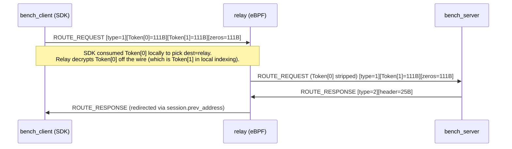

# ADR-006: Split RouteToken into Client View and Wire View for Bench Tooling

**Date:** 2026-05-10<br>
**Status:** Accepted<br>
**Deciders:** developer<br>
**Related Tasks:** `relay-bench`, `/bench_token` endpoint, bench_client route setup<br>
**Related ADRs:** N/A<br>
**Related Sessions:** [Session 2026-05-10](../sessions/2026-05-10-bench-relay-end-to-end.md)<br>

## Context

The relay protocol uses an array of encrypted RouteTokens to describe a multi-hop
path. Each hop decrypts Token[0], extracts routing fields, strips it, and forwards
the remainder. Two fields drive routing at each hop:

- `next_address / next_port` - where to forward the packet
- `prev_address / prev_port` - where to send ROUTE_RESPONSE back

The relay-sdk assembles this token array on the client side and sends it as part
of `route_update`. Token[0] is consumed locally by the SDK (never placed on the
wire) to determine the first-hop send target. Token[1] is what the first relay
actually receives and decrypts off the wire.



For bench tooling (`relay-bench`), the bench_client must produce a valid token
array for the path: `bench_client -> relay -> bench_server`. This requires:

1. Token[0] (`next = relay`) - SDK reads locally to know where to send packets.
2. Token[1] (`next = bench_server`, `prev = client_public_ip`) - relay reads on
   the wire to know where to forward and who to redirect ROUTE_RESPONSE to.

These two tokens MUST have different `next_address` values. A single shared token
cannot satisfy both roles simultaneously.

bench_client does not have access to the per-relay symmetric key needed to encrypt
RouteTokens (key is derived from `X25519(backend_sk, relay_pk)` + BLAKE2b). Only
the backend holds `backend_sk`; only the relay holds `relay_sk`. Neither secret is
available in bench_client.

## Options Considered

### Option A: Client derives per-relay key from a pre-shared bench secret

- **Description:** Export a "bench-only" symmetric key from the backend to the
  client (e.g. a pre-shared key per relay), bench_client encrypts both tokens
  locally.
- **Pros:** No round-trip to backend for the token pair; client is self-contained.
- **Cons:** Requires a new key distribution mechanism. The relay would need to
  accept tokens encrypted with this alternate key (two code paths in eBPF). Does
  not reflect production token format. | **Effort:** Impl: High / Migration: High
  / Maintenance: High

### Option B: Backend builds and encrypts both tokens, returns them via `/bench_token`

- **Description:** Add `?relay_addr` + `?bench_server_addr` to `/bench_token`.
  Backend derives the per-relay key (X25519 + BLAKE2b), builds two RouteToken
  structs with different `next_address` values, encrypts both with XChaCha20-Poly1305,
  and returns them as `client_route_token` (hex, 111B) and `wire_route_token`
  (hex, 111B). Also returns `relay_secret_key` (hex, 32B) so bench_client can
  pass it to `open_session`.
- **Pros:** Matches production token format exactly (same crypto, same struct).
  No new key distribution mechanism. relay-sdk and eBPF require zero changes.
  Security boundary preserved: relay_sk and backend_sk stay in their respective
  processes. | **Effort:** Impl: Medium / Migration: Low / Maintenance: Low
- **Cons:** bench_client must call `/bench_token` with both relay and server addr.
  Token pair becomes stale after `expire_timestamp` (300s); needs periodic refresh.

### Option C: Do nothing - bench_client sends packets directly, bypassing relay

- **Description:** Keep bench mode as direct-only (no relay in path).
- **Pros:** No token complexity.
- **Cons:** Cannot validate relay throughput, latency, or the eBPF data plane
  under load. Bench tooling loses its primary purpose. | **Effort:** Impl: None /
  Migration: None / Maintenance: None

## Decision

**Chosen: Option B - Backend builds and encrypts both tokens**

The backend derives the per-relay symmetric key and returns two pre-encrypted
111-byte RouteTokens:

- `client_route_token` (Token[0]):
  - `next_address = relay IP:port`, `prev_address = 0`
  - bench_client places at position 0 in the token array passed to `route_update`
  - relay-sdk consumes locally; never sent on the wire

- `wire_route_token` (Token[1]):
  - `next_address = bench_server IP:port`
  - `prev_address = client_public_ipv4` (post-NAT address of bench_client)
  - `prev_port = 0` (eBPF substitutes `udp.source` automatically when zero)
  - bench_client places at position 1 in the token array
  - this is the token the relay decrypts off the wire

Key derivation (both backend and relay independently arrive at the same value):

```
q   = X25519(backend_sk, relay_pk)   // computed by backend
q   = X25519(relay_sk,   backend_pk) // computed by relay (X25519 symmetry: same q)
key = BLAKE2b-512(q || relay_pk || backend_pk)[..32]
```

bench_client calls `relay_sdk::client::open_session(relay_secret_key)` once at
startup. The SDK uses this key to decrypt Token[0] locally and determine the
first-hop send address. Token[0] is never sent on the wire.

Token array layout sent by relay-sdk on `route_update`:

```
[Token[0] = client_route_token = 111B][Token[1] = wire_route_token = 111B][Token[2] = zeros = 111B]
```

Relay eBPF (`handle_route_request`) decrypts the first 111B off the wire (which
the SDK already stripped Token[0] from locally, so the relay sees what bench_client
calls Token[1] as its Token[0]). This is the `wire_route_token`.

## Rationale

- Option A breaks the key isolation model: the per-relay key would need to be
  knowable outside the relay process, defeating per-relay key separation.
- Option C makes the bench harness useless for validating the relay data plane.
- Option B reuses the exact same crypto path the relay uses in production. eBPF
  `handle_route_request` decrypts the token with the same derived key, reads
  `next_address` and `prev_address`, inserts the session, and forwards. No changes
  to eBPF or relay-sdk are required.

Critical field invariants enforced by this design:

| Field | Token[0] (client) | Token[1] (wire) | Why |
|---|---|---|---|
| `next_address` | relay IP | bench_server IP | SDK uses [0] for first send; relay uses [1] to forward |
| `prev_address` | 0 | client public IPv4 | eBPF copies verbatim into `session.prev_address` for ROUTE_RESPONSE redirect; if 0, relay drops with `REDIRECT_NOT_IN_WHITELIST` |
| `prev_port` | 0 | 0 | eBPF treats 0 as "first hop", substitutes `udp.source` automatically |

## Consequences

- **Positive:** Identical token format to production. Zero changes to eBPF or
  relay-sdk. Any future SDK implementation (Go, C++, Python) follows the same
  two-token convention without relay changes.
- **Positive:** Clear security boundary - bench_client never sees relay_sk or
  backend_sk; only the derived 32B symmetric key for `open_session`.
- **Negative:** bench_client must call `/bench_token` with both `relay_addr` and
  `bench_server_addr` query params. Missing either param returns empty token fields
  (graceful degradation to direct mode).
- **Negative:** Token pair expires after 300s. bench_client must refresh periodically
  (implemented: background task calls `route_update(UPDATE_TYPE_ROUTE)` every 10s,
  re-fetching `/bench_token` and re-registering with bench_server).
- **Neutral:** `relay_secret_key` is returned in the HTTP response body. Acceptable
  for the admin-only `/bench_token` endpoint; would need auth gating for
  multi-tenant deployments.

## Affected Components

| Component | Impact | Description |
|-----------|--------|-------------|
| `relay-backend/src/handlers.rs` | Medium | Added `build_encrypted_bench_token`, `derive_relay_secret_key`, `encrypt_route_token_inline`. New query params `relay_addr`, `bench_server_addr`. New response fields `client_route_token`, `wire_route_token`, `relay_secret_key`. |
| `relay-bench/src/bin/bench_client.rs` | Medium | Reads new response fields. Assembles 3-slot token array. `open_session` uses `relay_secret_key`. Background refresh task re-fetches tokens every 10s and calls `route_update`. |
| `relay-bench/src/bin/bench_server.rs` | Low | Unchanged for token handling. Existing `/register_session` called by bench_client refresh cycle to stay in sync. |
| `relay-xdp-ebpf/src/main.rs` | None | No changes required. Existing `handle_route_request` already implements the strip-and-forward behaviour this design relies on. |
| `relay-sdk` | None | No changes required. |

## Revisit When

- Multi-hop bench support is needed (N relays in chain): backend must accept a
  `relay_chain[]` array and produce N+2 tokens. The two-token convention extends
  naturally by prepending one additional token per relay hop.
- A second backend implementation is built: it must implement the same
  `derive_relay_secret_key` + two-token assembly to be compatible with the relay
  eBPF data plane.
- `relay_secret_key` in the HTTP response body is deemed unacceptable for a
  given deployment: gate `/bench_token` behind mTLS or move to an admin-only
  network interface.

## Migration Plan

N/A - decision implemented in full as of 2026-05-10. No migration required.

