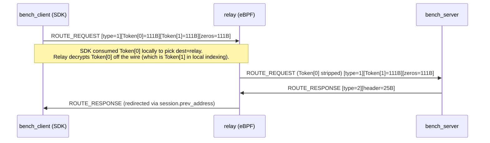
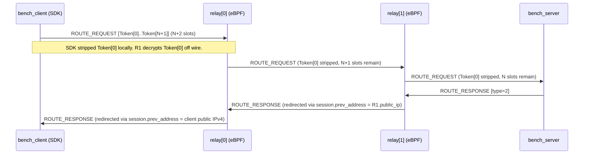

# ADR-006: Split RouteToken into Client View and Wire View for Bench Tooling

**Date:** 2026-05-10<br>
**Status:** Accepted (amended 2026-05-18 - multi-hop extension implemented)<br>
**Deciders:** developer<br>
**Related Tasks:** `relay-bench`, `/bench_token` endpoint, bench_client route setup<br>
**Related ADRs:** N/A<br>
**Related Sessions:** [Session 2026-05-10](../sessions/2026-05-10-bench-relay-end-to-end.md),
[Session 2026-05-17](../sessions/2026-05-17-multihop-bench-plan.md)<br>

## Context

The relay protocol uses an array of encrypted RouteTokens to describe a multi-hop
path. Each hop decrypts Token[0], extracts routing fields, strips it, and forwards
the remainder. Two fields drive routing at each hop:

- `next_address / next_port` - where to forward the packet
- `prev_address / prev_port` - where to send ROUTE_RESPONSE back

The relay-sdk assembles this token array on the client side and sends it as part
of `route_update`. Token[0] is consumed locally by the SDK (never placed on the
wire) to determine the first-hop send target. Token[1] is what the first relay
actually receives and decrypts off the wire.

Single-hop flow (original design):



Multi-hop flow (N relays, N+2 tokens, implemented 2026-05-17):



For bench tooling (`relay-bench`), the bench_client must produce a valid token
array for the path: `bench_client -> relay[0] -> ... -> relay[N-1] -> bench_server`.
This requires:

1. Token[0] (`next = relay[0]`) - SDK reads locally to know where to send packets.
2. Token[1..N] (`next = relay[i+1] or bench_server`, `prev = client_pub_ip or relay[i-1].ip`)
   - relay[i] reads Token[i] on the wire to know where to forward and who to redirect
   ROUTE_RESPONSE to.

These tokens MUST have different `next_address` values. A single shared token
cannot satisfy both roles simultaneously.

bench_client does not have access to the per-relay symmetric key needed to encrypt
RouteTokens (key is derived from `X25519(backend_sk, relay_pk)` + BLAKE2b). Only
the backend holds `backend_sk`; only the relay holds `relay_sk`. Neither secret is
available in bench_client.

## Options Considered

### Option A: Client derives per-relay key from a pre-shared bench secret

- **Description:** Export a "bench-only" symmetric key from the backend to the
  client (e.g. a pre-shared key per relay), bench_client encrypts both tokens
  locally.
- **Pros:** No round-trip to backend for the token pair; client is self-contained.
  | **Cons:** Requires a new key distribution mechanism. The relay would need to
  accept tokens encrypted with this alternate key (two code paths in eBPF). Does
  not reflect production token format. | **Effort:** Impl: High / Migration: High
  / Maintenance: High

### Option B: Backend builds and encrypts both tokens, returns them via `/bench_token`

- **Description:** Add `?relay_addr` + `?bench_server_addr` to `/bench_token`.
  Backend derives the per-relay key (X25519 + BLAKE2b), builds two RouteToken
  structs with different `next_address` values, encrypts both with XChaCha20-Poly1305,
  and returns them as `client_route_token` (hex, 111B) and `wire_route_token`
  (hex, 111B). Also returns `relay_secret_key` (hex, 32B) so bench_client can
  pass it to `open_session`.
- **Pros:** Matches production token format exactly (same crypto, same struct).
  No new key distribution mechanism. relay-sdk and eBPF require zero changes.
  Security boundary preserved: relay_sk and backend_sk stay in their respective
  processes. | **Cons:** bench_client must call `/bench_token` with both relay
  and server addr. Token pair becomes stale after `expire_timestamp` (300s); needs
  periodic refresh. | **Effort:** Impl: Medium / Migration: Low / Maintenance: Low

### Option C: Do nothing - bench_client sends packets directly, bypassing relay

- **Description:** Keep bench mode as direct-only (no relay in path).
- **Pros:** No token complexity. | **Cons:** Cannot validate relay throughput,
  latency, or the eBPF data plane under load. Bench tooling loses its primary
  purpose. | **Effort:** Impl: None / Migration: None / Maintenance: None

## Decision

**Chosen: Option B - Backend builds and encrypts both tokens**

The backend derives the per-relay symmetric key and returns pre-encrypted
111-byte RouteTokens. The original 1-hop design (two tokens) extends naturally
to N hops (N+2 tokens) without any change to the relay eBPF or relay-sdk.

### Single-hop (relay_addr mode)

- `client_route_token` (Token[0]):
  - `next_address = relay IP:port`, `prev_address = 0`
  - bench_client places at position 0 in the token array passed to `route_update`
  - relay-sdk consumes locally; never sent on the wire

- `wire_route_token` (Token[1]):
  - `next_address = bench_server IP:port`
  - `prev_address = client_public_ipv4` (post-NAT address of bench_client)
  - `prev_port = 0` (eBPF substitutes `udp.source` automatically when zero)
  - bench_client places at position 1 in the token array
  - this is the token the relay decrypts off the wire

### Multi-hop (relay_chain mode, implemented 2026-05-17)

Query param: `?relay_chain=IP1:PORT1,IP2:PORT2&bench_server_addr=IP:PORT`

Response contains `relay_chain_tokens` (array of N hex-encoded 111-byte tokens)
instead of the single `wire_route_token`. Chain length is capped at
`relay_xdp_common::MAX_RELAY_HOPS` (= 3); the backend returns HTTP 400 if exceeded.

Token layout for N relays (`relay_chain.len() == N`):

```
Token[0]    = client_route_token     next = relay[0]           encrypted with key[0]
Token[1]    = relay_chain_tokens[0]  next = relay[1]           encrypted with key[0]
Token[i+1]  = relay_chain_tokens[i]  next = relay[i+1]         encrypted with key[i]
Token[N]    = relay_chain_tokens[N-1] next = bench_server      encrypted with key[N-1]
Token[N+1]  = zeros (terminator pad)
```

`prev_address` invariant per hop:

| Token index | `prev_address` value | Reason |
|---|---|---|
| Token[1] (i=0) | client public IPv4 | eBPF copies verbatim to session.prev_address for ROUTE_RESPONSE redirect back to client |
| Token[i+1] (i>0) | relay[i-1].public_ip (from relay_data) | eBPF uses this to send ROUTE_RESPONSE to the previous relay in the chain |

`relay_secret_key` returned in the response is always `key[0]` (relay[0] symmetric
key). bench_client passes it to `open_session`; the SDK uses it to decrypt Token[0]
locally and read `session_id / session_private_key / next_address`.

bench_client token array assembly (N+2 slots):

```
tokens = [client_route_token] + relay_chain_tokens[0..N] + [zeros_pad]
num_tokens = N + 2
```

bench_server receives `server_relay = relay_chain.last()` (the last relay in the
chain) in `/register_session`. bench_server sends SERVER_PING to this relay so the
last relay's `whitelist_map` contains bench_server's IP:port, which is required for
the last relay to forward ROUTE_REQUEST onward to bench_server.

### Key derivation

Both backend and relay independently derive the same per-relay symmetric key:

```
q   = X25519(backend_sk, relay_pk)   // computed by backend
q   = X25519(relay_sk,   backend_pk) // computed by relay (X25519 symmetry: same q)
key = BLAKE2b-512(q || relay_pk || backend_pk)[..32]
```

Implemented in `relay_sdk::crypto::derive_relay_session_key`. Called for each
relay in the chain independently; relay[i] can only decrypt its own token.

### `/bench_token` response fields

| Field | Type | Description |
|---|---|---|
| `session_id` | u64 | Random session identifier |
| `session_version` | u8 | Always 1 |
| `session_private_key` | hex 32B | HMAC key for relay packet headers |
| `relay_backend_public_key` | hex 32B | Kept for debugging |
| `relay_address` | string | First-hop relay echoed back |
| `current_magic` | hex 8B | DDoS filter epoch token |
| `ping_key` | hex 32B | SHA-256 key for CLIENT_PING / SERVER_PING |
| `client_public_address` | string | Caller post-NAT IPv4 (via ConnectInfo) |
| `client_route_token` | hex 111B | Token[0] - SDK local use |
| `wire_route_token` | hex 111B | Token[1] - 1-hop mode only |
| `relay_chain_tokens` | array of hex 111B | Token[1..N] - multi-hop mode |
| `relay_secret_key` | hex 32B | key[0] for `open_session` |
| `encrypted_route_token` | hex 111B | Backwards-compat alias for `client_route_token` |

In 1-hop mode `relay_chain_tokens` is empty; bench_client falls back to
`wire_route_token`. In multi-hop mode `relay_chain_tokens` has N entries and
`wire_route_token` is empty.

## Rationale

Option A breaks the key isolation model: the per-relay key would need to be
knowable outside the relay process, defeating per-relay key separation.

Option C makes the bench harness useless for validating the relay data plane.

Option B reuses the exact same crypto path the relay uses in production. eBPF
`handle_route_request` decrypts the token with the same derived key, reads
`next_address` and `prev_address`, inserts the session, and forwards. No changes
to eBPF or relay-sdk are required.

Critical field invariants enforced by this design:

| Field | Token[0] (client) | Token[i+1] wire (i==0) | Token[i+1] wire (i>0) | Why |
|---|---|---|---|---|
| `next_address` | relay[0] IP | bench_server or relay[i+1] IP | bench_server or relay[i+1] IP | SDK uses [0] for first send; relay[i] uses [i] to forward |
| `prev_address` | 0 | client public IPv4 | relay[i-1].public_ip | eBPF copies verbatim into session.prev_address for ROUTE_RESPONSE redirect; if 0 on wire token, relay drops with REDIRECT_NOT_IN_WHITELIST |
| `prev_port` | 0 | 0 | 0 | eBPF treats 0 as "first hop", substitutes udp.source automatically |

## Consequences

- **Positive:** Identical token format to production. Zero changes to eBPF or
  relay-sdk crypto path. N-hop chains work without relay code changes by extending
  the token array to N+2 slots.
- **Positive:** Clear security boundary - bench_client never sees relay_sk or
  backend_sk; only the derived 32B symmetric key for `open_session`.
- **Positive:** Multi-hop validated on staging 2026-05-17: 2-relay chain
  (relay-staging-1 -> relay-staging-2 -> bench-staging-1), p50 RTT ~260 ms,
  loss < 0.8% over 60 s.
- **Negative:** bench_client must call `/bench_token` with mandatory
  `bench_server_addr` and at least one of `relay_addr` / `relay_chain`.
  Missing either returns empty token fields (graceful degradation to direct mode).
- **Negative:** Token pair expires after 300s. bench_client must refresh periodically
  (implemented: background task calls `route_update(UPDATE_TYPE_ROUTE)` every 10s,
  re-fetching `/bench_token` and re-registering with bench_server).
- **Neutral:** `relay_secret_key` is returned in the HTTP response body. Acceptable
  for the admin-only `/bench_token` endpoint; would need auth gating for
  multi-tenant deployments.
- **Neutral:** `relay_chain` query param uses comma-separated IPv4:PORT values
  with no URL encoding applied by bench_client. Safe for IPv4 addresses only;
  IPv6 chain support would require percent-encoding or a different delimiter.

## Affected Components

| Component | Impact | Description |
|-----------|--------|-------------|
| `relay-backend/src/handlers.rs` | Medium | Added `build_encrypted_bench_token` (1-hop) and `build_encrypted_bench_token_chain` (N-hop). Uses `relay_sdk::crypto::derive_relay_session_key` and `relay_sdk::tokens::encrypt_route_token` (delegated to relay-sdk, no inline crypto). New query params `relay_addr`, `bench_server_addr`, `relay_chain`. New response fields `client_route_token`, `wire_route_token`, `relay_chain_tokens`, `relay_secret_key`. Returns HTTP 400 if `relay_chain.len() > MAX_RELAY_HOPS`. |
| `relay-bench/src/bin/bench_client.rs` | Medium | Reads `client_route_token`, `wire_route_token`, `relay_chain_tokens`, `relay_secret_key`. Assembles N+2-slot token array. `open_session` uses `relay_secret_key`. Supports `RELAY_CHAIN` env var (comma-separated, supersedes `RELAY_ADDR`). Background refresh task re-fetches tokens every 10s and calls `route_update`. Passes `server_relay = relay_chain.last()` to `register_session`. |
| `relay-bench/src/bin/bench_server.rs` | Low | Unchanged for token handling. Receives updated `relay_address` pointing to the last relay in chain (instead of always relay[0]). |
| `relay-xdp-common/src/lib.rs` | Low | Added `MAX_RELAY_HOPS = 3` constant. Backend enforces this cap. |
| `relay-sdk` | Low | `derive_relay_session_key` and `encrypt_route_token` are the shared implementation used by both backend (token building) and relay-xdp (key derivation). No API changes required. |
| `relay-xdp-ebpf/src/main.rs` | None | No changes required. Existing `handle_route_request` strip-and-forward already implements the N-hop behaviour this design relies on. |

## Revisit When

- ~~Multi-hop bench support is needed (N relays in chain): backend must accept a
  `relay_chain[]` array and produce N+2 tokens.~~ **Done 2026-05-17.** See
  session `2026-05-17-multihop-bench-plan.md`.
- A second backend implementation is built: it must implement the same
  `derive_relay_session_key` + token assembly to be compatible with the relay
  eBPF data plane.
- `relay_secret_key` in the HTTP response body is deemed unacceptable for a
  given deployment: gate `/bench_token` behind mTLS or move to an admin-only
  network interface.
- IPv6 relay addresses in `relay_chain` are needed: the current comma-separated
  query param format conflicts with IPv6 colon syntax. Requires percent-encoding
  or a JSON body endpoint.

## Migration Plan

N/A - original decision implemented in full as of 2026-05-10. Multi-hop extension
implemented as backward-compatible addition on 2026-05-17. No migration required.
