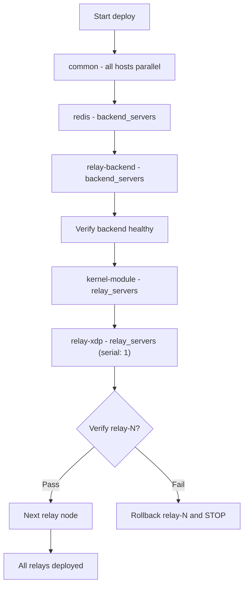

# Session Summary: Ansible Deployment Plan

**Date:** 2026-04-18  
**Duration:** ~4 interactions  
**Focus Area:** deployment/infrastructure

## Objectives

- [x] Design Ansible module structure for bare-metal deployment
- [x] Define staging and production environments
- [x] Plan CI pipeline (GitHub Actions) for build + release
- [x] Design rolling deploy with verification and rollback
- [x] Plan secret management with Ansible Vault

## Work Completed

### Deployment Architecture

Designed full Ansible-based bare-metal deployment for the relay-xdp stack. No Docker in staging/production - binaries deployed directly, managed by systemd.

#### Ansible Directory Structure

```
ansible/
  ansible.cfg
  inventory/
    staging.yml
    production.yml
  group_vars/
    all.yml                # shared defaults
    staging.yml            # staging overrides
    production.yml         # production overrides
    vault_staging.yml      # ansible-vault encrypted
    vault_production.yml   # ansible-vault encrypted
  roles/
    common/                # base OS, kernel check, deps, sysctl
    kernel-module/         # distribute + load relay_module.ko
    relay-backend/         # binary + systemd + env
    relay-xdp/             # binary + ebpf obj + systemd + env
    redis/                 # install + configure Redis 7
  playbooks/
    site.yml               # full deploy (ordered)
    relay-only.yml         # redeploy relays only
    module-only.yml        # update kernel module only
    rollback.yml           # manual rollback
```

#### Role Descriptions

- **common:** Verify kernel >= 6.5, install `libelf1`/`ca-certificates`, create `relay` user, configure sysctl (`net.core.rmem_max`, `net.core.wmem_max`), open firewall ports (UDP 40000, TCP 80).
- **kernel-module:** Download pre-built `relay_module-$(uname -r).ko` from GitHub Releases, `modprobe chacha20 poly1305`, `insmod`, verify via `dmesg`.
- **redis:** Install Redis 7 package, configure bind/maxmemory/persistence, systemd enable + start. Only on `backend_servers`.
- **relay-backend:** Copy binary to `/usr/local/bin/`, render `EnvironmentFile` at `/etc/relay/backend.env`, create systemd unit `relay-backend.service`, healthcheck via `curl localhost:{{ http_port }}/health`.
- **relay-xdp:** Copy binary + `relay_xdp_rust.o` to `/opt/relay/`, render `/etc/relay/relay.env`, create systemd unit `relay-xdp.service` (runs as root with `CAP_NET_ADMIN`, `CAP_BPF`, `CAP_SYS_ADMIN`). Backup previous version before deploy.

#### Deploy Order



#### Rolling Deploy Verification

After each relay node deploy, verify before continuing:

1. Wait 5s for startup
2. `systemctl is-active relay-xdp` - service running
3. `bpftool prog list | grep xdp` - BPF program loaded
4. `lsmod | grep relay_module` - kernel module present
5. `journalctl -u relay-xdp --since "30 seconds ago" | grep "Starting relay"` - relay started
6. `curl -sf http://{{ relay_backend_url }}/health` - backend still healthy

If any check fails, rollback that node (restore from `/opt/relay/backup/`) and stop deployment.

### CI Pipeline (GitHub Actions)

#### Build + Release Workflow (`.github/workflows/build-release.yml`)

Trigger: push tag `v*` or manual dispatch.

| Job | Runner | Output |
|-----|--------|--------|
| `build-userspace` | Ubuntu, Rust stable | `relay-backend`, `relay-xdp` binaries |
| `build-ebpf` | Ubuntu, Rust nightly + bpf-linker | `relay_xdp_rust.o` |
| `build-kernel-module` | Matrix per kernel version | `relay_module-$ver.ko` |
| `create-release` | Depends on all above | GitHub Release with all artifacts |

Artifacts attached to GitHub Release:

```
relay-backend                          # x86_64 binary
relay-xdp                             # x86_64 binary
relay_xdp_rust.o                      # eBPF object
relay_module-6.5.0-44-generic.ko      # kernel module per version
relay_module-6.8.0-45-generic.ko
```

#### Deploy Workflow (`.github/workflows/deploy.yml`)

Trigger: `workflow_dispatch` with inputs `environment` (staging/production) and `version` (release tag).

Steps: checkout, install Ansible, configure SSH, run `ansible-playbook -i inventory/{{ environment }}.yml playbooks/site.yml -e relay_version={{ version }}`.

### Environment Configuration

| Variable | Staging | Production |
|----------|---------|------------|
| `rust_log` | `info` | `warn` |
| `relay_dedicated` | `false` | `true` |
| `redis_maxmemory` | `256mb` | `1gb` |
| `serial` (relay deploy) | all parallel | `1` (rolling) |

### Secret Management (Ansible Vault)

Each environment has a vault file (`vault_staging.yml`, `vault_production.yml`) encrypted with `ansible-vault`. Contains:

- `vault_relay_backend_public_key`
- `vault_relay_backend_private_key`
- Per-relay keypairs: `vault_relay_keys[relay_name].{public_key, private_key}`

Vault password stored in GitHub Secrets as `ANSIBLE_VAULT_PASSWORD`.

### CI Secrets (GitHub Settings)

| Secret | Purpose |
|--------|---------|
| `ANSIBLE_VAULT_PASSWORD` | Decrypt vault files |
| `DEPLOY_SSH_KEY` | SSH into target servers |
| `DEPLOY_SSH_KNOWN_HOSTS` | Known hosts for target servers |

## Decisions Made

| Decision | Rationale | ADR |
|----------|-----------|-----|
| Bare-metal only (no Docker in staging/prod) | XDP requires `--net=host` + `--privileged`, Docker adds overhead and complexity for no benefit | N/A |
| GitHub Releases for artifacts | Free (2GB limit sufficient), integrated with CI, no extra infra (vs S3) | N/A |
| Ansible Vault for secrets | Simple, no extra infra, sufficient for this scale. Can migrate to HashiCorp Vault later | N/A |
| Pre-build kernel modules per version | Kernel modules must match exact kernel version. Building on target host requires kernel headers + build tools on every server | N/A |
| Rolling deploy serial:1 for production | Avoid full relay fleet downtime. Verify each node before proceeding | N/A |
| Rollback via backup dir | Simple, no artifact re-download needed. Previous binary/config/ebpf kept at `/opt/relay/backup/` | N/A |

## Tests Added/Modified

No code changes in this session - planning only.

## Issues Encountered

| Issue | Resolution | Blocking |
|-------|------------|----------|
| Kernel module must match exact kernel version | Matrix build in CI, download per `ansible_kernel` | No |
| Relay-xdp needs root/CAP_BPF for XDP | Systemd unit with ambient capabilities | No |

## Next Steps

1. **High:** Implement `ansible/` directory structure with all roles, templates, and playbooks
2. **High:** Implement `.github/workflows/build-release.yml` CI pipeline
3. **High:** Implement `.github/workflows/deploy.yml` deploy workflow
4. **Medium:** Determine exact kernel versions running on staging/production hosts for CI matrix
5. **Medium:** Generate staging/production keypairs and encrypt with Ansible Vault
6. **Low:** Add monitoring integration (Prometheus node_exporter, relay metrics endpoint) - deferred

## Files Changed

No files changed - planning session only.

