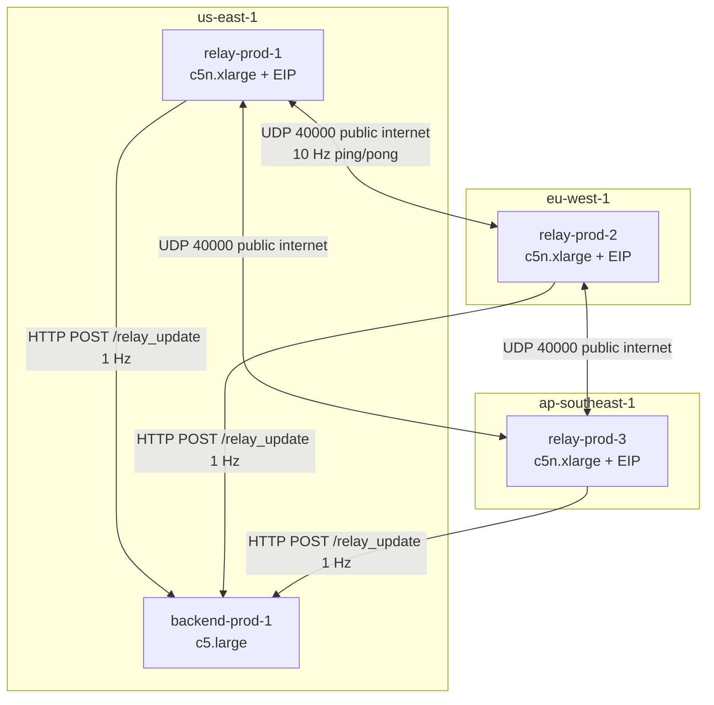

# Session Summary: Pulumi Python AWS Infrastructure Plan for Relay Nodes

**Date:** 2026-04-30<br>
**Duration:** ~5 interactions<br>
**Focus Area:** Build infrastructure - `infra/` Pulumi project<br>

## Objectives

- [x] Define cloud provider, instance types, SSH key strategy, state backend
- [x] Design multi-region network topology and inter-region relay communication model
- [x] Produce complete file-by-file implementation plan for `infra/` Pulumi project
- [x] Define Ansible inventory generation bridge (`inventory_gen.py`)
- [x] Document full deploy workflow (Pulumi -> inventory gen -> Ansible)
- [ ] Implement `infra/` files (next session)

## Work Completed

### Decision Finalization (planning only, no files created)

All architecture decisions were locked across 5 interactions:

| Decision Point | Confirmed Value |
|---|---|
| Cloud provider | AWS |
| Relay instance type (prod) | `c5n.xlarge` (ena driver, XDP native mode) |
| Relay instance type (staging) | `t3.medium` (XDP generic, acceptable for testing) |
| Backend instance type (prod) | `c5.large` |
| Backend instance type (staging) | `t3.medium` |
| AMI | Ubuntu 24.04 x86_64, Canonical owner `099720109477`, filter `ubuntu/images/hvm-ssd-gp3/ubuntu-noble-24.04-amd64-server-*` |
| SSH key | Local `~/.ssh/id_ed25519.pub`, imported per-region via `aws.ec2.KeyPair` |
| Pulumi state backend | S3-compatible, `pulumi login s3://<bucket>?region=us-east-1` |
| Stack separation | `Pulumi.staging.yaml` (1 relay, us-east-1 only) / `Pulumi.production.yaml` (3 relays, multi-region) |

### Multi-Region Topology

Production: 3 relay nodes (one per region) + 1 backend (us-east-1).



Inter-region communication uses public EIPs over public internet - no VPC Peering needed.
XDP data plane only requires EIP-to-EIP public routing. `relay_map` (2048 entries) and
`session_map` (200K LRU) are sufficient for a 3-node multi-region mesh.

### CIDR Plan

| Region | Role | VPC CIDR |
|---|---|---|
| `us-east-1` | relay-prod-1 + backend-prod-1 | `10.1.0.0/16` |
| `eu-west-1` | relay-prod-2 | `10.2.0.0/16` |
| `ap-southeast-1` | relay-prod-3 | `10.3.0.0/16` |
| backend region (us-east-1) | shared with relay-prod-1 | `10.1.0.0/16` |

### Security Group Rules

`sg_relay` (relay nodes):

| Direction | Protocol | Port | Source |
|---|---|---|---|
| Inbound | UDP | 40000 | `0.0.0.0/0` (game clients + inter-relay ping) |
| Inbound | TCP | 8080 | `0.0.0.0/0` |
| Inbound | TCP | 22 | `admin_cidr` |
| Outbound | all | all | `0.0.0.0/0` |

`sg_backend` (backend node):

| Direction | Protocol | Port | Source |
|---|---|---|---|
| Inbound | TCP | 8090 | `0.0.0.0/0` (relay nodes POST /relay_update) |
| Inbound | TCP | 6379 | VPC CIDR only (Redis internal) |
| Inbound | TCP | 22 | `admin_cidr` |
| Outbound | all | all | `0.0.0.0/0` |

### `c5n` AZ Constraints

`c5n` is not available in all AZs. Hardcoded known-good AZs per region:

| Region | AZ |
|---|---|
| `us-east-1` | `us-east-1a` |
| `eu-west-1` | `eu-west-1b` |
| `ap-southeast-1` | `ap-southeast-1a` |

Subnets are pinned to these AZs in `network.py`.

### Planned `infra/` File Structure

```
infra/
├── Pulumi.yaml                  # project metadata (runtime: python, name: relay-xdp-infra)
├── Pulumi.staging.yaml          # staging stack config
├── Pulumi.production.yaml       # production stack config
├── requirements.txt             # pulumi>=3, pulumi-aws>=6
├── README.md                    # login command, deploy workflow, EIP cost warning
├── __main__.py                  # entrypoint - orchestrates all resources
├── config.py                    # InfraConfig class, REGION_CIDR_MAP, AZ_MAP, AMI constants
├── network.py                   # create_regional_network() -> VPC + subnet + IGW + RT + SGs
├── relay_node.py                # RelayNode(ComponentResource) - EC2 c5n + EIP + KeyPair
├── backend_node.py              # BackendNode(ComponentResource) - EC2 + Redis SG
└── inventory_gen.py             # CLI: pulumi output -> ansible/inventory/<stack>.yml
```

### Stack Config Schema

`Pulumi.production.yaml`:
```yaml
config:
  relay-xdp-infra:relay_regions:
    - us-east-1
    - eu-west-1
    - ap-southeast-1
  relay-xdp-infra:relay_count: 3
  relay-xdp-infra:relay_instance_type: c5n.xlarge
  relay-xdp-infra:backend_region: us-east-1
  relay-xdp-infra:backend_instance_type: c5.large
  relay-xdp-infra:key_pub_path: ~/.ssh/id_ed25519.pub
  relay-xdp-infra:admin_cidr: <your-ip>/32
```

`Pulumi.staging.yaml`: same keys, `relay_regions: ["us-east-1"]`, `relay_count: 1`,
`relay_instance_type: t3.medium`, `backend_instance_type: t3.medium`.

### `user_data` Cloud-Init Scope

Only prerequisites - no duplication of Ansible role logic:
- `apt install libelf1 kmod`
- Set 6 sysctl params matching `ansible/roles/common/tasks/main.yml`:
  `rmem_max`, `wmem_max`, `rmem_default`, `wmem_default`, `netdev_max_backlog`, `udp_mem`

Ansible `common` role re-applies sysctl idempotently - no conflict.

### Ansible Inventory Bridge

`inventory_gen.py` runs `pulumi stack output --json --stack <stack>`, parses the JSON, and
renders `ansible/inventory/<stack>.yml` with `ansible_user: ubuntu` added to each host.
Output file is prepended with `# Generated by inventory_gen.py - do not edit manually`.

### Full Deploy Workflow

```bash
# 1 - Provision AWS infrastructure
pulumi up --stack production --cwd infra/

# 2 - Generate Ansible inventory from Pulumi outputs
python infra/inventory_gen.py --stack production

# 3 - Deploy software (existing Ansible pipeline, unchanged)
ansible-playbook -i ansible/inventory/production.yml \
    ansible/playbooks/site.yml \
    -e relay_version=v1.0.0 \
    --ask-vault-pass
```

To be captured in a top-level `Makefile` target `deploy-production`.

## Decisions Made

| Decision | Rationale | ADR |
|---|---|---|
| `c5n.xlarge` for relay nodes | ena driver supports XDP native mode (driver-level, not generic). Required for sub-microsecond packet processing budget. | N/A |
| `t3.medium` for staging relay | `c5n` not needed for staging (XDP generic acceptable, `RELAY_NO_BPF=1` also available). Cost saving. | N/A |
| Public internet for inter-relay UDP | VPC Peering adds complexity with no benefit - relay data plane only needs EIP-to-EIP routing. relay-backend RTT measurement accounts for real internet latency. | N/A |
| No EIP on backend node | Backend receives inbound HTTP POST from relay nodes - auto-assigned public IP with DNS is sufficient. EIP cost avoided. | N/A |
| Local key import per-region | Avoids managing multiple private keys. `aws.ec2.KeyPair` imports same public key into each region's AWS account. Private key stays local only. | N/A |
| S3 state backend | Avoids Pulumi Cloud vendor lock-in. Self-hosted, consistent with project's self-hosted deployment model. | N/A |
| `inventory_gen.py` bridge vs. replacing Ansible | Ansible roles are complete and tested. Pulumi only provisions VMs - Ansible handles all software deployment. Minimal disruption to existing pipeline. | N/A |

## Tests Added/Modified

None - planning session only.

## Issues Encountered

| Issue | Resolution | Blocking |
|---|---|---|
| `c5n` not available in all AZs | Hardcode known-good AZs per region in `C5N_AZ_MAP` constant in `config.py` | No |
| EIP charge when instance stopped | Document warning in `infra/README.md`, note `pulumi destroy` for staging when idle | No |

## Next Steps

1. **High:** Implement `infra/` files per the plan - `Pulumi.yaml`, `requirements.txt`, `config.py`, `network.py`, `relay_node.py`, `backend_node.py`, `__main__.py`, `inventory_gen.py`, `README.md`
2. **High:** Add `Makefile` targets `deploy-production` and `deploy-staging` at repo root
3. **Medium:** Run `pulumi preview --stack staging` to validate resource graph before first `pulumi up`
4. **Medium:** Test `inventory_gen.py` output against Ansible inventory schema with `ansible --list-hosts`
5. **Low:** Consider adding an ADR for the Pulumi-over-manual-inventory decision

## Files Changed

| Status | File |
|---|---|
| A (planned) | `infra/Pulumi.yaml` |
| A (planned) | `infra/Pulumi.staging.yaml` |
| A (planned) | `infra/Pulumi.production.yaml` |
| A (planned) | `infra/requirements.txt` |
| A (planned) | `infra/README.md` |
| A (planned) | `infra/__main__.py` |
| A (planned) | `infra/config.py` |
| A (planned) | `infra/network.py` |
| A (planned) | `infra/relay_node.py` |
| A (planned) | `infra/backend_node.py` |
| A (planned) | `infra/inventory_gen.py` |
| M (planned) | `Makefile` (new targets: `deploy-production`, `deploy-staging`) |

