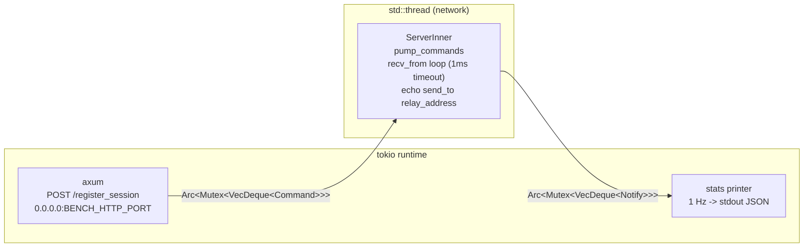
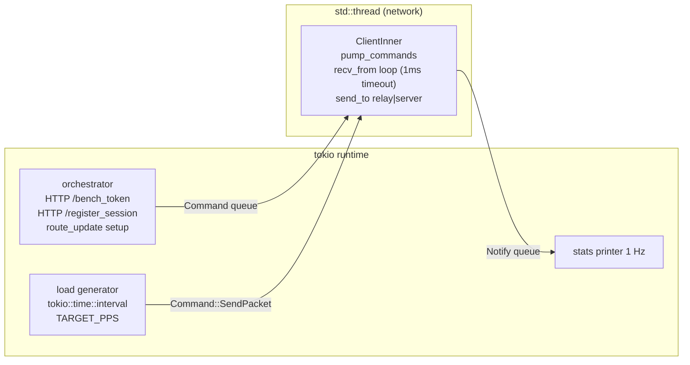
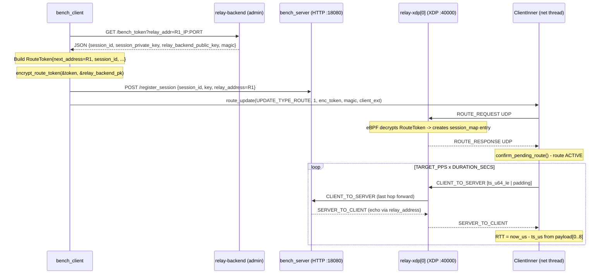

# Session Summary: relay-bench - Client/Server Benchmark Harness

**Date:** 2026-05-07<br>
**Duration:** ~1 session (~6 interactions)<br>
**Focus Area:** relay-bench / relay-backend / relay-sdk<br>

## Objectives

- [x] Research existing architecture: relay-sdk (ClientInner/ServerInner), relay-backend (handlers, state, config), relay-xdp-common (RouteToken, SessionData)
- [x] Design a client/server benchmark harness using relay-sdk + relay-backend + relay-xdp
- [x] Choose provisioning architecture (HTTP endpoint vs JSON fixture)
- [x] Choose bench token delivery method (client-side encrypt vs backend encrypt)
- [x] Define thread model for bench_server and bench_client
- [x] Define env vars, metrics format, and Makefile targets
- [x] Resolve session_map provisioning for relay mode
- [x] Implementation: steps 1-4 complete (2026-05-08)
- [x] Implementation: step 5 complete (2026-05-08)

## Work Completed

### Architecture Research

Files read and understood:

- `relay-sdk/ARCHITECTURE.md`: ClientInner/ServerInner two-half pattern, 14 packet types, RouteManager state machine, FFI exports
- `relay-backend/ARCHITECTURE.md`: RelayUpdateRequest/Response wire format, SimpleReader/SimpleWriter, optimizer, Redis leader election
- `relay-sdk/src/bin/relay_sdk_smoke.rs`: UDP loopback E2E test (Group 4) - confirmed pattern for ROUTE_RESPONSE simulation and session setup
- `relay-sdk/src/client/mod.rs`: Command/Notify queue types, IPC model
- `relay-backend/src/handlers.rs`: public vs admin router split (P1-14), NaCl decrypt flow
- `relay-backend/src/config.rs`: `relay_backend_public_key` available in `AppState.config`
- `relay-xdp-common/src/lib.rs`: RouteToken struct (71B, repr(C, packed)), session_map lifetime

### Design Decisions Finalized

See the "Decisions Made" table below.

### Full Design Spec

#### New Workspace Crate: `relay-bench/`

- **Members**: add to root `Cargo.toml` `members[]`
- **Deps**: `relay-sdk`, `relay-xdp-common`, `tokio {full}`, `axum 0.8`, `anyhow`, `serde/serde_json`, `rand 0.8`, `hex`
- **Binaries**: `bench_server` + `bench_client` (two `[[bin]]` entries)

#### relay-backend: `GET /bench_token` (admin router)

- **Route**: add to `create_admin_router` in `handlers.rs`
- **Query param**: `?relay_addr=IP:PORT`
- **Logic**: generate `session_id` (uuid v4 as u64), generate `session_private_key` (getrandom 32B), read `relay_backend_public_key` from config, get `current_magic` from `magic_rotator.get()`
- **Response JSON**:
  ```json
  {
    "session_id": 12345678901234567890,
    "session_version": 1,
    "session_private_key": "<hex 32B>",
    "relay_backend_public_key": "<hex 32B>",
    "relay_address": "IP:PORT",
    "current_magic": "<hex 8B>"
  }
  ```
- **Constraint**: relay-xdp-common stays as `[dev-dependencies]` in relay-backend - no RouteToken struct imported in production code

#### bench_server Thread Model



- `POST /register_session` body: `{session_id, session_version, session_private_key_hex, relay_address}`
- Network thread: `set_read_timeout(1ms)`, loop: `pump_commands -> recv_from -> process_incoming -> echo payload via send_to(relay_address)`
- Echo: ServerInner calls `send_packet(session_id, &payload, magic, from_addr)`, pushes `Notify::SendRaw` -> network thread calls `send_to`

#### bench_client Thread Model



#### bench_client Modes

**Relay mode** (`--mode relay`):



**Direct mode** (`--mode direct`):
1. Generate session materials locally (rand): session_id, session_private_key, CLIENT_SECRET_KEY
2. Build RouteToken with `next_address` = bench_server UDP addr
3. Encrypt RouteToken locally with `encrypt_route_token`
4. POST `/register_session` to bench_server with `relay_address = bench_client UDP bind addr`
5. Simulate ROUTE_RESPONSE (pattern from `relay_sdk_smoke.rs:run_udp_loopback`): build packet with `write_header(SESSION_KEY)`, feed to `inner.process_incoming`, confirm route
6. Load generation: CLIENT_TO_SERVER goes directly to `bench_server UDP`, echo returns, RTT measured

#### session_map Provisioning (relay mode)

relay-xdp eBPF automatically creates a `session_map` entry when processing the first ROUTE_REQUEST:
1. eBPF receives ROUTE_REQUEST UDP from `ClientInner`
2. Decrypts RouteToken using `relay_backend_public_key` (XChaCha20-Poly1305 via kfunc `bpf_relay_xchacha20poly1305_decrypt`)
3. Creates `SessionData` in `session_map` (LruHash 200K)
4. Forwards ROUTE_REQUEST to `next_address` (bench_server or next relay hop)
5. bench_server (or last relay) sends ROUTE_RESPONSE back - XDP forwards it to client

Result: `bench_client` does not need to call any additional API to provision the session. It only needs to POST `/register_session` on `bench_server` HTTP before sending the first ROUTE_REQUEST.

#### Payload Format (RTT measurement)

```
Bytes [0..8]  : send_timestamp_us (u64 LE) - microseconds since UNIX_EPOCH
Bytes [8..]   : zero-padding to PAYLOAD_BYTES
```

bench_server echoes the exact payload back. bench_client reads `timestamp_us` from `payload[0..8]` and computes `rtt_us = now_us - timestamp_us`.

#### Metrics Output (JSON line, 1 Hz, stdout)

```json
{"ts_ms": 1746624000000, "role": "client", "mode": "relay", "pkt_sent": 1000, "pkt_recv": 980, "rtt_p50_us": 1200, "rtt_p95_us": 2100, "rtt_p99_us": 3500, "loss_pct": 2.0, "route": "active"}
```

RTT histogram: `Vec<u64>` rolling window (reset every second), sort in-place + index for p50/p95/p99. No external stats crate required.

#### Environment Variables

| Var | Default | Binary | Description |
|-----|---------|--------|-------------|
| `BENCH_SERVER_HTTP` | `127.0.0.1:18080` | client | bench_server HTTP provisioning address |
| `BENCH_SERVER_UDP` | `127.0.0.1:17777` | client | bench_server UDP bind address (direct mode) |
| `BENCH_CLIENT_UDP` | `127.0.0.1:17778` | client | client UDP bind address |
| `BENCH_HTTP_PORT` | `18080` | server | axum listen port |
| `BENCH_UDP_PORT` | `17777` | server | UDP listen port |
| `BACKEND_ADMIN` | `http://127.0.0.1:81` | client | relay-backend admin URL |
| `RELAY_ADDR` | - | client | relay-xdp first hop `IP:PORT` (relay mode only) |
| `TARGET_PPS` | `1000` | client | target packets per second |
| `PAYLOAD_BYTES` | `128` | client | payload size in bytes (minimum 8 for timestamp) |
| `DURATION_SECS` | `30` | client | benchmark duration |
| `BENCH_MODE` | `direct` | client | `direct` or `relay` |

#### Makefile Targets

```makefile
# bench-local: direct mode, no relay-xdp needed, assert p99 RTT < 500us
bench-local:
    cargo build --release -p relay-bench
    ./target/release/bench_server &
    BENCH_SERVER_HTTP=127.0.0.1:18080 BENCH_SERVER_UDP=127.0.0.1:17777 \
    BENCH_MODE=direct DURATION_SECS=10 TARGET_PPS=1000 \
    ./target/release/bench_client; \
    STATUS=$$?; kill %1 2>/dev/null || true; exit $$STATUS

# bench-relay: relay mode, requires RELAY_ADDR + BACKEND_ADMIN set
bench-relay:
    cargo build --release -p relay-bench
    BENCH_MODE=relay DURATION_SECS=30 TARGET_PPS=500 \
    RELAY_ADDR=$(RELAY_ADDR) BACKEND_ADMIN=$(BACKEND_ADMIN) \
    BENCH_SERVER_HTTP=$(BENCH_SERVER_HTTP) \
    ./target/release/bench_client
```

## Decisions Made

| Decision | Rationale | ADR |
|----------|-----------|-----|
| New workspace crate `relay-bench/` instead of adding bins to relay-sdk | relay-sdk is a cdylib/staticlib - adding tokio/axum as deps would bloat the library footprint and affect C ABI consumers | N/A |
| bench_server exposes `POST /register_session` (axum + tokio) | Matches production flow where relay-backend pushes session info to the game server - more realistic than a static JSON fixture | N/A |
| relay-backend `GET /bench_token` returns raw JSON session materials; client encrypts RouteToken | Avoids adding crypto deps to relay-backend production code; relay-xdp-common stays as dev-dep; relay-sdk already has `encrypt_route_token` | N/A |
| relay-xdp session_map provisioning via ROUTE_REQUEST (automatic) | eBPF processes ROUTE_REQUEST -> decrypts RouteToken -> creates session_map entry; no special provisioning API needed; confirmed from architecture docs | N/A |
| Criterion benchmarks stay separate (standalone binaries, not merged into benches/relay_sdk.rs) | Micro-benchmarks (criterion) and load tests (multi-second real UDP) serve different purposes; keeping them separate avoids slowing down `cargo bench` | N/A |
| RTT histogram uses `Vec<u64>` sort-in-place, no HDR histogram crate | Sufficient p99 accuracy for 1s windows (max ~10K entries at 10K PPS); `hdrhistogram` crate can be added later if high-precision percentiles are needed | N/A |

## Tests Added/Modified


| Test | Type | Status |
|------|------|--------|
| `bench_server POST /register_session accepts session and pumps Command` | Integration | Not yet implemented |
| `bench_client direct mode: p99 RTT < 500us over loopback` | Functional | Not yet implemented |
| `relay-backend GET /bench_token returns correct JSON shape` | Integration | Not yet implemented |
| `bench_client relay mode: route ACTIVE after ROUTE_RESPONSE` | Integration | Not yet implemented |

## Issues Encountered

| Issue | Resolution | Blocking |
|-------|------------|----------|
| relay-xdp-common is a dev-dep in relay-backend - cannot use RouteToken struct in bench_token handler | Moved RouteToken encryption responsibility to bench_client (relay-sdk already exposes `encrypt_route_token`); handler returns raw hex fields only | No |
| bench_server echo in relay mode: SERVER_TO_CLIENT must be sent to `relay_address` from SessionInfo (= last relay hop), not the UDP `from_addr` | bench_client passes `relay_address = RELAY_ADDR` when calling POST /register_session; this matches the `relay_address` stored in SessionInfo | No |
| session_map entry must exist before the first CLIENT_TO_SERVER packet arrives | ROUTE_REQUEST -> eBPF creates session_map -> ROUTE_RESPONSE -> route ACTIVE. This ordering guarantees session_map is populated before any data packet | No |

## Next Steps

1. ~~**High:** Create `relay-bench/Cargo.toml` and add to workspace `Cargo.toml`~~ - done 2026-05-08
2. ~~**High:** Write `relay-backend/src/handlers.rs`: add `bench_token_handler` to `create_admin_router` - generate session materials, return JSON~~ - done 2026-05-08
3. ~~**High:** Write `relay-bench/src/bin/bench_server.rs` - axum `/register_session` + ServerInner network thread + echo + stats~~ - done 2026-05-08
4. ~~**High:** Write `relay-bench/src/bin/bench_client.rs` - orchestrator + ClientInner network thread + direct mode with simulated ROUTE_RESPONSE~~ - done 2026-05-08
5. ~~**Medium:** Add relay mode to `bench_client` - GET /bench_token, encrypt RouteToken, wait for real ROUTE_RESPONSE from relay-xdp~~ - done 2026-05-08
6. **Medium:** Add `bench-local` + `bench-relay` targets to `Makefile`
7. **Medium:** Write `relay-bench/README.md` with full Mermaid diagrams (direct mode + relay mode sequences)
8. **Low:** Add integration test for `GET /bench_token` endpoint in `relay-backend/tests/`
9. **Low:** Evaluate adding `hdrhistogram` crate if rolling-sort p99 is insufficient at TARGET_PPS > 10K

## Files Changed

| Status | File |
|--------|------|
| A | `relay-bench/Cargo.toml` |
| A | `relay-bench/src/bin/bench_server.rs` |
| A | `relay-bench/src/bin/bench_client.rs` |
| A | `relay-bench/README.md` (pending - step 7) |
| M | `Cargo.toml` (add `relay-bench` to `members[]`) |
| M | `relay-backend/src/handlers.rs` (add `bench_token_handler`, route on admin router) |
| M | `Makefile` (add `bench-local`, `bench-relay` targets) (pending - step 6) |
