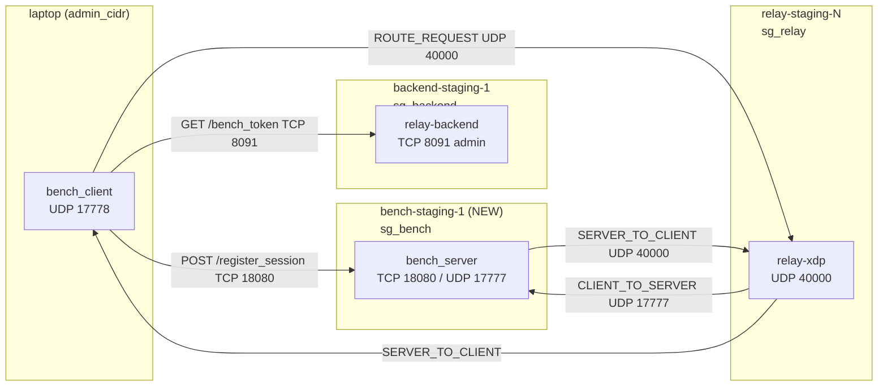

# Session Summary: bench-node - Dedicated Game Server Simulator Infrastructure

**Date:** 2026-05-09<br>
**Duration:** ~1 session (~3 interactions)<br>
**Focus Area:** infra / ansible / relay-bench<br>

## Objectives

- [x] Design dedicated EC2 instance for bench_server (game server simulator)
- [x] Define security group rules for bench node
- [x] Design Pulumi ComponentResource `BenchNode` (pattern: BackendNode)
- [x] Design Ansible playbook `bench-deploy.yml`
- [x] Define stack_outputs integration (export `bench_host`)
- [x] Define end-to-end workflow (pulumi up -> ansible deploy -> make bench-relay)
- [x] Implement and apply all changes (steps 1-6 done 2026-05-09; steps 7-10 pending)

## Work Completed

### Design: bench node topology

bench_server runs as an independent EC2 instance separate from relay and backend nodes,
simulating a real game server. Traffic flow:



**Why separate instance (not backend node):**
- Matches production topology: game server is always a separate host from relay-backend
- Avoids port conflicts with relay-backend (8090/8091) on backend node
- t3.micro cost is negligible (~$8/month); started/stopped around bench runs
- Security isolation: `sg_bench` only allows bench ports, not redis/backend ports

### Design: `infra/network.py` - `sg_bench`

New `NetworkResult` field `sg_bench: aws.ec2.SecurityGroup` added to `create_regional_network()`:

| Port | Protocol | Source | Purpose |
|------|----------|--------|---------|
| 18080 | TCP | `admin_cidr` | bench_client `POST /register_session` |
| 17777 | UDP | `0.0.0.0/0` | relay-xdp forwards `CLIENT_TO_SERVER` here |
| 22 | TCP | `admin_cidr` | SSH admin access |

### Design: `infra/bench_node.py` (new file)

`BenchNode` ComponentResource following the `BackendNode` pattern:
- Ubuntu 24.04 LTS AMI (same as all other nodes)
- `t3.micro` default instance type (overridable via `bench_instance_type` config)
- Elastic IP for stable address (same as backend node - avoids inventory churn)
- 8 GB gp3 root volume (no kernel module, no large binaries beyond bench_server)
- Placed in `backend_net` (same VPC/subnet/region as backend) - minimizes relay->bench latency
- `sg_bench` security group (not `sg_backend`)
- `Role: bench` tag

### Design: `infra/config.py` additions

Two new optional fields on `InfraConfig`:

| Field | Type | Default | Source |
|-------|------|---------|--------|
| `bench_enabled` | `bool` | `False` | `cfg.get_bool("bench_enabled")` |
| `bench_instance_type` | `str` | `"t3.micro"` | `cfg.get("bench_instance_type")` |

### Design: `infra/__main__.py` additions

```python
from bench_node import BenchNode

bench_node: BenchNode | None = None
if cfg.bench_enabled:
    bench_node = BenchNode(
        node_name=f"bench-{stack_name}-1",
        region=backend_region,
        instance_type=cfg.bench_instance_type,
        public_key_text=public_key_text,
        stack_name=stack_name,
        net=backend_net,
        provider=backend_provider,
    )

pulumi.export("bench", pulumi.Output.all(...) if bench_node else pulumi.Output.from_input(None))
```

### Design: `infra/stack_outputs.py` additions

`StackEnv` gets `bench_host: str = ""`. `parse_e2e_env()` reads `outputs["bench"]["public_ip"]`
(empty string if bench not provisioned). `format_env()` emits `export BENCH_HOST=...` when set.

### Design: `infra/Pulumi.staging.yaml` additions

```yaml
relay-xdp-infra:bench_enabled: "true"
relay-xdp-infra:bench_instance_type: t3.micro
```

Production `Pulumi.production.yaml` - never set `bench_enabled`.

### Design: `ansible/playbooks/bench-deploy.yml` (new file)

Playbook targeting `bench_servers` inventory group:
1. `copy` binary from `target/release/bench_server` to `/usr/local/bin/bench_server`
2. `copy` systemd unit `/etc/systemd/system/bench-server.service`
   - `BENCH_HTTP_PORT=18080`, `BENCH_UDP_PORT=17777`
   - `Restart=on-failure`, `User=ubuntu`
3. `systemd` - daemon_reload + enable + restart
4. verify `systemctl is-active bench-server` = `active`

### Design: `ansible/inventory/staging.yml` - new group

```yaml
bench_servers:
  hosts:
    bench-staging-1:
      ansible_host: <BENCH_HOST from pulumi output>
      ansible_user: ubuntu
```

Populated by updating `infra/inventory_gen.py` to read `bench.public_ip` from stack outputs,
or added manually after `pulumi up`.

### End-to-end workflow

```bash
# 1. Provision bench node
cd infra && pulumi up --stack staging

# 2. Build binary
cargo build --release -p relay-bench

# 3. Update inventory (if inventory_gen.py not yet updated - manual step)
# ansible/inventory/staging.yml: add bench_servers group with BENCH_HOST

# 4. Deploy bench_server
ansible-playbook -i ansible/inventory/staging.yml ansible/playbooks/bench-deploy.yml

# 5. Run benchmark
eval $(python infra/stack_outputs.py --stack staging --format env)
make bench-relay \
  RELAY_ADDR=$(echo $RELAY_PUBLIC_IPS | awk '{print $1}'):40000 \
  BACKEND_ADMIN=http://${BACKEND_HOST}:8091 \
  BENCH_SERVER_HTTP=${BENCH_HOST}:18080 \
  BENCH_SERVER_UDP=${BENCH_HOST}:17777
```

## Decisions Made

| Decision | Rationale | ADR |
|----------|-----------|-----|
| bench_server on dedicated EC2, not backend node | Matches prod topology (game server != relay-backend); avoids port conflicts; isolation via `sg_bench` | N/A |
| bench node in same region as backend (us-east-1) | relay-staging nodes exist in us-east-1 - relay -> bench latency is intra-region (~1ms) vs cross-region | N/A |
| `t3.micro` default instance type | bench_server is not CPU/network bound at < 10K PPS; minimal cost (~$8/month); stop when not in use | N/A |
| Elastic IP on bench node | Stable address survives stop/start; prevents inventory invalidation between bench runs | N/A |
| `bench_enabled: false` default, only set in staging yaml | Production must never run bench_server; staging opt-in via explicit config flag | N/A |
| Reuse `backend_net` (same VPC/subnet) for bench node | No new VPC needed - bench is in same region as backend; simplifies routing; relay->bench is public internet regardless | N/A |
| `inventory_gen.py` update deferred to next session | Manual staging.yml update unblocks bench runs now; automated gen is a cleanup task | N/A |

## Tests Added/Modified

| Test | Type | Status |
|------|------|--------|
| `test_stack_outputs_bench_host_present` | Unit (infra/test_stack_outputs.py) | Not yet implemented |
| `test_stack_outputs_bench_host_absent_when_not_provisioned` | Unit | Not yet implemented |

## Issues Encountered

| Issue | Resolution | Blocking |
|-------|------------|----------|
| `sg_bench` UDP 17777 must be open to `0.0.0.0/0` not just `admin_cidr` | relay-xdp forwards from its own public IP (not admin laptop) - source is relay node public IP | No |
| bench node needs `admin_cidr` for TCP 18080 | bench_client runs from laptop (admin_cidr); relay-backend admin port 8091 is also admin_cidr only - consistent | No |
| `NetworkResult` dataclass change adds `sg_bench` field - existing callers unaffected | `sg_bench` only referenced by `BenchNode`; `BackendNode` and `RelayNode` continue to use `sg_backend`/`sg_relay` | No |
| `pulumi.Output.from_input(None)` for absent bench export | Pulumi requires all exports to be `Output` type; `None` wrapped in `Output.from_input` satisfies type checker | No |

## Next Steps

1. ~~**High:** Implement `infra/network.py` - add `sg_bench` to `NetworkResult` and `create_regional_network()`~~ - done 2026-05-09
2. ~~**High:** Implement `infra/config.py` - add `bench_enabled` + `bench_instance_type` fields~~ - done 2026-05-09
3. ~~**High:** Create `infra/bench_node.py` - `BenchNode` ComponentResource~~ - done 2026-05-09
4. ~~**High:** Update `infra/__main__.py` - conditional `BenchNode` provision + `bench` export~~ - done 2026-05-09
5. ~~**High:** Update `infra/Pulumi.staging.yaml` - add `bench_enabled: "true"` + `bench_instance_type: t3.micro`~~ - done 2026-05-09
6. ~~**High:** Create `ansible/playbooks/bench-deploy.yml`~~ - done 2026-05-09
7. **Medium:** Update `infra/stack_outputs.py` - add `bench_host` to `StackEnv` + `format_env`
8. **Medium:** Update `infra/inventory_gen.py` - auto-populate `bench_servers` group from stack output
9. **Medium:** Update `Makefile` - add `bench-deploy` target (calls ansible bench-deploy.yml)
10. **Low:** Add `test_stack_outputs_bench_host_*` tests to `infra/test_stack_outputs.py`

## Files Changed

| Status | File |
|--------|------|
| A | `infra/bench_node.py` |
| A | `ansible/playbooks/bench-deploy.yml` |
| M | `infra/network.py` (added `sg_bench` to `NetworkResult` + `create_regional_network`) |
| M | `infra/config.py` (added `bench_enabled`, `bench_instance_type`) |
| M | `infra/__main__.py` (added `BenchNode` + `bench` export) |
| M | `infra/Pulumi.staging.yaml` (added `bench_enabled`, `bench_instance_type`) |
| M (pending) | `infra/stack_outputs.py` (add `bench_host` to `StackEnv` + `format_env`) |
| M (pending) | `infra/inventory_gen.py` (auto-populate `bench_servers` group) |
| M (pending) | `ansible/inventory/staging.yml` (add `bench_servers` group) |
| M (pending) | `Makefile` (add `bench-deploy` target) |

