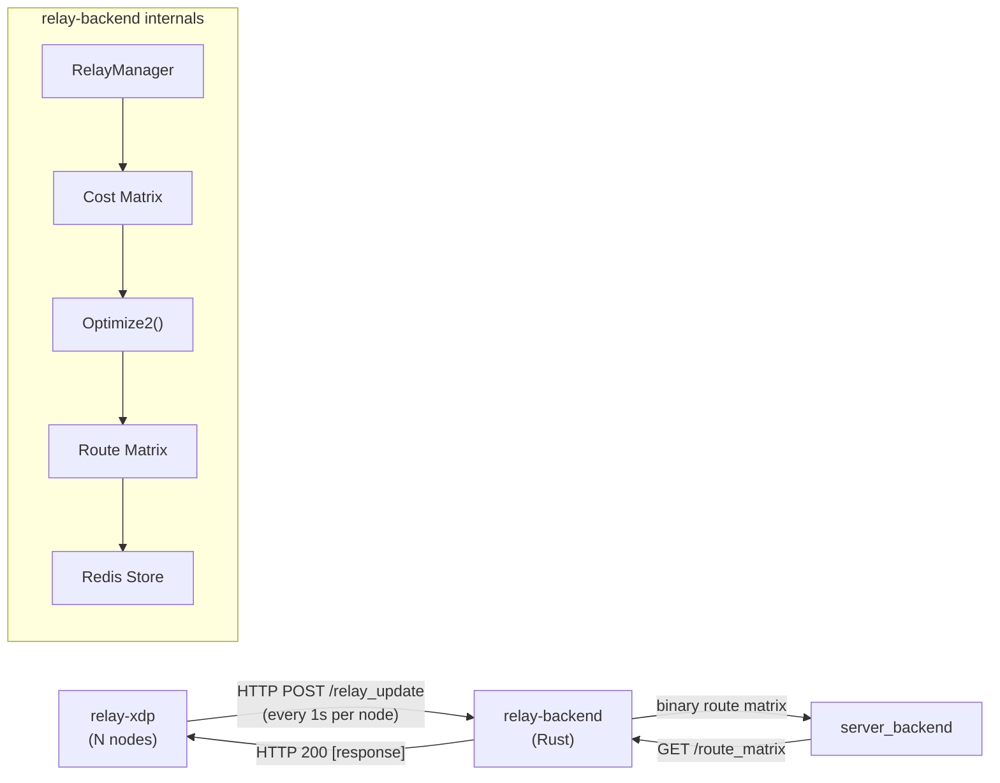
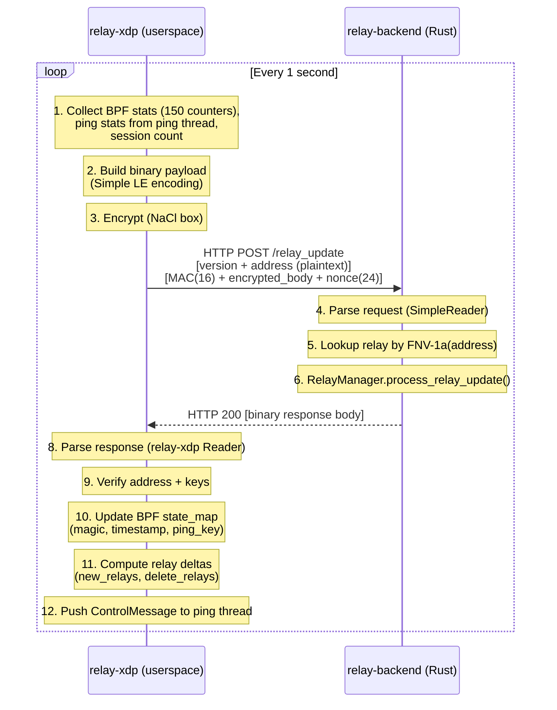
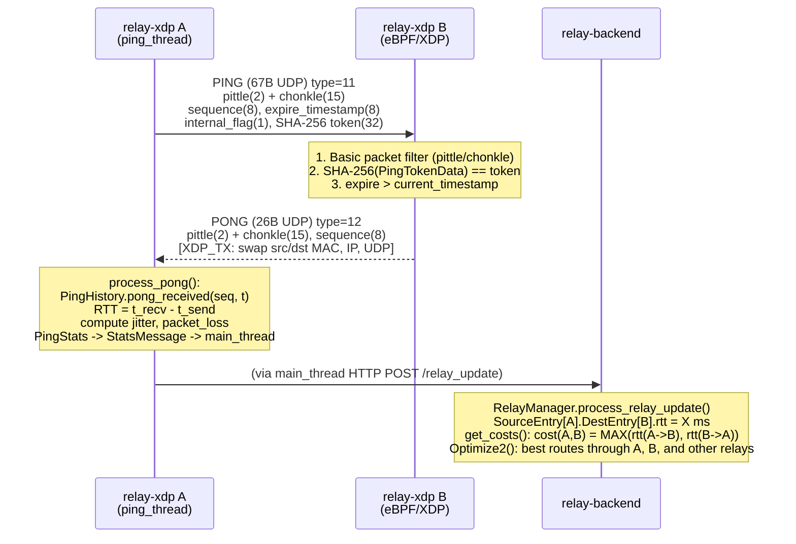

# Relay Backend (Rust) - Architecture and relay-xdp Interaction

## Overview

`relay-backend` is the **route computation brain** for the entire relay network: it ingests
latency data from all relay nodes, builds a cost matrix, computes optimal routes
(route matrix), and serves the results to `server_backend`.



---

## Table of Contents

- [Overview](#overview)
- [Module Structure](#module-structure)
- [Component Details](#component-details)
    - [1. Entry Point and Background Tasks](#1-entry-point-and-background-tasks-mainrs)
    - [2. Shared State](#2-shared-state-staters)
    - [3. HTTP Handlers](#3-http-handlers-handlersrs)
    - [4. Encoding](#4-encoding-encodingrs)
    - [5. Relay Update Protocol](#5-relay-update-protocol-relay_updaters)
    - [6. Relay Manager](#6-relay-manager-relay_managerrs)
    - [7. Cost Matrix](#7-cost-matrix-cost_matrixrs)
    - [8. Optimizer](#8-optimizer-optimizerrs)
    - [9. Route Matrix](#9-route-matrix-route_matrixrs)
    - [10. Redis Leader Election](#10-redis-leader-election-redis_clientrs)
- [Interaction with relay-xdp](#interaction-with-relay-xdp)
    - [Communication Flow Overview](#communication-flow-overview)
    - [Wire Format: Address Encoding Mismatch](#wire-format-address-encoding-mismatch)
    - [Relay Update Flow - Detail](#relay-update-flow---detail)
    - [Relay Ping Flow](#relay-ping-flow-data-source-for-cost-matrix)
    - [Relay ID Computation](#relay-id-computation)
- [Triangular Matrix](#triangular-matrix)
- [Configuration](#configuration)
- [Testing](#testing)
- [Dependencies](#dependencies)

---

## Module Structure

```
relay-backend/
├── Cargo.toml
├── ARCHITECTURE.md          (this file)
├── src/
│   ├── main.rs              # Entry point, background tasks, web server (axum + tokio)
│   ├── lib.rs               # Re-export modules for integration tests
│   ├── config.rs            # Read env vars into Config struct
│   ├── constants.rs         # Relay protocol constants + counter name arrays
│   ├── state.rs             # AppState: shared state between handlers + background tasks
│   ├── handlers.rs          # HTTP handlers (axum Router, 16 routes)
│   ├── encoding.rs          # Two encoding systems: Bitpacked (WriteStream/ReadStream) + Simple LE (SimpleWriter/SimpleReader)
│   ├── relay_update.rs      # Parse RelayUpdateRequest + build RelayUpdateResponse
│   ├── relay_manager.rs     # In-memory relay pair state tracker (RTT/jitter/loss per relay pair)
│   ├── cost_matrix.rs       # Cost matrix serialization (bitpacked)
│   ├── route_matrix.rs      # Route matrix serialization (bitpacked)
│   ├── optimizer.rs         # Optimize2: optimal route finding (multi-threaded)
│   ├── database.rs          # RelayData: relay config loaded from JSON file, validation, public keys
│   ├── redis_client.rs      # Redis leader election + data store/load
│   ├── metrics.rs           # Prometheus metrics rendering (per-relay counters + backend internals)
│   └── magic.rs             # Magic bytes + ping key rotation (3-value window, 10s interval)
└── tests/
    ├── integration_xdp.rs   # 18 test groups, 30 test functions: wire format, optimizer, relay manager
    ├── cross_crate_wire.rs  # 10 tests: relay-xdp Writer <-> relay-backend SimpleReader wire compat
    ├── e2e_encrypted.rs     # 11 tests: NaCl crypto_box encrypt/decrypt, tampered payloads
    ├── http_handler_integration.rs  # 6 tests: HTTP handler validation, error responses
    ├── json_loader_integration.rs   # 6 tests: JSON relay data -> encrypted request pipeline
    ├── pipeline_integration.rs      # 3 tests: multi-relay update -> cost -> optimizer pipeline
    └── helpers/
        └── mod.rs           # Test helpers: build/parse packets, wrappers
```

---

## Component Details

### 1. Entry Point and Background Tasks (`main.rs`)

Async application (tokio) with 4 background tasks running concurrently:

```
main()
  ├── config::read_config()              # Read env vars
  ├── RelayData::load_json() / empty()   # Load from JSON if RELAY_DATA_FILE set
  ├── RelayManager::new()                # In-memory state tracker
  ├── RedisLeaderElection::new()         # Leader election via Redis
  ├── AppState { ... }                   # Arc<AppState> shared state
  │
  ├── spawn update_initial_delay()       # Wait INITIAL_DELAY seconds before becoming ready
  ├── spawn leader_election_loop()       # Update leader status every 1 second
  ├── spawn update_relay_backend_instance()  # Register instance in Redis
  ├── spawn update_route_matrix()        # Core loop: cost -> optimize -> route matrix
  │
  └── axum::serve(router)               # HTTP server
```

**`update_route_matrix()`** is the main loop, running every `ROUTE_MATRIX_INTERVAL_MS`
(default 1000ms):

```
update_route_matrix() loop:
  1. relay_manager.get_relays_csv()       -> CSV for monitoring
  2. relay_manager.get_costs()            -> Cost matrix (triangular u8 array)
  3. CostMatrix::write()                  -> Serialize (bitpacked)
  4. optimizer::optimize2()               -> Route entries (parallelized)
  5. RouteMatrix::write()                 -> Serialize (bitpacked)
  6. leader_election.store() -> Redis     -> Leader writes data
  7. leader_election.load() <- Redis      -> All instances read data from leader
  8. route_matrix.analyze()               -> Logging metrics
```

### 2. Shared State (`state.rs`)

```rust
pub struct AppState {
    pub config: Arc<Config>,                         // Configuration (immutable)
    pub relay_data: Arc<RelayData>,                  // Relay metadata from JSON file
    pub relay_manager: Arc<RelayManager>,             // In-memory RTT/jitter/loss tracker
    pub relays_csv: RwLock<Vec<u8>>,                 // CSV output for /relays endpoint
    pub cost_matrix_data: RwLock<Vec<u8>>,            // Serialized cost matrix
    pub route_matrix_data: RwLock<Vec<u8>>,           // Serialized route matrix
    pub start_time: SystemTime,                       // Startup timestamp
    pub delay_completed: AtomicBool,                  // Whether initial delay has completed
    pub leader_election: Arc<RedisLeaderElection>,    // Redis leader election
}
```

### 3. HTTP Handlers (`handlers.rs`)

| Route                         | Method | Description                                           | Consumer         |
|-------------------------------|--------|-------------------------------------------------------|------------------|
| `/relay_update`               | POST   | Receive relay update packet, feed into RelayManager   | relay-xdp        |
| `/route_matrix`               | GET    | Binary route matrix (bitpacked)                       | server_backend   |
| `/cost_matrix`                | GET    | Binary cost matrix (bitpacked)                        | debug/monitoring |
| `/relays`                     | GET    | CSV relay list (name, status, sessions)               | debug            |
| `/relay_data`                 | GET    | JSON relay metadata (ids, lat/lng, datacenter)        | debug            |
| `/relay_counters/{name}`      | GET    | HTML auto-refresh counters per relay                  | debug            |
| `/relay_history/{src}/{dest}` | GET    | RTT/jitter/loss history between 2 relays              | debug            |
| `/costs`                      | GET    | Text costs between active relay pairs                 | debug            |
| `/active_relays`              | GET    | List of online relays                                 | debug            |
| `/health`, `/vm_health`       | GET    | "OK"                                                  | load balancer    |
| `/lb_health`                  | GET    | OK if route matrix exists and initial delay completed | load balancer    |
| `/ready`                      | GET    | OK if delay completed and leader election ready       | load balancer    |
| `/status`                     | GET    | "relay_backend (rust)"                                | debug            |

> The `/relay_update` handler supports two modes:
> - **Direct mode** (`RELAY_BACKEND_PRIVATE_KEY` set): decrypts NaCl crypto_box request
>   from relay-xdp, parses it, feeds into RelayManager, and returns a full
>   `RelayUpdateResponse` body (relay list, magic bytes, ping key, keys).
> - **Legacy mode** (no private key): receives plaintext from a gateway proxy,
>   parses it, feeds into RelayManager, and returns a `RelayUpdateResponse` body.
>
> Magic bytes and ping key are generated and rotated by `MagicRotator` (every 10s).
> See `magic.rs`.

### 4. Encoding (`encoding.rs`)

Two parallel encoding systems serving different purposes:

#### 4.1 Simple LE Encoding - for relay update packets

`SimpleReader` / `SimpleWriter`: little-endian byte-level, **no bitpacking**. Used for
relay-xdp <-> relay-backend communication (relay update request/response).

```
SimpleWriter::write_address(addr):
  if addr == 0.0.0.0:0 -> write_uint8(0)                           // NONE (1 byte)
  else                  -> write_uint8(1) + ip_octets(4) + port_le(2)  // IPv4 (7 bytes)

SimpleReader::read_address():
  addr_type = read_uint8()
  if 0 -> return 0.0.0.0:0
  if 1 -> ip = [byte0, byte1, byte2, byte3], port = read_uint16_le()
  if 2 -> skip 18 bytes (IPv6, return unspecified)
```

**Wire format address (IPv4):**

```
Byte:  [0]     [1]    [2]    [3]    [4]    [5]     [6]
       type=1  ip[0]  ip[1]  ip[2]  ip[3]  port_lo port_hi
```

Example: `10.0.0.1:40000` -> `[0x01, 0x0A, 0x00, 0x00, 0x01, 0x40, 0x9C]`

#### 4.2 Bitpacked Encoding - for cost matrix and route matrix

`WriteStream` / `ReadStream`: bitpacked serialization for cost/route matrices.
Used for large data structures (cost matrix, route matrix) transmitted to `server_backend`.

```
WriteStream::serialize_address(addr):
  if addr == 0.0.0.0:0 -> write 2 bits (IP_ADDRESS_NONE=0)
  else -> write 2 bits (IP_ADDRESS_IPV4=1) + align + 4 bytes ip + 16 bits port

ReadStream::serialize_address():
  addr_type = read 2 bits
  if IPV4 -> align + read 4 bytes ip + read 16 bits port
```

### 5. Relay Update Protocol (`relay_update.rs`)

#### 5.1 RelayUpdateRequest - sent by relay-xdp

Binary structure (Simple LE encoding):

```
+-----------------------------------------------------------------+
| version (u8)                                                    | 1 byte
| address: type(u8) + ip(4 bytes) + port(u16 LE)                 | 7 bytes
| current_time (u64 LE)                                           | 8 bytes
| start_time (u64 LE)                                             | 8 bytes
| num_samples (u32 LE)                                            | 4 bytes
| +--- per sample (num_samples times) -------------------------+  |
| | relay_id (u64 LE)                                          |  | 8 bytes
| | rtt (u8)                                                   |  | 1 byte
| | jitter (u8)                                                |  | 1 byte
| | packet_loss (u16 LE)                                       |  | 2 bytes
| +------------------------------------------------------------+  |
| session_count (u32 LE)                                          | 4 bytes
| envelope_bandwidth_up_kbps (u32 LE)                             | 4 bytes
| envelope_bandwidth_down_kbps (u32 LE)                           | 4 bytes
| packets_sent_per_second (f32 LE)                                | 4 bytes
| packets_received_per_second (f32 LE)                            | 4 bytes
| bandwidth_sent_kbps (f32 LE)                                    | 4 bytes
| bandwidth_received_kbps (f32 LE)                                | 4 bytes
| client_pings_per_second (f32 LE)                                | 4 bytes
| server_pings_per_second (f32 LE)                                | 4 bytes
| relay_pings_per_second (f32 LE)                                 | 4 bytes
| relay_flags (u64 LE)                                            | 8 bytes
| relay_version: len(u32 LE) + bytes                              | 4+N bytes
| num_relay_counters (u32 LE) = 150                               | 4 bytes
| counters[150] (u64 LE x 150)                                   | 1200 bytes
+-----------------------------------------------------------------+
```

#### 5.2 RelayUpdateResponse - returned by relay-backend

```
+-----------------------------------------------------------------+
| version (u8)                                                    | 1 byte
| timestamp (u64 LE)                                              | 8 bytes
| num_relays (u32 LE)                                             | 4 bytes
| +--- per relay (num_relays times) ----------------------------+ |
| | relay_id (u64 LE)                                           | | 8 bytes
| | address: type(u8) + ip(4) + port(u16 LE)                    | | 7 bytes
| | internal_flag (u8)                                           | | 1 byte
| +-------------------------------------------------------------+ |
| target_version: len(u32 LE) + bytes                             | 4+N bytes
| upcoming_magic (8 bytes)                                        | 8 bytes
| current_magic (8 bytes)                                         | 8 bytes
| previous_magic (8 bytes)                                        | 8 bytes
| expected_public_address: type(u8) + ip(4) + port(u16 LE)       | 7 bytes
| has_internal (u8)                                               | 1 byte
| [if has_internal] internal_address: type(u8)+ip(4)+port(2)      | 7 bytes (optional)
| expected_relay_public_key (32 bytes)                            | 32 bytes
| expected_relay_backend_public_key (32 bytes)                    | 32 bytes
| encrypted_test_token (111 bytes)                                | 111 bytes
| ping_key (32 bytes)                                             | 32 bytes
+-----------------------------------------------------------------+
```

### 6. Relay Manager (`relay_manager.rs`)

Two-level in-memory structure tracking RTT/jitter/packet_loss between **every relay pair**:

```
RelayManager
  └── inner: RwLock<RelayManagerInner>
        └── source_entries: HashMap<relay_id, SourceEntry>
              ├── last_update_time, relay_id, relay_name, relay_address
              ├── sessions, relay_version, shutting_down
              ├── counters: [u64; 150]
              └── dest_entries: HashMap<dest_relay_id, DestEntry>
                    ├── rtt, jitter, packet_loss (current values)
                    └── history_rtt/jitter/packet_loss: [f32; 300] (ring buffer)
```

**`process_relay_update()`**: For each sample (relay A pings relay B with X ms RTT):

- Create or update `SourceEntry` for relay A
- Time out stale `DestEntry` records (> 30 seconds without update)
- Write to ring buffer history for `DestEntry[B]`
- If `enable_history`: RTT = **max** of history, Jitter/PacketLoss = **mean** of history
- Otherwise: use the latest value directly

**`get_costs()`**: Builds a **triangular matrix** (n*(n-1)/2 entries):

- Only computes for active relay pairs (not timed out, not shutting down)
- rtt(i,j) = MAX(rtt(i->j), rtt(j->i)), conservative worst-case
- jitter(i,j) = MAX(jitter(i->j), jitter(j->i))
- packet_loss(i,j) = MAX(packet_loss(i->j), packet_loss(j->i))
- If RTT < 255ms AND jitter <= max_jitter AND packet_loss <= max_packet_loss: cost = ceil(RTT)
- If cost = 0: set to 255 (edge case: 0ms RTT treated as unreachable)
- Otherwise: cost = 255 (unreachable)

### 7. Cost Matrix (`cost_matrix.rs`)

Bitpacked serialization (uses `WriteStream`/`ReadStream`):

```
CostMatrix (version 2):
  version (u32, 32 bits)
  num_relays (u32, 32 bits)
  per relay:
    relay_id (u64, 64 bits)
    address (bitpacked: 2 bits type + aligned 4 bytes ip + 16 bits port)
    name (string: integer length + aligned bytes)
    latitude (f32, 32 bits)
    longitude (f32, 32 bits)
    datacenter_id (u64, 64 bits)
  costs[] (aligned bytes, triangular matrix)
  relay_price[] (aligned bytes, version >= 2)
  dest_relays[] (1 bit per relay)
```

### 8. Optimizer (`optimizer.rs`)

**Optimize2**: algorithm for finding optimal routes through relays, parallelized
via `std::thread::scope` (manual segment slicing, not rayon):

```
Phase 1: Build indirect matrix (parallel per segment)
  For each pair (i,j), find relay x such that:
    cost(i->x) + cost(x->j) < cost(i->j)
  Keep at most MAX_INDIRECTS=8 best intermediate relays

Phase 2: Build routes (parallel per segment)
  Try 5 route patterns:
    i -> j                           (direct, 2 hops)
    i -> (k) -> j                    (1 intermediate, 3 hops)
    i -> (x) -> k -> j               (2 intermediates, 4 hops)
    i -> k -> (y) -> j               (2 intermediates, 4 hops)
    i -> (x) -> k -> (y) -> j        (3 intermediates, 5 hops)

  Only keep routes with cost < direct cost
  Each relay pair keeps at most MAX_ROUTES_PER_ENTRY=16 routes
  Routes are sorted by cost in ascending order
  Duplicate routes are removed by hash (route_hash = FNV variant)
```

Output: `Vec<RouteEntry>`, one entry per relay pair in the triangular matrix:

```rust
pub struct RouteEntry {
    pub direct_cost: i32,                                    // Direct cost
    pub num_routes: i32,                                     // Number of routes found
    pub route_cost: [i32; 16],                               // Cost per route
    pub route_price: [i32; 16],                              // Price per route
    pub route_hash: [u32; 16],                               // Unique hash per route
    pub route_num_relays: [i32; 16],                         // Number of relays in route
    pub route_relays: [[i32; MAX_ROUTE_RELAYS]; 16],         // Relay indices
}
```

### 9. Route Matrix (`route_matrix.rs`)

Bitpacked serialization, version 4:

```
RouteMatrix:
  version (8 bits)
  created_at (u64, 64 bits)
  bin_file_bytes (integer, 0..MAX_DATABASE_SIZE)
  bin_file_data (aligned bytes)
  num_relays (u32, 32 bits)
  per relay: relay_id, address, name, lat, lng, datacenter_id
  dest_relays[] (1 bit per relay)
  num_entries (u32, 32 bits)
  per entry:
    direct_cost (integer, 0..255)
    num_routes (integer, 0..16)
    per route:
      route_cost (integer, -1..255)
      route_num_relays (integer, 0..5)
      route_hash (u32, 32 bits)
      route_relays[num_relays] (integer, 0..i32::MAX)
  cost_matrix_size (u32, version >= 2)
  optimize_time (u32, version >= 2)
  costs[] (aligned bytes, version >= 3)
  relay_price[] (aligned bytes, version >= 4)
```

### 10. Redis Leader Election (`redis_client.rs`)

Supports multiple relay-backend instances running concurrently (horizontal scaling):

```
Every 1 second:
  1. Write instance entry to Redis hash:
     key: "{service}-instance-{version}-{period}"
     field: instance_id
     value: "{instance_id}|{start_time}|{update_time}"

  2. Read all entries from 2 periods (current + previous)

  3. Sort by start_time, earliest = leader

  4. Leader: store("relays", data), store("cost_matrix", data), store("route_matrix", data)
     All instances: load data from leader's key
```

Ensures all instances serve the **same version** of the route matrix (from the leader).

---

## Interaction with relay-xdp

### Communication Flow Overview



### Wire Format: Address Encoding Mismatch

**This is the most critical point** in the relay-xdp <-> relay-backend interaction.

The two crates use **different IP address representations**:

|                      | relay-backend (SimpleWriter/SimpleReader)              | relay-xdp (Writer/Reader)                                |
|----------------------|--------------------------------------------------------|----------------------------------------------------------|
| **IP storage**       | 4 raw octets `[10, 0, 0, 1]`                           | u32 host-order, written via `write_uint32(addr.to_be())` |
| **Wire format**      | `[type, ip[0], ip[1], ip[2], ip[3], port_lo, port_hi]` | `[type, LE(addr_be), port_lo, port_hi]`                  |
| **Example 10.0.0.1** | `[0x01, 0x0A, 0x00, 0x00, 0x01, 0x40, 0x9C]`           | `[0x01, 0x01, 0x00, 0x00, 0x0A, 0x40, 0x9C]` (reversed!) |

**relay-xdp** (`encoding.rs`):

```rust
// Writer: writes address as BE u32 -> stored as LE bytes
pub fn write_address_ipv4(&mut self, address_be: u32, port: u16) {
    self.write_uint8(RELAY_ADDRESS_IPV4);
    self.write_uint32(address_be);   // write_uint32 stores as LE, so BE address gets byte-swapped
    self.write_uint16(port);
}

// Reader: reads LE u32 -> converts from BE to host
pub fn read_address(&mut self) -> (u32, u16) {
    let _addr_type = self.read_uint8();
    let addr_be = self.read_uint32();      // reads LE u32
    let port = self.read_uint16();
    (u32::from_be(addr_be), port)          // convert BE -> host
}
```

**relay-backend** (`encoding.rs`):

```rust
// SimpleWriter: writes 4 raw octets directly
pub fn write_address(&mut self, addr: &SocketAddrV4) {
    self.write_uint8(1);                   // IPv4
    let octets = ip.octets();
    self.data[self.index..self.index + 4].copy_from_slice(&octets);  // raw octets
    self.data[self.index..self.index + 2].copy_from_slice(&port.to_le_bytes());
}

// SimpleReader: reads 4 raw octets directly
pub fn read_address(&mut self) -> Option<SocketAddrV4> {
    let ip = Ipv4Addr::new(
        self.data[self.index],             // raw octets
        self.data[self.index + 1],
        self.data[self.index + 2],
        self.data[self.index + 3],
    );
    let port = u16::from_le_bytes([self.data[self.index + 4], self.data[self.index + 5]]);
}
```

**Result**: relay-backend (SimpleWriter/SimpleReader) writes IP octets directly in network
byte order. relay-xdp (Writer/Reader) writes the BE address via `write_uint32`
(LE storage), producing reversed byte order.

**In direct mode** (`RELAY_BACKEND_PRIVATE_KEY` set), relay-xdp sends encrypted requests
directly to relay-backend, which decrypts them via NaCl crypto_box. The handler parses
the relay address from the plaintext header (bytes 2-5 are raw IP octets due to the
`LE(BE(host)) = network order` identity on little-endian machines), looks up the relay's
public key, and decrypts the body. In **legacy mode** (no private key), a gateway proxy
decrypts and forwards the plaintext payload to relay-backend.

However, **relay-xdp reads the response directly** from relay-backend. relay-backend's
SimpleWriter writes `[0x0A, 0x00, 0x00, 0x01]` (raw octets), and relay-xdp's Reader reads
via `read_uint32()` (LE) to get `0x0100000A`, then `u32::from_be()` produces `0x0A000001`.
**Compatible!** Because raw IP octets are identical to network byte order (big-endian),
reading them as a LE u32 and then calling `from_be` yields the correct result.

### Relay Update Flow - Detail

#### Step 1: relay-xdp builds request (`main_thread.rs`)

```rust
// relay-xdp main_thread.rs::update()
let mut update_data = Vec::with_capacity(10 * 1024 * 1024);
let mut w = Writer::new( & mut update_data);

w.write_uint8(1);                           // version
w.write_uint8(RELAY_ADDRESS_IPV4);           // address type
w.write_uint32( self .config.relay_public_address.to_be());  // IP (BE -> LE storage)
w.write_uint16( self .config.relay_port);      // port (LE)

w.write_uint64(local_timestamp);             // current_time
w.write_uint64( self .start_time);             // start_time

w.write_uint32(ping_stats.num_relays as u32);  // num_samples
for i in 0..ping_stats.num_relays {
w.write_uint64(ping_stats.relay_ids[i]);
w.write_uint8(rtt);                      // ceil, clamped 0..255
w.write_uint8(jitter);                   // ceil, clamped 0..255
w.write_uint16(packet_loss);             // (loss/100) * 65535, clamped 0..65535
}

// ... counters, flags, version, 150 counters ...

// Encrypt: NaCl crypto_box (SalsaBox)
// Output: header(plaintext) + MAC(16) + ciphertext + nonce(24)
```

#### Step 2: relay-backend parses request (`handlers.rs` + `relay_update.rs`)

```rust
// handlers.rs: relay_update_handler()
let request = RelayUpdateRequest::read( & body) ?;
let addr_str = format!("{}", request.address);     // "10.0.0.1:40000"
let rid = relay_id( & addr_str);                     // FNV-1a hash
let relay_index = relay_data.relay_id_to_index.get( & rid) ?;

state.relay_manager.process_relay_update(
current_time, rid, relay_name, relay_address,
request.session_count, & request.relay_version, request.relay_flags,
num_samples, & request.sample_relay_id, & request.sample_rtt,
& request.sample_jitter, & request.sample_packet_loss, & request.relay_counters,
);
```

#### Step 3: relay-xdp parses response (`main_thread.rs`)

```rust
// relay-xdp main_thread.rs::parse_update_response()
let mut r = Reader::new(data);

let version = r.read_uint8();               // must be 1
let backend_timestamp = r.read_uint64();

let num_relays = r.read_uint32() as usize;
for _ in 0..num_relays {
let id = r.read_uint64();
let addr_type = r.read_uint8();          // must be 1 (IPv4)
let addr_be = r.read_uint32();           // LE -> value = octets as LE u32
let addr = u32::from_be(addr_be);        // convert -> host order
let port = r.read_uint16();
let internal = r.read_uint8();
relay_ping_set.push(id, addr, port, internal);
}

let _target_version = r.read_string(RELAY_VERSION_LENGTH);

// Magic values (raw bytes, no endian conversion needed)
r.read_bytes_into( & mut next_magic);          // 8 bytes
r.read_bytes_into( & mut current_magic);       // 8 bytes
r.read_bytes_into( & mut previous_magic);      // 8 bytes

// Expected address verification
let (expected_public_address, expected_port) = r.read_address();
assert!(self.config.relay_public_address == expected_public_address);
assert!(self.config.relay_port == expected_port);

// Keys + tokens
r.read_bytes_into( & mut expected_relay_pk);   // 32 bytes
r.read_bytes_into( & mut _expected_backend_pk); // 32 bytes
let _dummy = r.read_bytes(RELAY_ENCRYPTED_ROUTE_TOKEN_BYTES);  // 111 bytes
r.read_bytes_into( & mut ping_key);            // 32 bytes

// Update BPF state
state_map.set(0, RelayState {
current_timestamp: backend_timestamp,
current_magic, previous_magic, next_magic, ping_key,
});
```

### Relay Ping Flow (data source for cost matrix)



### Relay ID Computation

Both relay-xdp and relay-backend use **FNV-1a 64-bit** hash on the address string:

```rust
// relay-backend relay_update.rs
pub fn relay_id(address: &str) -> u64 {
    fnv1a_64(address.as_bytes())  // "10.0.0.1:40000" -> u64
}

fn fnv1a_64(data: &[u8]) -> u64 {
    const FNV_OFFSET: u64 = 14695981039346656037;
    const FNV_PRIME: u64 = 1099511628211;
    let mut hash = FNV_OFFSET;
    for &b in data {
        hash ^= b as u64;
        hash = hash.wrapping_mul(FNV_PRIME);
    }
    hash
}
```

---

## Triangular Matrix

Used to store symmetric data between N relays (costs, routes) without wasting memory:

```
For N=4 relays (A, B, C, D):

Full matrix (wasteful):
     A   B   C   D
A    -  10  20  30
B   10   -  15  25
C   20  15   -  12
D   30  25  12   -

Triangular (only stores lower half):
index 0: (1,0) = A-B = 10
index 1: (2,0) = A-C = 20
index 2: (2,1) = B-C = 15
index 3: (3,0) = A-D = 30
index 4: (3,1) = B-D = 25
index 5: (3,2) = C-D = 12

Size: N*(N-1)/2 = 4*3/2 = 6 entries instead of 16

tri_matrix_index(i, j):
  (i,j) -> if i > j: i*(i+1)/2 - i + j
           else: swap(i,j) then compute
```

---

## Configuration

All configuration via environment variables:

| Env Var                     | Type   | Default        | Purpose                                 |
|-----------------------------|--------|----------------|-----------------------------------------|
| `HTTP_PORT`                 | u16    | 80             | HTTP server port                        |
| `MAX_JITTER`                | i32    | 1000           | Maximum jitter threshold (ms)           |
| `MAX_PACKET_LOSS`           | f32    | 100.0          | Maximum packet loss threshold (%)       |
| `ROUTE_MATRIX_INTERVAL_MS`  | u64    | 1000           | Route matrix computation interval (ms)  |
| `INITIAL_DELAY`             | u64    | 15             | Delay before service becomes ready (s)  |
| `ENABLE_RELAY_HISTORY`      | bool   | false          | Use ring buffer history for RTT         |
| `REDIS_HOSTNAME`            | string | 127.0.0.1:6379 | Redis address                           |
| `INTERNAL_ADDRESS`          | string | 127.0.0.1      | Internal address for Redis registration |
| `INTERNAL_PORT`             | string | = HTTP_PORT    | Internal port for Redis registration    |
| `RELAY_BACKEND_PUBLIC_KEY`  | base64 | none           | Public key for crypto (optional)        |
| `RELAY_BACKEND_PRIVATE_KEY` | base64 | none           | Private key for crypto (optional)       |
| `RELAY_DATA_FILE`           | string | none           | Path to relay data JSON file (optional) |

---

## Testing

### Unit Tests

| Module       | Count | Description                                        |
|--------------|-------|----------------------------------------------------|
| `encoding`   | 3     | bits_required, tri_matrix, WriteStream/ReadStream   |
| `database`   | 16    | JSON loading, validation, sort order, public keys, internal addresses |
| `metrics`    | 3     | Counter name arrays, label escaping                |

### Integration Tests (`tests/integration_xdp.rs`)

18 test groups, **30 `#[test]` functions** verifying wire format compatibility and correctness:

| Test                                                    | Description                                         |
|---------------------------------------------------------|-----------------------------------------------------|
| `test_fnv1a_relay_id_matches_go`                        | FNV-1a hash matches expected test vectors           |
| `test_relay_update_request_wire_format`                 | Parse relay update request from raw bytes           |
| `test_relay_update_request_shutting_down`               | Request with relay_flags=1                          |
| `test_relay_update_response_wire_format`                | Build + parse response roundtrip                    |
| `test_relay_update_response_with_internal_address`      | Response with internal address                      |
| `test_cost_matrix_roundtrip`                            | Cost matrix write/read roundtrip                    |
| `test_cost_matrix_empty_relays`                         | Cost matrix with no relays                          |
| `test_route_matrix_roundtrip`                           | Route matrix write/read roundtrip                   |
| `test_relay_manager_process_update_and_get_costs`       | RelayManager cost computation                       |
| `test_relay_manager_shutting_down_excludes_from_active` | Shutting-down relay filtered out                    |
| `test_relay_manager_timeout_expired_entries`            | Expired relay timeout (30s)                         |
| `test_relay_manager_with_history_enabled`               | History ring buffer mode                            |
| `test_relay_manager_packet_loss_filtering`              | Filter relay pairs with high packet loss            |
| `test_relay_manager_jitter_filtering`                   | Filter relay pairs with high jitter                 |
| `test_optimizer_no_relays`                              | Optimize2 with empty input                          |
| `test_optimizer_two_relays_direct_only`                 | Optimize2 direct route (2 relays)                   |
| `test_optimizer_three_relays_finds_indirect_route`      | Optimize2 finds indirect route                      |
| `test_optimizer_no_improvement_skips_indirect`          | Optimize2 skips when no improvement                 |
| `test_optimizer_stress_20_relays`                       | Optimize2 stress test with 20 relays, multi-segment |
| `test_tri_matrix_length`                                | Triangular matrix length formula                    |
| `test_tri_matrix_index_symmetry`                        | tri_matrix_index(i,j) == tri_matrix_index(j,i)      |
| `test_tri_matrix_index_values`                          | Triangular matrix known index values                |
| `test_relays_csv_format`                                | CSV output format verification                      |
| `test_bitpacked_stream_roundtrip`                       | Bitpacked encoding roundtrip                        |
| `test_route_matrix_analysis_basic`                      | Route matrix analysis metrics                       |
| `test_end_to_end_relay_update_to_cost_pipeline`         | Full pipeline: 4 relays -> costs -> optimize        |
| `test_simple_writer_address_encoding_matches_go`        | SimpleWriter address matches expected wire format   |
| `test_simple_writer_none_address`                       | SimpleWriter NONE address encoding                  |
| `test_route_hash_determinism`                           | Route hash is deterministic and order-dependent     |
| `test_relay_update_request_max_samples`                 | Request with 100 samples stress test                |

### Unit Tests (`src/encoding.rs`)

- `test_bits_required`: bit utilities
- `test_tri_matrix`: triangular matrix index
- `test_write_read_roundtrip`: WriteStream/ReadStream roundtrip

### Cross-Crate Wire Tests (`tests/cross_crate_wire.rs`)

10 tests verifying that relay-xdp's `Writer`/`Reader` and relay-backend's
`SimpleWriter`/`SimpleReader` produce compatible wire format:

| Test                                               | Description                                     |
|----------------------------------------------------|-------------------------------------------------|
| `test_xdp_writer_request_parsed_by_backend`        | relay-xdp request parsed by relay-backend       |
| `test_backend_response_parsed_by_xdp_reader`       | relay-backend response parsed by relay-xdp      |
| `test_address_encoding_request_byte_level`          | Byte-level address encoding in requests         |
| `test_address_encoding_response_byte_level`         | Byte-level address encoding in responses        |
| `test_magic_bytes_preserved_cross_crate`            | Magic bytes roundtrip across crates             |
| `test_ping_key_preserved_cross_crate`               | Ping key roundtrip across crates                |
| `test_multi_relay_response_cross_crate`             | Multi-relay response parsing                    |
| `test_none_address_encoding_cross_crate`            | NONE address encoding compatibility             |
| `test_request_shutting_down_flag_cross_crate`       | Shutting down flag preserved                    |
| `test_response_with_internal_address_cross_crate`   | Internal address in response                    |

### End-to-End Encrypted Tests (`tests/e2e_encrypted.rs`)

11 tests verifying NaCl crypto_box encryption between relay-xdp and relay-backend:

| Test                                                    | Description                                    |
|---------------------------------------------------------|------------------------------------------------|
| `test_e2e_encrypted_request_decrypts_and_returns_ok`    | Encrypted request decrypts successfully        |
| `test_e2e_encrypted_request_updates_relay_manager`      | Decrypted request updates relay manager state  |
| `test_e2e_encrypted_response_contains_expected_keys`    | Response contains correct keys                 |
| `test_e2e_multiple_encrypted_requests_succeed`          | Multiple sequential encrypted requests         |
| `test_e2e_plaintext_mode_when_no_crypto_keys`           | Plaintext mode without private key             |
| `test_e2e_tampered_ciphertext_returns_bad_request`      | Tampered ciphertext rejected                   |
| `test_e2e_tampered_mac_returns_bad_request`             | Tampered MAC rejected                          |
| `test_e2e_tampered_nonce_returns_bad_request`           | Tampered nonce rejected                        |
| `test_e2e_truncated_encrypted_body_returns_bad_request` | Truncated body rejected                        |
| `test_e2e_unknown_relay_in_encrypted_header_returns_error` | Unknown relay address rejected              |
| `test_e2e_wrong_relay_key_returns_bad_request`          | Wrong relay key rejected                       |

### HTTP Handler Tests (`tests/http_handler_integration.rs`)

6 tests verifying HTTP handler behavior:

| Test                                             | Description                                     |
|--------------------------------------------------|-------------------------------------------------|
| `test_relay_update_valid_request_returns_ok`      | Valid request returns HTTP 200                  |
| `test_relay_update_too_large_returns_error`       | Oversized request rejected                      |
| `test_relay_update_too_small_returns_bad_request` | Undersized request rejected                     |
| `test_relay_update_invalid_format_returns_bad_request` | Invalid format rejected                    |
| `test_relay_update_unknown_relay_returns_not_found` | Unknown relay returns 404                     |
| `test_relay_update_updates_relay_manager_state`   | Valid request updates relay manager             |

### JSON Loader Tests (`tests/json_loader_integration.rs`)

6 tests verifying JSON relay data loading and encrypted request pipeline:

| Test                                                       | Description                                 |
|------------------------------------------------------------|---------------------------------------------|
| `test_json_loaded_relay_encrypted_request_returns_ok`       | JSON-loaded relay accepts encrypted request |
| `test_json_loaded_relay_encrypted_request_updates_relay_manager` | Request updates relay manager          |
| `test_json_loaded_relay_response_echoes_correct_public_key` | Response echoes correct public key         |
| `test_json_loaded_relay_wrong_key_returns_bad_request`      | Wrong key rejected for JSON-loaded relay   |
| `test_json_loaded_two_relays_see_each_other_as_peers`       | Two relays appear as peers in responses    |
| `test_json_file_load_then_encrypted_request`                | File load -> encrypted request pipeline    |

### Pipeline Tests (`tests/pipeline_integration.rs`)

3 tests verifying the full relay update -> cost matrix -> optimizer pipeline:

| Test                                          | Description                                      |
|-----------------------------------------------|--------------------------------------------------|
| `test_four_relay_updates_to_cost_matrix`       | 4 relay updates produce valid cost matrix        |
| `test_indirect_route_discovery_pipeline`       | Optimizer discovers indirect routes              |
| `test_shutting_down_relay_excluded_from_costs` | Shutting-down relay excluded from cost matrix    |

### Running Tests

```bash
cargo test -p relay-backend                    # All tests (22 unit + 66 integration = 88 total)
cargo test -p relay-backend -- --test-threads=1  # Sequential (if needed)
```

---

## Dependencies

| Crate                  | Version    | Purpose                                  |
|------------------------|------------|------------------------------------------|
| `axum`                 | 0.8        | HTTP web framework                       |
| `tokio`                | 1 (full)   | Async runtime                            |
| `tower-http`           | 0.6        | HTTP middleware (trace)                  |
| `redis`                | 0.27       | Redis client (tokio-comp)                |
| `serde` + `serde_json` | 1          | JSON serialization (relay_data endpoint) |
| `base64`               | 0.22       | Decode env var keys                      |
| `uuid`                 | 1 (v4)     | Instance ID for leader election          |
| `env_logger` + `log`   | 0.11 / 0.4 | Logging                                  |
| `anyhow`               | 1          | Error handling                           |
| `num_cpus`             | 1          | Detect CPU count for parallelism         |

> **Note**: The optimizer uses `std::thread::scope` (standard library) for parallel
> processing, not rayon.
