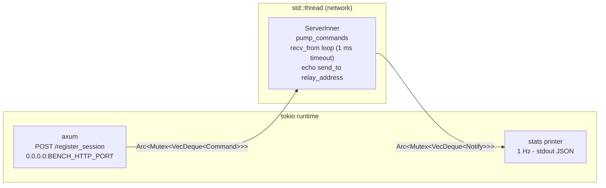
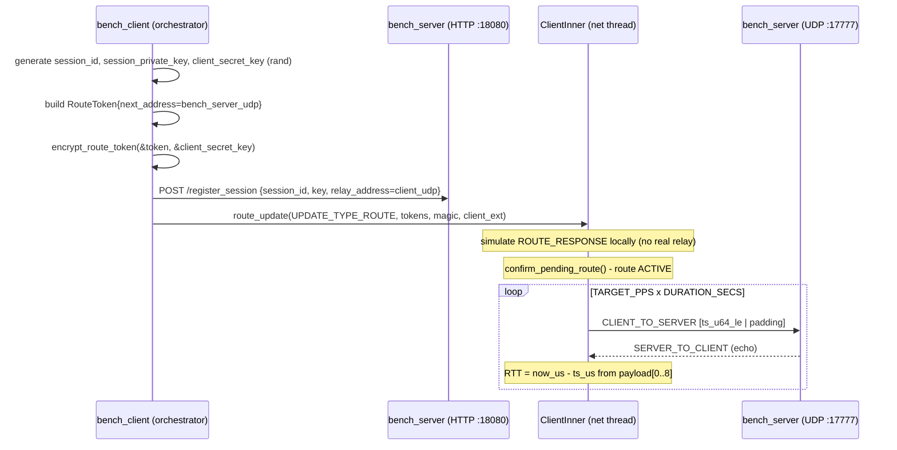
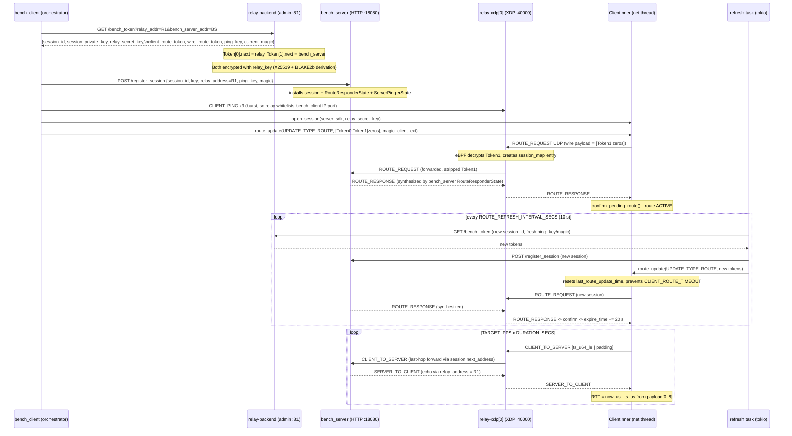
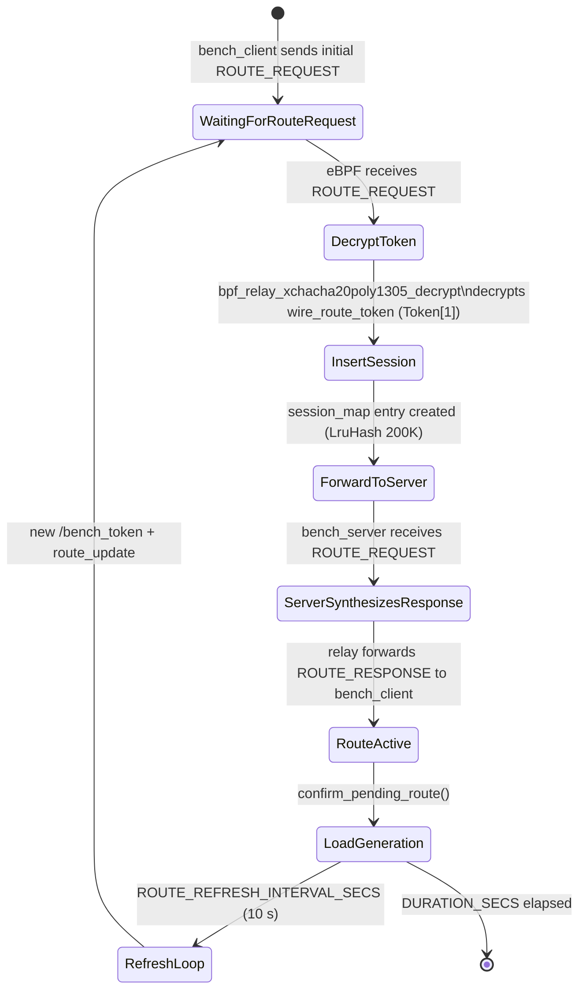

# relay-bench

UDP benchmark harness for relay-xdp. Measures end-to-end RTT and packet loss
for both direct (loopback) and relay (live XDP) code paths using the same
`relay-sdk` primitives as a real game client and server.

## Binaries

| Binary | Description |
|--------|-------------|
| `bench_server` | Echo server - receives CLIENT_TO_SERVER, sends SERVER_TO_CLIENT echo |
| `bench_client` | Load generator - sends packets, measures RTT p50/p95/p99 |

## Quick Start

```bash
# Direct mode (no relay-xdp required, loopback only)
make bench-local

# Relay mode (requires live relay-xdp + relay-backend)
make bench-relay RELAY_ADDR=10.0.0.1:40000 BACKEND_ADMIN=http://10.0.0.2:81
```

## Environment Variables

### bench_client

| Variable | Default | Description |
|----------|---------|-------------|
| `BENCH_MODE` | `direct` | `direct` or `relay` |
| `BENCH_SERVER_HTTP` | `127.0.0.1:18080` | bench_server HTTP provisioning address |
| `BENCH_SERVER_UDP` | `127.0.0.1:17777` | bench_server UDP bind address (direct mode) |
| `BENCH_CLIENT_UDP` | `127.0.0.1:17778` | Client UDP bind address |
| `BACKEND_ADMIN` | `http://127.0.0.1:81` | relay-backend admin URL (relay mode) |
| `RELAY_ADDR` | *(required in relay mode)* | relay-xdp first hop `IP:PORT` |
| `TARGET_PPS` | `1000` | Target packets per second |
| `PAYLOAD_BYTES` | `128` | Payload size in bytes (minimum 8 for timestamp) |
| `DURATION_SECS` | `30` | Benchmark duration in seconds |

### bench_server

| Variable | Default | Description |
|----------|---------|-------------|
| `BENCH_HTTP_PORT` | `18080` | axum HTTP listen port (`POST /register_session`) |
| `BENCH_UDP_PORT` | `17777` | UDP listen port |

## Architecture

### bench_server



The HTTP handler pushes a `Command::AddSession` onto the queue.
The network thread drains the queue on each iteration, then calls `recv_from`
(1 ms timeout) and echoes every CLIENT_TO_SERVER packet back as
SERVER_TO_CLIENT via `relay_address` from the session record.

### bench_client (direct mode)



Session materials are generated locally with `rand`. ROUTE_RESPONSE is
simulated by injecting a crafted packet directly into `ClientInner` -
the same pattern used by `relay_sdk_smoke.rs`. No relay-xdp process is
required.

### bench_client (relay mode)

Token encryption is performed **server-side** in relay-backend because bench_client
cannot derive the per-relay XChaCha20-Poly1305 key (it has neither the relay's
private key nor the backend's private key). The backend holds both sides of the
X25519 exchange and computes:

```
q          = X25519(backend_sk, relay_pk)
relay_key  = BLAKE2b-512(q || relay_pk || backend_pk)[..32]
```

This matches what the relay-xdp node computes via `config::derive_secret_key`,
giving both sides the same symmetric key without any key exchange packet.

Two tokens are returned per `/bench_token` call:

| Field | Encrypted with | next_address | Used by |
|-------|---------------|--------------|---------|
| `client_route_token` (Token[0]) | `relay_key` | relay IP:port | SDK locally (first-hop send target) |
| `wire_route_token` (Token[1]) | `relay_key` | bench_server IP:port | relay-xdp eBPF (decrypts off wire) |



### Route lifetime and refresh

The SDK's `RouteManager` has two expiry mechanisms:

| Mechanism | Constant | Behavior |
|-----------|----------|----------|
| `last_route_update_time` timeout | `CLIENT_ROUTE_TIMEOUT = 20 s` | Route dies if no route_update call for 20 s |
| `current_route_expire_time` | `2 * SLICE_SECONDS = 20 s` (initial), +20 s per confirm | Route expires unless refreshed |

Without the refresh task, traffic would stop after ~20 s (observed in the
2026-05-10 session). The background refresh task calls
`route_update(UPDATE_TYPE_ROUTE, ...)` every `ROUTE_REFRESH_INTERVAL_SECS = 10 s`,
which:

1. Resets `last_route_update_time` (prevents FLAGS_ROUTE_TIMED_OUT).
2. Triggers a new ROUTE_REQUEST/ROUTE_RESPONSE exchange with the relay.
3. On confirm: `current_route_expire_time += 2 * SLICE_SECONDS = 20 s`
   (because a current route exists - see `confirm_pending_route` in relay-sdk).

Each refresh also updates the shared `PingerRefreshKeys` (ping_key + magic) so
subsequent CLIENT_PING / SERVER_PING packets use the current backend magic, keeping
the relay whitelist entry valid across ping_key rotations.

### bench_server ROUTE_RESPONSE synthesis

In the deployed topology nothing else generates ROUTE_RESPONSE. The relay-xdp
eBPF only *forwards* ROUTE_REQUEST to the next hop and ROUTE_RESPONSE in
reverse - it does not synthesize one. bench_server intercepts inbound
ROUTE_REQUEST (type 1) and synthesizes a 43-byte ROUTE_RESPONSE signed with
the known session_private_key. This transitions the relay session_map entry to
"confirmed" and allows CLIENT_TO_SERVER traffic to flow.

## Metrics Output

One JSON line per second on stdout:

```json
{"ts_ms": 1746624000000, "role": "client", "mode": "relay", "pkt_sent": 1000, "pkt_recv": 980, "rtt_p50_us": 1200, "rtt_p95_us": 2100, "rtt_p99_us": 3500, "loss_pct": 2.0, "route": "active"}
```

RTT percentiles are computed over a 1-second rolling window using
in-place sort + index lookup - no external stats crate required.

## Payload Format

```
Bytes [0..8]  : send_timestamp_us (u64 LE) - microseconds since UNIX_EPOCH
Bytes [8..]   : zero-padding to PAYLOAD_BYTES
```

bench_server echoes the payload byte-for-byte. bench_client reads
`payload[0..8]` as a little-endian `u64` and computes
`rtt_us = now_us - timestamp_us`.

## session_map Provisioning (relay mode)

relay-xdp eBPF creates the `session_map` entry automatically on the first
ROUTE_REQUEST. The entry is periodically extended by the route refresh task
(every 10 s) which issues a fresh ROUTE_REQUEST with a new session. Old sessions
expire naturally after `token.expire_timestamp` (now + 300 s from the backend).



No additional provisioning API call is needed. bench_client only needs to
POST `/register_session` to bench_server before sending the first
ROUTE_REQUEST so that bench_server has the session key ready to:
- Synthesize ROUTE_RESPONSE (signed with session_private_key)
- Decrypt incoming CLIENT_TO_SERVER packets and echo them back
- Send periodic SERVER_PING packets (keeps bench_server's IP:port whitelisted)

