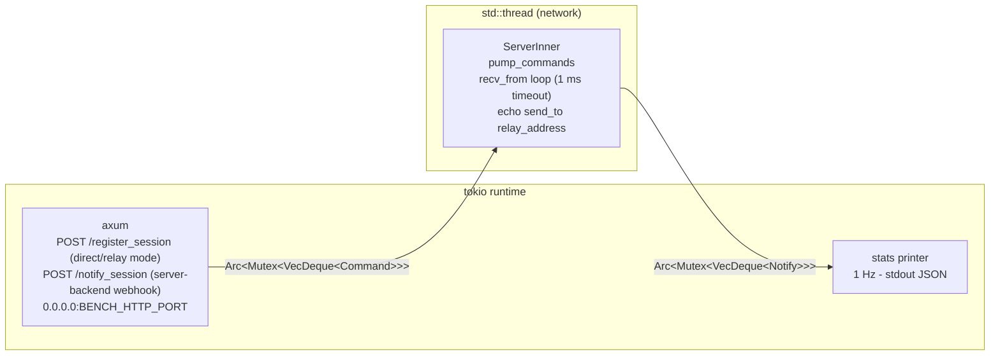
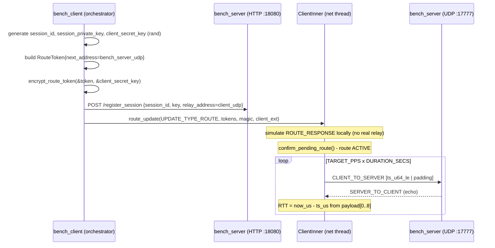
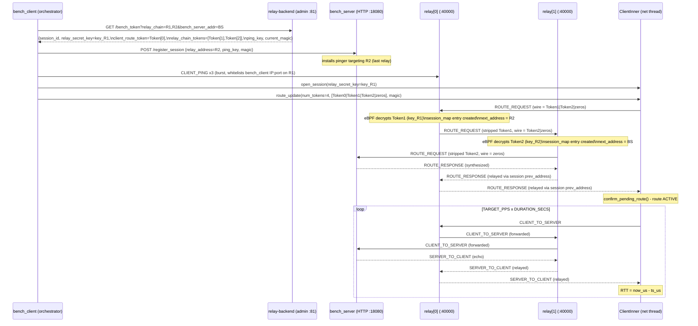
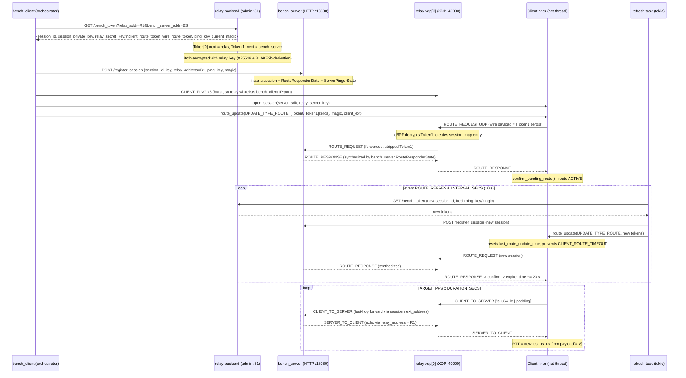
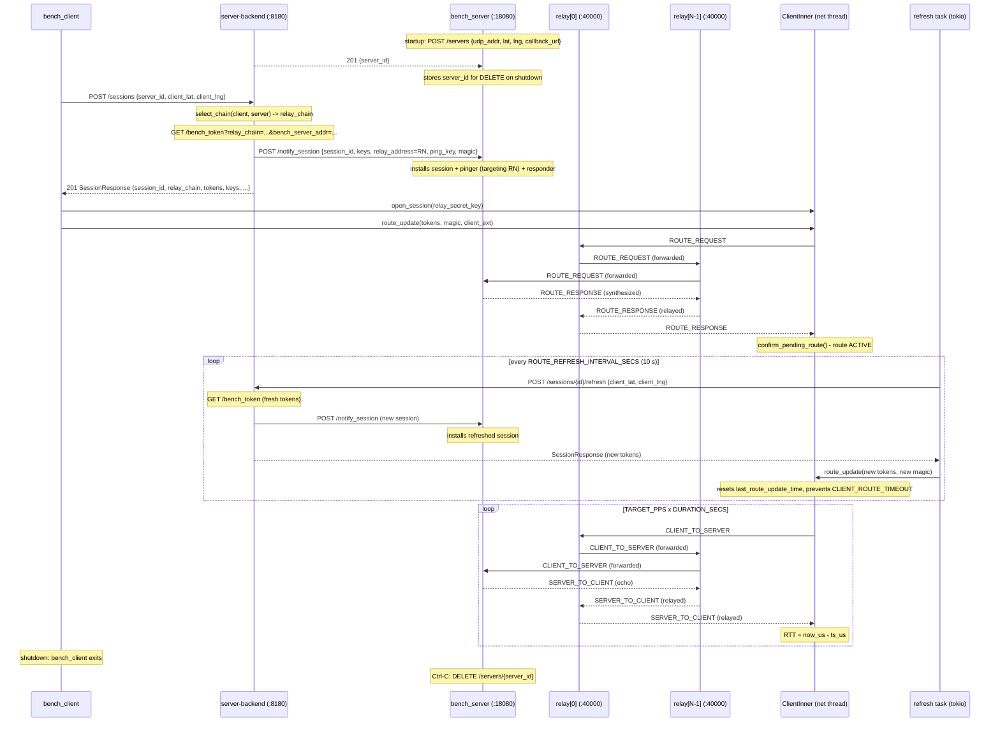
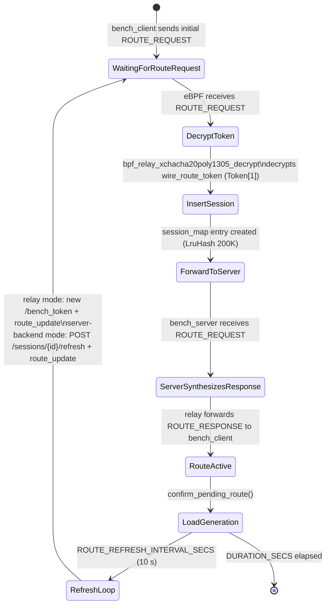

# relay-bench

UDP benchmark harness for relay-xdp. Measures end-to-end RTT and packet loss
for both direct (loopback) and relay (live XDP) code paths using the same
`relay-sdk` primitives as a real game client and server.

## Binaries

| Binary | Description |
|--------|-------------|
| `bench_server` | Echo server - receives CLIENT_TO_SERVER, sends SERVER_TO_CLIENT echo |
| `bench_client` | Load generator - sends packets, measures RTT p50/p95/p99 |

## Quick Start

```bash
# Direct mode (no relay-xdp required, loopback only)
make bench-local

# Relay mode - single-hop (requires live relay-xdp + relay-backend)
make bench-relay RELAY_ADDR=10.0.0.1:40000 BACKEND_ADMIN=http://10.0.0.2:81

# Relay mode - multi-hop (comma-separated relay chain, RELAY_CHAIN overrides RELAY_ADDR)
make bench-relay RELAY_CHAIN=10.0.0.1:40000,10.0.0.2:40000 DURATION_SECS=60

# Auto-resolve all addresses from the Pulumi staging stack
make bench-relay STACK=staging DURATION_SECS=60
make bench-relay STACK=staging RELAY_CHAIN=52.201.126.193:40000,52.48.191.174:40000 DURATION_SECS=60

# Server-backend mode - full matchmaking via server-backend (relay chain auto-selected)
# bench_server must be deployed with SERVER_BACKEND_URL set and registered.
# The SERVER_ID is printed in bench_server logs at startup.
BENCH_MODE=server-backend \
  SERVER_BACKEND_URL=http://54.198.0.1:8180 \
  SERVER_ID=550e8400-e29b-41d4-a716-446655440000 \
  CLIENT_LAT=37.77 \
  CLIENT_LNG=-122.42 \
  cargo run --release -p relay-bench --bin bench_client
```

## Environment Variables

### bench_client

| Variable | Default | Description |
|----------|---------|-------------|
| `BENCH_MODE` | `direct` | `direct`, `relay`, or `server-backend` |
| `BENCH_SERVER_HTTP` | `127.0.0.1:18080` | bench_server HTTP provisioning address (direct/relay mode) |
| `BENCH_SERVER_UDP` | `127.0.0.1:17777` | bench_server UDP bind address (direct mode) |
| `BENCH_CLIENT_UDP` | `127.0.0.1:17778` | Client UDP bind address |
| `BACKEND_ADMIN` | `http://127.0.0.1:81` | relay-backend admin URL (relay mode) |
| `RELAY_ADDR` | *(required in relay mode unless RELAY_CHAIN set)* | relay-xdp first-hop `IP:PORT` (single-hop) |
| `RELAY_CHAIN` | *(optional)* | Comma-separated `IP:PORT` list for multi-hop, e.g. `r1:40000,r2:40000`. Supersedes `RELAY_ADDR` when set. Length must be in `[1..=MAX_RELAY_HOPS]` (currently 5). |
| `TARGET_PPS` | `1000` | Target packets per second |
| `PAYLOAD_BYTES` | `128` | Payload size in bytes (minimum 8 for timestamp) |
| `DURATION_SECS` | `30` | Benchmark duration in seconds |

**server-backend mode env vars** (`BENCH_MODE=server-backend`):

| Variable | Default | Description |
|----------|---------|-------------|
| `SERVER_BACKEND_URL` | *(required)* | Base URL of server-backend, e.g. `http://54.198.0.1:8180` |
| `SERVER_ID` | *(required)* | UUID of the bench_server game server registered with server-backend |
| `CLIENT_LAT` | `0.0` | Client geographic latitude (decimal degrees) - used for relay chain selection |
| `CLIENT_LNG` | `0.0` | Client geographic longitude (decimal degrees) - used for relay chain selection |

In server-backend mode `BACKEND_ADMIN`, `RELAY_ADDR`, `RELAY_CHAIN`, `BENCH_SERVER_HTTP`, and
`BENCH_SERVER_UDP` are not used - relay chain and server address come from the `SessionResponse`.

### bench_server

| Variable | Default | Description |
|----------|---------|-------------|
| `BENCH_HTTP_PORT` | `18080` | axum HTTP listen port (`POST /register_session`, `POST /notify_session`) |
| `BENCH_UDP_PORT` | `17777` | UDP listen port |
| `SERVER_PUBLIC_ADDR` | *(optional)* | Externally visible `IP:PORT` of bench_server UDP socket. Required for pinger/responder installation in server-backend mode so the relay whitelists bench_server. |
| `SERVER_BACKEND_URL` | *(optional)* | Base URL of server-backend. When set, bench_server calls `POST /servers` at startup to register itself and `DELETE /servers/{id}` on graceful shutdown. |
| `SERVER_LAT` | `0.0` | Geographic latitude for relay chain selection (used with `SERVER_BACKEND_URL`). |
| `SERVER_LNG` | `0.0` | Geographic longitude for relay chain selection (used with `SERVER_BACKEND_URL`). |
| `SERVER_CALLBACK_URL` | `http://127.0.0.1:BENCH_HTTP_PORT` | URL server-backend calls for `POST /notify_session` webhook. Must be reachable from server-backend host (use EIP in AWS). |

## Architecture

### bench_server



The HTTP handler pushes a `Command::AddSession` onto the queue.
The network thread drains the queue on each iteration, then calls `recv_from`
(1 ms timeout) and echoes every CLIENT_TO_SERVER packet back as
SERVER_TO_CLIENT via `relay_address` from the session record.

In **server-backend mode**, bench_server also:

1. Registers itself with server-backend at startup via `POST /servers` (if `SERVER_BACKEND_URL` set).
2. Receives the `POST /notify_session` webhook from server-backend (instead of a direct
   `/register_session` call from bench_client) - same pinger + responder + session registration logic.
3. Deregisters via `DELETE /servers/{id}` on graceful shutdown (Ctrl-C).

### bench_client (direct mode)



Session materials are generated locally with `rand`. ROUTE_RESPONSE is
simulated by injecting a crafted packet directly into `ClientInner` -
the same pattern used by `relay_sdk_smoke.rs`. No relay-xdp process is
required.

### bench_client (relay mode)

Token encryption is performed **server-side** in relay-backend because bench_client
cannot derive the per-relay XChaCha20-Poly1305 key (it has neither the relay's
private key nor the backend's private key). The backend holds both sides of the
X25519 exchange and computes:

```
q          = X25519(backend_sk, relay_pk)
relay_key  = BLAKE2b-512(q || relay_pk || backend_pk)[..32]
```

This matches what the relay-xdp node computes via `config::derive_secret_key`,
giving both sides the same symmetric key without any key exchange packet.

#### Multi-hop token layout

For a chain of N relays, `/bench_token?relay_chain=r1,r2,...,rN` returns
`relay_chain_tokens` with N entries. bench_client assembles the full
`num_tokens = N + 2` token vector and passes it to `route_update`:

```
Token slot  Size    Field                   Encrypted-with   next_address field   Who uses it
----------  ------  ----------------------  ---------------  -------------------  ---------------------------
Token[0]    111 B   client_route_token      relay[0] key     relay[0] IP:port     SDK locally: first-hop target
Token[1]    111 B   relay_chain_tokens[0]   relay[0] key     relay[1] IP:port     relay[0] eBPF decrypts on wire
Token[2]    111 B   relay_chain_tokens[1]   relay[1] key     relay[2] IP:port     relay[1] eBPF decrypts on wire
 ...         ...     ...                     ...              ...                  ...
Token[N]    111 B   relay_chain_tokens[N-1] relay[N-1] key   bench_server IP:port relay[N-1] eBPF decrypts on wire
Token[N+1]  111 B   zeros (trailing pad)    -                -                    signals chain end to eBPF
```

**prev_address / prev_port rules**

| Token | prev_address | prev_port | Reason |
|-------|-------------|-----------|--------|
| Token[0] | 0 (unused by SDK) | 0 | SDK only uses next_address |
| Token[1] (i=0) | client public IPv4 (or 0 if unknown) | 0 | eBPF uses this as ROUTE_RESPONSE return address; prev_port=0 causes eBPF to substitute `udp.source` from the live packet |
| Token[i+1] for i>0 | relay[i-1] public IPv4 | 0 | eBPF uses relay[i-1] public IP as ROUTE_RESPONSE return path; prev_port=0 same as above |

Wire bytes sent by the SDK in the ROUTE_REQUEST UDP payload:
`Token[1] || Token[2] || ... || Token[N] || Token[N+1]` = `(N+1) * 111` bytes.

Each relay strips exactly one 111 B token via `bpf_xdp_adjust_head` and forwards
the remainder, so by the time the packet reaches bench_server only the trailing
zeros pad remains after the relay headers.

**Design constraints** (from `relay-xdp-common::MAX_RELAY_HOPS = 5`):

| N (relay count) | num_tokens | ROUTE_REQUEST body (bytes) | Wire MTU headroom |
|----------------|-----------|--------------------------|------------------|
| 1 (single-hop) | 3 | 18 + 2 * 111 = 240 | 960 B free |
| 2 (2-hop) | 4 | 18 + 3 * 111 = 351 | 849 B free |
| 3 (3-hop) | 5 | 18 + 4 * 111 = 462 | 738 B free |
| 4 (4-hop) | 6 | 18 + 5 * 111 = 573 | 627 B free |
| 5 (5-hop = max) | 7 | 18 + 6 * 111 = 684 | 516 B free |

`relay-backend` rejects `relay_chain` with more than `MAX_RELAY_HOPS` entries with
HTTP 400. `relay-sdk` enforces `num_tokens <= MAX_TOKENS = MAX_RELAY_HOPS + 2 = 7` at
`route_update` time. eBPF is stateless per hop and supports up to 9 relays physically
(MTU bound); the cap of 5 is a policy/safety bound - see ADR-010.

#### bench_server registration (multi-hop)

For a multi-hop bench bench_client calls `/register_session` with:
- `relay_address = relay[N-1]` (the **last** relay in the chain)

This is because bench_server must send SERVER_PING to the **last relay** (relay[N-1]),
not relay[0]. SERVER_PING populates relay[N-1]'s `whitelist_map` entry for
bench_server's IP:port, which is required for relay[N-1] to forward ROUTE_REQUEST
(and subsequently CLIENT_TO_SERVER) packets to bench_server.

For single-hop N=1 the last relay equals relay[0] - no behavioral change.

#### Sequence diagram (multi-hop, N=2)



#### Single-hop relay mode (legacy, RELAY_ADDR)

Two tokens are returned per `/bench_token?relay_addr=...&bench_server_addr=...` call
(backward-compatible single-hop path):

| Field | Encrypted with | next_address | Used by |
|-------|---------------|--------------|---------|
| `client_route_token` (Token[0]) | `relay_key` | relay IP:port | SDK locally (first-hop send target) |
| `wire_route_token` (Token[1]) | `relay_key` | bench_server IP:port | relay-xdp eBPF (decrypts off wire) |

#### Sequence diagram (single-hop, RELAY_ADDR)



### bench_client (server-backend mode)

In server-backend mode bench_client delegates all session management (relay chain selection,
token minting, bench_server provisioning) to server-backend. This exercises the real
matchmaking path including Haversine geo-scoring (`select_chain`) instead of a
manually-configured `RELAY_CHAIN`.

Key differences from relay mode:

| | Relay mode | Server-backend mode |
|---|---|---|
| Session create | `GET /bench_token` direct to relay-backend | `POST /sessions` to server-backend |
| bench_server setup | `POST /register_session` from bench_client | `POST /notify_session` webhook from server-backend |
| Relay chain source | `RELAY_CHAIN` / `RELAY_ADDR` env vars | `relay_chain[]` in `SessionResponse` (auto-selected) |
| Refresh | `GET /bench_token` + `POST /register_session` | `POST /sessions/{id}/refresh` (webhook auto-sent) |

#### Sequence diagram (server-backend mode)



#### Deploy workflow (staging)

```bash
# 1. Deploy server-backend to backend node (first time or after binary change)
cargo build --release -p server-backend
ansible-playbook -i inventory/staging.yml playbooks/bench-server-backend-deploy.yml

# 2. Deploy bench_server with server-backend registration
eval $(python infra/stack_outputs.py --stack staging --format env)
cargo build --release -p relay-bench
ansible-playbook -i inventory/staging.yml playbooks/bench-deploy.yml \
  -e "server_backend_url=${SERVER_BACKEND_URL}"

# 3. Get the server_id from bench_server logs
ssh ubuntu@${BENCH_HOST} journalctl -u bench-server -n 20 | grep registered

# 4. Run bench_client in server-backend mode
BENCH_MODE=server-backend \
  SERVER_BACKEND_URL=${SERVER_BACKEND_URL} \
  SERVER_ID=<uuid-from-step-3> \
  CLIENT_LAT=37.77 CLIENT_LNG=-122.42 \
  DURATION_SECS=60 \
  cargo run --release -p relay-bench --bin bench_client
```

### Route lifetime and refresh

The SDK's `RouteManager` has two expiry mechanisms:

| Mechanism | Constant | Behavior |
|-----------|----------|----------|
| `last_route_update_time` timeout | `CLIENT_ROUTE_TIMEOUT = 20 s` | Route dies if no route_update call for 20 s |
| `current_route_expire_time` | `2 * SLICE_SECONDS = 20 s` (initial), +20 s per confirm | Route expires unless refreshed |

Without the refresh task, traffic would stop after ~20 s (observed in the
2026-05-10 session). The background refresh task calls
`route_update(UPDATE_TYPE_ROUTE, ...)` every `ROUTE_REFRESH_INTERVAL_SECS = 10 s`,
which:

1. Resets `last_route_update_time` (prevents FLAGS_ROUTE_TIMED_OUT).
2. Triggers a new ROUTE_REQUEST/ROUTE_RESPONSE exchange with the relay.
3. On confirm: `current_route_expire_time += 2 * SLICE_SECONDS = 20 s`
   (because a current route exists - see `confirm_pending_route` in relay-sdk).

Each refresh also updates the shared `PingerRefreshKeys` (ping_key + magic) so
subsequent CLIENT_PING / SERVER_PING packets use the current backend magic, keeping
the relay whitelist entry valid across ping_key rotations.

### bench_server ROUTE_RESPONSE synthesis

In the deployed topology nothing else generates ROUTE_RESPONSE. The relay-xdp
eBPF only *forwards* ROUTE_REQUEST to the next hop and ROUTE_RESPONSE in
reverse - it does not synthesize one. bench_server intercepts inbound
ROUTE_REQUEST (type 1) and synthesizes a 43-byte ROUTE_RESPONSE signed with
the known session_private_key. This transitions the relay session_map entry to
"confirmed" and allows CLIENT_TO_SERVER traffic to flow.

## Metrics Output

One JSON line per second on stdout:

```json
{"ts_ms": 1746624000000, "role": "client", "mode": "relay", "pkt_sent": 1000, "pkt_recv": 980, "rtt_p50_us": 1200, "rtt_p95_us": 2100, "rtt_p99_us": 3500, "loss_pct": 2.0, "route": "active"}
```

RTT percentiles are computed over a 1-second rolling window using
in-place sort + index lookup - no external stats crate required.

## Payload Format

```
Bytes [0..8]  : send_timestamp_us (u64 LE) - microseconds since UNIX_EPOCH
Bytes [8..]   : zero-padding to PAYLOAD_BYTES
```

bench_server echoes the payload byte-for-byte. bench_client reads
`payload[0..8]` as a little-endian `u64` and computes
`rtt_us = now_us - timestamp_us`.

## session_map Provisioning (relay mode)

relay-xdp eBPF creates the `session_map` entry automatically on the first
ROUTE_REQUEST. The entry is periodically extended by the route refresh task
(every 10 s) which issues a fresh ROUTE_REQUEST with a new session. Old sessions
expire naturally after `token.expire_timestamp` (now + 300 s from the backend).



No additional provisioning API call is needed. In **relay mode** bench_client
POSTs `/register_session` to bench_server before sending the first ROUTE_REQUEST
so that bench_server has the session key ready to:
- Synthesize ROUTE_RESPONSE (signed with session_private_key)
- Decrypt incoming CLIENT_TO_SERVER packets and echo them back
- Send periodic SERVER_PING packets (keeps bench_server's IP:port whitelisted)

In **server-backend mode** server-backend sends `POST /notify_session` to
bench_server as part of `POST /sessions` processing, so bench_client never
calls `/register_session` directly. The same session key installation and
pinger/responder setup happens - only the caller differs.

