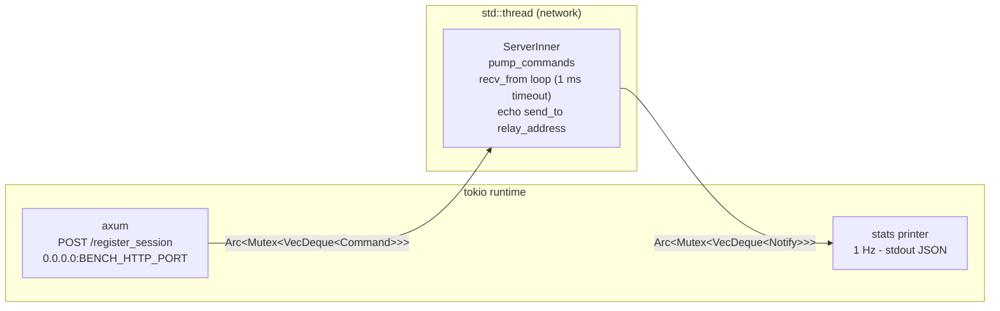
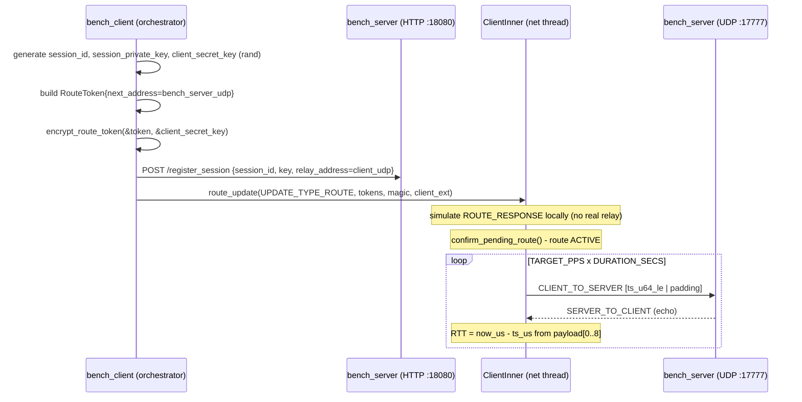
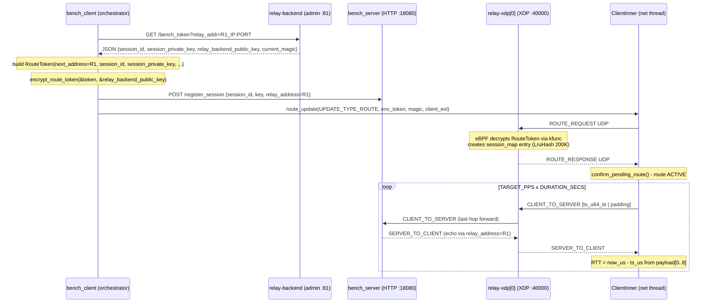
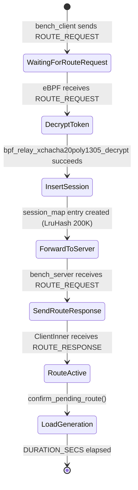

# relay-bench

UDP benchmark harness for relay-xdp. Measures end-to-end RTT and packet loss
for both direct (loopback) and relay (live XDP) code paths using the same
`relay-sdk` primitives as a real game client and server.

## Binaries

| Binary | Description |
|--------|-------------|
| `bench_server` | Echo server - receives CLIENT_TO_SERVER, sends SERVER_TO_CLIENT echo |
| `bench_client` | Load generator - sends packets, measures RTT p50/p95/p99 |

## Quick Start

```bash
# Direct mode (no relay-xdp required, loopback only)
make bench-local

# Relay mode (requires live relay-xdp + relay-backend)
make bench-relay RELAY_ADDR=10.0.0.1:40000 BACKEND_ADMIN=http://10.0.0.2:81
```

## Environment Variables

### bench_client

| Variable | Default | Description |
|----------|---------|-------------|
| `BENCH_MODE` | `direct` | `direct` or `relay` |
| `BENCH_SERVER_HTTP` | `127.0.0.1:18080` | bench_server HTTP provisioning address |
| `BENCH_SERVER_UDP` | `127.0.0.1:17777` | bench_server UDP bind address (direct mode) |
| `BENCH_CLIENT_UDP` | `127.0.0.1:17778` | Client UDP bind address |
| `BACKEND_ADMIN` | `http://127.0.0.1:81` | relay-backend admin URL (relay mode) |
| `RELAY_ADDR` | *(required in relay mode)* | relay-xdp first hop `IP:PORT` |
| `TARGET_PPS` | `1000` | Target packets per second |
| `PAYLOAD_BYTES` | `128` | Payload size in bytes (minimum 8 for timestamp) |
| `DURATION_SECS` | `30` | Benchmark duration in seconds |

### bench_server

| Variable | Default | Description |
|----------|---------|-------------|
| `BENCH_HTTP_PORT` | `18080` | axum HTTP listen port (`POST /register_session`) |
| `BENCH_UDP_PORT` | `17777` | UDP listen port |

## Architecture

### bench_server



The HTTP handler pushes a `Command::AddSession` onto the queue.
The network thread drains the queue on each iteration, then calls `recv_from`
(1 ms timeout) and echoes every CLIENT_TO_SERVER packet back as
SERVER_TO_CLIENT via `relay_address` from the session record.

### bench_client (direct mode)



Session materials are generated locally with `rand`. ROUTE_RESPONSE is
simulated by injecting a crafted packet directly into `ClientInner` -
the same pattern used by `relay_sdk_smoke.rs`. No relay-xdp process is
required.

### bench_client (relay mode)



`relay_backend_public_key` (32 B hex from `/bench_token`) is the XChaCha20
symmetric key relay-xdp uses to decrypt RouteTokens. The client uses it as
the encryption key so the eBPF kfunc can decrypt the token and insert the
`session_map` entry automatically on first ROUTE_REQUEST.

## Metrics Output

One JSON line per second on stdout:

```json
{"ts_ms": 1746624000000, "role": "client", "mode": "relay", "pkt_sent": 1000, "pkt_recv": 980, "rtt_p50_us": 1200, "rtt_p95_us": 2100, "rtt_p99_us": 3500, "loss_pct": 2.0, "route": "active"}
```

RTT percentiles are computed over a 1-second rolling window using
in-place sort + index lookup - no external stats crate required.

## Payload Format

```
Bytes [0..8]  : send_timestamp_us (u64 LE) - microseconds since UNIX_EPOCH
Bytes [8..]   : zero-padding to PAYLOAD_BYTES
```

bench_server echoes the payload byte-for-byte. bench_client reads
`payload[0..8]` as a little-endian `u64` and computes
`rtt_us = now_us - timestamp_us`.

## session_map Provisioning (relay mode)

relay-xdp eBPF creates the `session_map` entry automatically:



No additional provisioning API call is needed. bench_client only needs to
POST `/register_session` to bench_server before sending the first
ROUTE_REQUEST so that bench_server has the session key ready to decrypt
incoming CLIENT_TO_SERVER packets.

