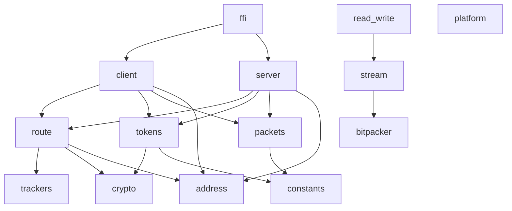
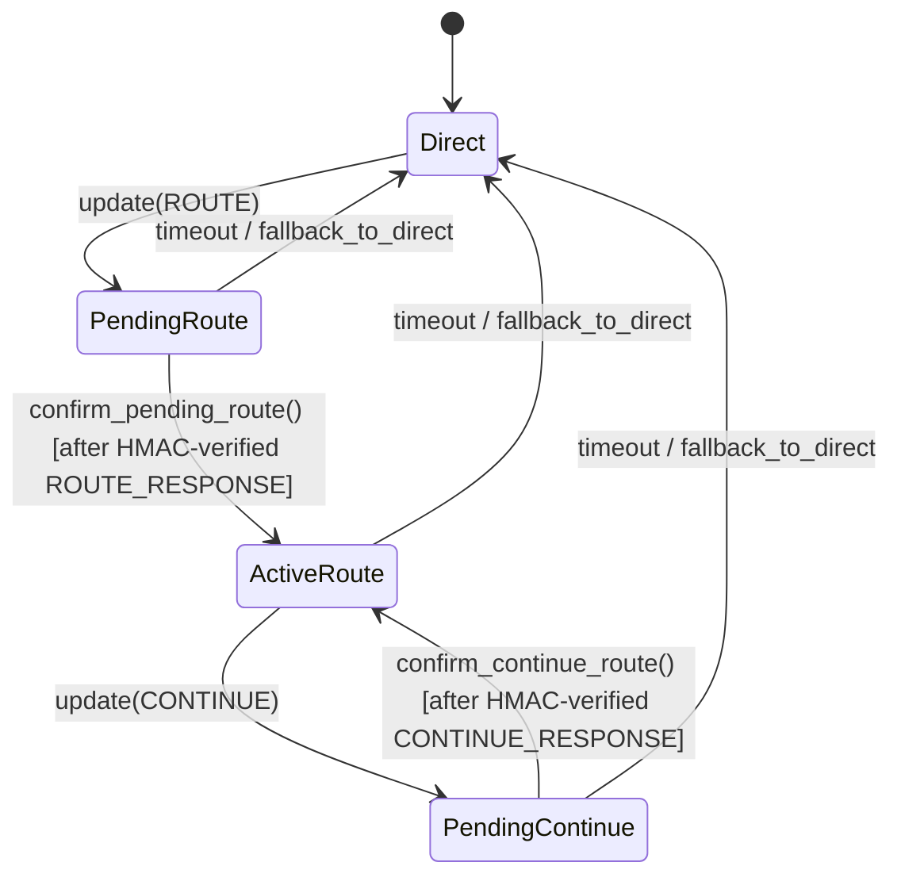
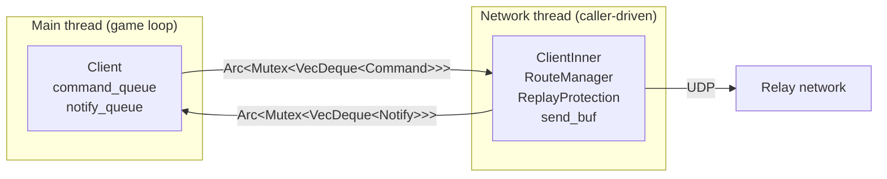
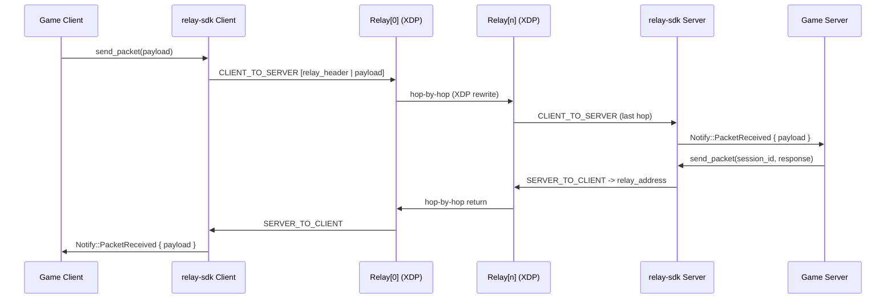

# Architecture: relay-sdk

Pure Rust SDK for game clients/servers connecting to the relay-xdp network.
Wire-compatible with `relay-xdp` (XDP relay node) and `relay-xdp-common` (shared types).

---

## Goals

| Goal | Detail |
|---|---|
| **Wire-compatible** | Packet bytes match 100% with relay-xdp eBPF + userspace |
| **Memory-safe** | No `unsafe` outside the FFI export layer; all unsafe blocks documented |
| **Pure Rust** | SHA-256 (sha2), XChaCha20-Poly1305 (chacha20poly1305) - no libsodium |
| **Cross-platform** | Linux / Windows / macOS, compiled via `cargo` |
| **C ABI export** | `mod ffi` exports `relay_client_t` / `relay_server_t` via `extern "C"` |

---

## Crate structure

```
relay-sdk/
+-- Cargo.toml          # crate name = "relay-sdk", crate-type = [cdylib, staticlib, rlib]
+-- build.rs            # runs cbindgen -> generates relay_generated.h
+-- cbindgen.toml       # cbindgen configuration
+-- include/
|   +-- relay_generated.h   # generated by cbindgen
+-- src/
|   +-- lib.rs          # re-exports all public modules
|   +-- constants.rs    # all wire constants (explicit, no glob imports)
|   +-- address/        # Address enum - byte LE + RELAY_ADDRESS_*
|   +-- bitpacker/      # BitWriter / BitReader - copied from rust-sdk
|   +-- stream/         # WriteStream / ReadStream + serialize macros - copied from rust-sdk
|   +-- read_write.rs   # WriteBuf / ReadBuf (byte-level helpers) - copied from rust-sdk
|   +-- crypto/         # SHA-256 + XChaCha20-Poly1305 - rewritten (subset of rust-sdk)
|   +-- tokens/         # RouteToken, ContinueToken encrypt/decrypt - rewritten
|   +-- packets/        # 14 packet types (ID 1-14) encode/decode - rewritten
|   +-- route/
|   |   +-- mod.rs      # RouteManager state machine - rewritten (pittle/chonkle copied)
|   |   +-- trackers.rs # ReplayProtection, PingHistory, BandwidthLimiter - copied from rust-sdk
|   +-- client/         # ClientInner + Client handle
|   +-- server/         # ServerInner + Server handle (final destination)
|   +-- platform/       # time() + ConnectionType + socket buffer helpers (Linux: libc setsockopt/getsockopt)
|   +-- ffi/            # #[no_mangle] extern "C" exports - 15 functions
+-- benches/
|   +-- relay_sdk.rs    # criterion 0.5 benchmarks (18 functions across 5 groups)
+-- examples/
|   +-- client_example.rs  # end-to-end game client integration walkthrough
|   +-- server_example.rs  # end-to-end game server integration walkthrough
+-- tests/
    +-- wire_compat.rs  # byte-level golden vector tests + constant compatibility
```

---

## Module origin map

| Module | Origin | Notes |
|---|---|---|
| `bitpacker` | Copied from `rust-sdk` | Unchanged - 7 tests passing |
| `stream` | Copied from `rust-sdk` | Unchanged - 7 tests passing |
| `read_write` | Copied from `rust-sdk` | Unchanged - 5 tests passing |
| `platform` | Extended from `rust-sdk` | Added ConnectionType, connection_type(), socket buffer helpers - 10 tests |
| `route/trackers` | Copied from `rust-sdk` | Unchanged - 29 tests passing |
| `address` | Rewritten | rust-sdk uses bitstream; relay-sdk uses byte LE + RELAY_ADDRESS_* |
| `crypto` | Rewritten (subset) | Only SHA-256 + XChaCha20-Poly1305; removed NaCl/BLAKE2/Ed25519/KX |
| `tokens` | Rewritten | Uses relay-xdp-common::RouteToken/ContinueToken; random nonce via rand |
| `packets` | Rewritten | 14 types (ID 1-14); encode/decode LE byte-level, no bitstream |
| `route/mod` | Rewritten (pittle/chonkle copied) | HeaderData layout matches relay-xdp-common; state machine logic preserved |
| `client` | New | ClientInner + Client handle (route request -> forward chain); HMAC verification on ROUTE_RESPONSE/CONTINUE_RESPONSE |
| `server` | New | Final destination - receives from last relay hop; Notify::SendError + last_send_error |
| `ffi` | New | 15 extern "C" functions; catch_unwind on all entry points; null-safe |
| `pool` | New | BytePool - shared byte buffer pool (Arc<Mutex<Vec<Box<[u8]>>>>); ByteGuard RAII release |

---

## Inter-module dependency diagram



Principle: lower-level modules do not import upward.
`bitpacker` and `platform` are leaves.
All constants imported explicitly by name from `crate::constants` - no `use crate::constants::*`.

---

## Module descriptions

### `mod constants`

Single source of truth for all wire constants used across relay-sdk modules.
All values verified to match `relay-xdp-common` in `tests/wire_compat.rs::constants_match_relay_xdp_common`.

Key constants:

| Constant | Value | Description |
|---|---|---|
| `PACKET_BODY_OFFSET` | 18 | Bytes before packet body (type + pittle + chonkle) |
| `HEADER_BYTES` | 25 | Relay header size (sequence + session_id + version + HMAC) |
| `SESSION_PRIVATE_KEY_BYTES` | 32 | Session private key size |
| `ENCRYPTED_ROUTE_TOKEN_BYTES` | 111 | nonce(24) + RouteToken(71) + tag(16) |
| `ENCRYPTED_CONTINUE_TOKEN_BYTES` | 57 | nonce(24) + ContinueToken(17) + tag(16) |
| `MAX_PACKET_BYTES` | 1384 | Maximum packet buffer size |
| `MTU` | 1200 | Maximum relay payload |

---

### `mod platform`

OS-level utilities. Linux implementation in `platform/linux.rs`; non-Linux stubs in `platform/mod.rs` provide the same API returning safe defaults.

**Time:**

| Function | Description |
|---|---|
| `time() -> f64` | Monotonic seconds since first call. Equivalent to `next_platform_time()` in C++. |

**Connection type:**

```rust
pub enum ConnectionType { Unknown, Wired, Wifi, Cellular }

pub fn connection_type() -> ConnectionType
```

Algorithm (Linux only):
1. Parse `/proc/net/route` - find first entry with `Destination == 00000000` (default route interface).
2. If `/sys/class/net/{iface}/wireless` directory exists -> `Wifi`.
3. If `/sys/class/net/{iface}/uevent` contains line `DEVTYPE=wwan` -> `Cellular`.
4. Otherwise -> `Wired`. Returns `Unknown` on any I/O error or no default route.

Non-Linux stub always returns `ConnectionType::Unknown`.

**Socket buffer helpers (Linux only, wraps `setsockopt`/`getsockopt` via `libc`):**

| Function | Description |
|---|---|
| `set_socket_send_buffer_size(socket: &UdpSocket, size: usize) -> bool` | Sets `SO_SNDBUF`. Kernel may round up. Returns `true` on success. |
| `set_socket_recv_buffer_size(socket: &UdpSocket, size: usize) -> bool` | Sets `SO_RCVBUF`. |
| `get_socket_send_buffer_size(socket: &UdpSocket) -> usize` | Returns current `SO_SNDBUF` value, 0 on failure. |
| `get_socket_recv_buffer_size(socket: &UdpSocket) -> usize` | Returns current `SO_RCVBUF` value, 0 on failure. |

Non-Linux stubs return `false` / `0`.

Usage pattern (call after `UdpSocket::bind`):

```rust
use relay_sdk::platform;
let sock = UdpSocket::bind("0.0.0.0:0")?;
platform::set_socket_send_buffer_size(&sock, 2 * 1024 * 1024);  // 2 MiB
platform::set_socket_recv_buffer_size(&sock, 2 * 1024 * 1024);
println!("conn={:?} sndbuf={}", platform::connection_type(),
         platform::get_socket_send_buffer_size(&sock));
```

---

### `mod address`

```rust
pub enum Address {
    None,
    V4 { octets: [u8; 4], port: u16 },  // octets in network byte order
    V6 { words: [u16; 8], port: u16 },
}
```

Serialized as byte-level LE: `address_type(u8)` + `ip(4 or 16 bytes, network order)` + `port(u16 LE)`.
Constants: `ADDRESS_NONE = 0`, `ADDRESS_IPV4 = 1`, `ADDRESS_IPV6 = 2`.
Implements: `encode(&mut Writer)`, `decode(&mut Reader)`, `Display`, `FromStr`, `From<SocketAddr>`.

**Byte order note**: `Address::V4.octets` stores IPv4 in network byte order (big-endian).
When converting a `RouteToken.next_address` (stored as BE u32) to `Address::V4` octets:
```rust
// Correct - convert from BE u32 to native, then to network-order bytes
octets: u32::from_be(rt.next_address).to_be_bytes()
```

---

### `mod crypto`

Two functions only:

| Function | Crate | Description |
|---|---|---|
| `hash_sha256(data) -> [u8; 32]` | `sha2::Sha256` | Used for HeaderData verification in write_header/read_header |
| `xchacha20poly1305_encrypt(msg, nonce, key) -> Vec<u8>` | `chacha20poly1305::XChaCha20Poly1305` | Token encryption (nonce 24B, key 32B, tag 16B appended) |
| `xchacha20poly1305_decrypt(ciphertext, nonce, key) -> Result<Vec<u8>>` | `chacha20poly1305::XChaCha20Poly1305` | Token decryption - matches kfunc `bpf_relay_xchacha20poly1305_decrypt` |

No KX keypair, no secretbox, no Ed25519.

---

### `mod tokens`

Uses structs from `relay-xdp-common` directly:

| Token | Plaintext size | Encrypted size | Encryption key |
|---|---|---|---|
| `RouteToken` | 71 bytes | 111 bytes (`ENCRYPTED_ROUTE_TOKEN_BYTES`) | `relay_backend_public_key` |
| `ContinueToken` | 17 bytes | 57 bytes (`ENCRYPTED_CONTINUE_TOKEN_BYTES`) | `session_private_key` |

Public API:
```rust
fn encrypt_route_token(token: &RouteToken, key: &[u8; 32]) -> [u8; ENCRYPTED_ROUTE_TOKEN_BYTES]
fn decrypt_route_token(data: &[u8; ENCRYPTED_ROUTE_TOKEN_BYTES], key: &[u8; 32]) -> Result<RouteToken>
fn encrypt_continue_token(token: &ContinueToken, key: &[u8; 32]) -> [u8; ENCRYPTED_CONTINUE_TOKEN_BYTES]
fn decrypt_continue_token(data: &[u8; ENCRYPTED_CONTINUE_TOKEN_BYTES], key: &[u8; 32]) -> Result<ContinueToken>
```

Each encrypt call generates a random 24-byte nonce internally via `rand`. The nonce is prepended to the ciphertext.

---

### `mod packets`

14 packet types from `relay-xdp-common`, encoded/decoded at byte level (little-endian).
No bitstream (`WriteStream`/`ReadStream`).

Wire layout common to all packets:
```
[0]      packet_type   u8
[1..3]   pittle        2 bytes  (filled by stamp_packet in route/mod.rs)
[3..18]  chonkle       15 bytes (filled by stamp_packet)
[18..]   packet body   (type-specific, LE)
```

| ID | Constant | Struct | Size |
|---|---|---|---|
| 1 | `PACKET_TYPE_ROUTE_REQUEST` | variable | 18 + (N-1)*111 bytes |
| 2 | `PACKET_TYPE_ROUTE_RESPONSE` | `RouteResponsePacket` | 43 bytes |
| 3 | `PACKET_TYPE_CLIENT_TO_SERVER` | variable | 18 + 25 + payload |
| 4 | `PACKET_TYPE_SERVER_TO_CLIENT` | variable | 18 + 25 + payload |
| 5 | `PACKET_TYPE_SESSION_PING` | `SessionPingPacket` | 51 bytes |
| 6 | `PACKET_TYPE_SESSION_PONG` | `SessionPongPacket` | 51 bytes |
| 7 | `PACKET_TYPE_CONTINUE_REQUEST` | variable | 18 + (N-1)*57 bytes |
| 8 | `PACKET_TYPE_CONTINUE_RESPONSE` | `ContinueResponsePacket` | 43 bytes |
| 9 | `PACKET_TYPE_CLIENT_PING` | `ClientPingPacket` | 74 bytes |
| 10 | `PACKET_TYPE_CLIENT_PONG` | `ClientPongPacket` | 34 bytes |
| 11 | `PACKET_TYPE_RELAY_PING` | `RelayPingPacket` | 67 bytes |
| 12 | `PACKET_TYPE_RELAY_PONG` | `RelayPongPacket` | 26 bytes |
| 13 | `PACKET_TYPE_SERVER_PING` | `ServerPingPacket` | 66 bytes |
| 14 | `PACKET_TYPE_SERVER_PONG` | `ServerPongPacket` | 26 bytes |

Note: `CLIENT_TO_SERVER` and `SERVER_TO_CLIENT` are built by `route::write_client_to_server_packet` (which calls `stamp_packet`), not via `packets::encode`.

---

### `mod route`

#### `mod route::trackers` (copied from rust-sdk)

| Struct | Purpose |
|---|---|
| `ReplayProtection` | Ring buffer of 1024 entries, detects replayed packets |
| `PacketLossTracker` | Ring buffer counting gaps in sequence numbers |
| `PingHistory` | 1024-entry ping/pong history, computes RTT / jitter / loss |
| `BandwidthLimiter` | EMA bits/sec, enforces bandwidth limits |

#### `mod route` (wire helpers + RouteManager)

**Header layout** (HEADER_BYTES = 25):
```
[0..8]   sequence         u64 LE
[8..16]  session_id       u64 LE
[16]     session_version  u8
[17..25] SHA-256(HeaderData)[0..8]
```

**HeaderData** (50 bytes, matches relay-xdp-common::HeaderData #[repr(C, packed)]):
```
[0..32]  session_private_key [u8; 32]
[32]     packet_type         u8
[33..41] packet_sequence     u64 LE
[41..49] session_id          u64 LE
[49]     session_version     u8
```

**Public wire helpers:**

| Function | Signature | Description |
|---|---|---|
| `write_header` | `(packet_type, seq, sid, sver, key, hdr)` | Writes relay header + SHA-256 HMAC |
| `read_header` | `(packet_type, key, hdr) -> Option<(u64, u64, u8)>` | Verifies HMAC; returns (seq, sid, sver) or None |
| `generate_pittle` | `(out, from, to, len)` | Fills 2-byte pittle filter field |
| `generate_chonkle` | `(out, magic, from, to, len)` | Fills 15-byte chonkle filter field |
| `stamp_packet` | `(packet, magic, from, to)` | Stamps pittle + chonkle onto a complete packet |
| `write_client_to_server_packet` | `(buf, seq, sid, sver, key, payload, magic, from, to)` | Builds and stamps CLIENT_TO_SERVER |
| `write_route_request_packet` | `(buf, token_data, magic, from, to)` | Builds ROUTE_REQUEST |
| `write_continue_request_packet` | `(buf, token_data, magic, from, to)` | Builds CONTINUE_REQUEST |

**RouteManager state machine:**



**Key RouteManager methods:**

| Method | Description |
|---|---|
| `update(type, num_tokens, tokens, key, magic, addr)` | Dispatches on UPDATE_TYPE_ROUTE / CONTINUE / DIRECT |
| `begin_next_route(...)` | Decrypts first RouteToken; validates `tokens.len() >= num_tokens * ENCRYPTED_ROUTE_TOKEN_BYTES` |
| `continue_next_route(...)` | Decrypts first ContinueToken; validates `tokens.len() >= num_tokens * ENCRYPTED_CONTINUE_TOKEN_BYTES` |
| `prepare_send_packet(seq, payload, buf, magic, addr)` | Wraps payload -> CLIENT_TO_SERVER with relay header |
| `process_server_to_client_packet(type, data)` | Verifies HMAC; returns sequence or None |
| `send_route_request(buf)` | Returns pending ROUTE_REQUEST packet if due |
| `check_for_timeouts()` | Falls back to Direct on route expiry / request timeout |
| `get_pending_route_private_key()` | Returns pending session key (used by client to verify ROUTE_RESPONSE) |
| `get_current_route_private_key()` | Returns current session key (used by client to verify CONTINUE_RESPONSE) |

---

### `mod client`

**Two-half design, no threads spawned internally:**



**Command** (main -> inner): `OpenSession`, `CloseSession`, `RouteUpdate`, `Tick`, `SendPacket`, `Destroy`

**Notify** (inner -> main): `PacketReceived { payload, via_relay }`, `RouteChanged { has_relay_route, fallback_to_direct, flags }`, `SendRaw { to, data }`

**Security: ROUTE_RESPONSE and CONTINUE_RESPONSE verification**

`process_incoming()` does NOT confirm a route on receipt of type-2 or type-8 packets alone.
Full verification chain before route confirmation:
1. `RouteResponsePacket::decode(data)` - validates size and type byte
2. `get_pending_route_private_key()` - returns None if no pending route (packet dropped)
3. `read_header(PACKET_TYPE_ROUTE_RESPONSE, &key, &pkt.relay_header)` - SHA-256 HMAC verify (packet dropped on mismatch)
4. Only then: `confirm_pending_route()`

Same chain applies to CONTINUE_RESPONSE using `get_current_route_private_key()`.

**Packet send flow:**
- With route (ActiveRoute): `route_manager.prepare_send_packet()` -> `Notify::SendRaw` to relay[0]
- Direct fallback: `[CLIENT_TO_SERVER header | payload]` -> `Notify::SendRaw` to server_address

---

### `mod server`

**Server is the final destination** - receives payload forwarded from the last relay hop.
Not a relay node - no BPF session_map.

**SessionInfo** - per-client state:

```rust
struct SessionInfo {
    session_id:          u64,
    session_version:     u8,
    session_private_key: [u8; 32],   // from RouteToken (pushed by backend HTTP)
    relay_address:       Address,    // last relay hop - send SERVER_TO_CLIENT here
    send_sequence:       u64,
    replay_protection:   ReplayProtection,
}
```

**Receive packet (ClientToServer):**
```
UDP datagram arrives at server port
  +-> read packet_type = PACKET_TYPE_CLIENT_TO_SERVER
  +-> iterate sessions to find matching session_id
  +-> read_header() + SHA-256 verify with session_private_key
  +-> ReplayProtection check
  +-> payload -> push Notify::PacketReceived { session_id, payload }
```

**Send packet back (ServerToClient):**
```
Server::send_packet(session_id, payload, magic, from_address)
  +-> lookup session -> get relay_address + send_sequence
  +-> check total size <= MAX_PACKET_BYTES; push Notify::SendError if exceeded
  +-> write_header() with PACKET_TYPE_SERVER_TO_CLIENT
  +-> stamp_packet() fills pittle + chonkle
  +-> push Notify::SendRaw { to: relay_address, data }
```

**Error reporting:**

`ServerInner` pushes `Notify::SendError { session_id, reason }` instead of silently returning when a send fails (e.g. payload exceeds `MAX_PACKET_BYTES`). The main-thread `Server` handle captures the most recent error:

```rust
pub last_send_error: Option<(u64, &'static str)>  // (session_id, reason)
pub fn clear_last_send_error(&mut self)
```

`drain_notify()` applies `SendError` events; `clear_last_send_error()` resets the field. The `relay_server_last_send_error` / `relay_server_clear_last_send_error` FFI functions expose this to C callers.

**Session provisioning:**
- `session_private_key` comes from `RouteToken` pushed to the game server by `relay-backend` via HTTP
- Game server calls `server.register_session(session_id, session_version, session_private_key, relay_address)`
- Sessions are expired explicitly via `server.expire_session(session_id)`

---

### `mod ffi`

C ABI exports, `cbindgen` generates `include/relay_generated.h`.
All entry points: `catch_unwind` + null check on every pointer parameter.

```c
// Client
relay_client_t* relay_client_create(const char* bind_address);
void            relay_client_destroy(relay_client_t*);
void            relay_client_open_session(relay_client_t*, const char* server_address,
                                          const uint8_t* client_secret_key);
void            relay_client_close_session(relay_client_t*);
void            relay_client_send_packet(relay_client_t*, const uint8_t* data, int bytes);
int             relay_client_recv_packet(relay_client_t*, uint8_t* out, int max_bytes);
uint32_t        relay_client_flags(relay_client_t*);

// Server
relay_server_t* relay_server_create(const char* bind_address);
void            relay_server_destroy(relay_server_t*);
void            relay_server_register_session(relay_server_t*, uint64_t session_id,
                                              uint8_t session_version,
                                              const uint8_t* session_private_key,
                                              const char* relay_address);
void            relay_server_expire_session(relay_server_t*, uint64_t session_id);
int             relay_server_send_packet(relay_server_t*, uint64_t session_id,
                                         const uint8_t* data, int bytes,
                                         const uint8_t* magic,
                                         const char* from_address);
int             relay_server_recv_packet(relay_server_t*, uint64_t* out_session_id,
                                         uint8_t* out, int max_bytes);
uint64_t        relay_server_last_send_error(relay_server_t*);
void            relay_server_clear_last_send_error(relay_server_t*);
```

**Function notes:**

| Function | Notes |
|---|---|
| `relay_client_flags` | Returns bitfield of `FLAGS_BAD_ROUTE_TOKEN`, `FLAGS_ROUTE_EXPIRED`, etc. (see `constants.rs`). 0 = no fallback flags. |
| `relay_server_send_packet` | Returns 0 = ok, -1 = error (null handle, null data, or payload > `MAX_PACKET_BYTES`). |
| `relay_server_last_send_error` | Returns session\_id of the last failed send, or 0 if no error recorded. |
| `relay_server_clear_last_send_error` | Resets the last-send-error field on the server handle. |

**Safety contracts:**
- `relay_client_create` / `relay_server_create`: return null on null/invalid `bind_address`
- All `*_destroy`: null pointer is a no-op
- All other functions: null handle or null data pointer is a no-op (returns 0 for int/uint functions)
- `relay_client_recv_packet` / `relay_server_recv_packet`: return 0 if no packet available
- `relay_client_send_packet`: no-op if `bytes > MAX_PACKET_BYTES` (prevents out-of-bounds read)
- Void-returning functions (`open_session`, `close_session`, `register_session`, `expire_session`, `clear_last_send_error`): panics inside `catch_unwind` are silently swallowed (no return channel)

---

## End-to-end data flow



---

## Dependency map (crate-level)

```
relay-sdk
+-- relay-xdp-common   # shared types: RouteToken, ContinueToken, HeaderData, packet IDs
+-- chacha20poly1305   0.10   # XChaCha20-Poly1305 AEAD
+-- sha2               0.10   # SHA-256 for header verification
+-- rand               0.8    # random nonce generation
+-- zeroize            1      # zero secret keys on drop
+-- thiserror          1      # error derive
+-- anyhow             1      # Result in userspace paths
+-- libc               0.2    # setsockopt/getsockopt for socket buffer helpers [Linux only]
```

Build deps: `cbindgen 0.27`.
Dev deps: `hex-literal 0.4` (golden vector tests), `criterion 0.5` (benchmarks).

---

## Wire compatibility testing

`tests/wire_compat.rs` verifies byte-level correctness of all packet types.

**Coverage:**
- `constants_match_relay_xdp_common` - all 18 packet type IDs and layout constants match `relay-xdp-common`
- `packet_size_constants` - documented packet sizes verified at compile time
- Golden byte tests for: `ROUTE_RESPONSE`, `CONTINUE_RESPONSE`, `CLIENT_TO_SERVER`, `SERVER_TO_CLIENT`, `SESSION_PING`, `RELAY_PONG`, `SERVER_PONG`, `RELAY_PING`, `CLIENT_PONG`
- Each golden test verifies: correct size, type byte at offset 0, field values at known byte offsets, HMAC verification via `read_header`, encode/decode roundtrip
- `pittle_chonkle_deterministic` - identical inputs produce identical stamped bytes
- `pittle_chonkle_differ_for_different_addresses` - filter is address-sensitive
- `header_hmac_matches_relay_xdp_common_layout` - SHA-256(HeaderData) computed from relay-xdp-common struct matches relay-sdk `write_header` output byte-for-byte

Run: `cargo test -p relay-sdk` (118 unit + 14 wire compat tests).
Regenerate golden vectors: `cargo test -p relay-sdk wire_compat::print_golden -- --ignored --nocapture`
Run examples: `cargo run --example client_example -p relay-sdk` / `cargo run --example server_example -p relay-sdk`
Run benchmarks: `cargo bench -p relay-sdk`

---

## Status

| Module | Origin | Status | Tests |
|---|---|---|---|
| `bitpacker` | Copied | Done | 7 |
| `stream` | Copied | Done | 7 |
| `read_write` | Copied | Done | 5 |
| `platform` | Extended | Done | 10 |
| `route/trackers` | Copied | Done | 29 |
| `address` | Rewritten | Done | 7 |
| `crypto` | Rewritten | Done | 6 |
| `tokens` | Rewritten | Done | 6 |
| `packets` | Rewritten | Done | 14 |
| `route/mod` | Rewritten | Done | 21 |
| `client` | New | Done | 10 |
| `server` | New | Done | 10 |
| `ffi` | New | Done | 21 |
| `pool` | New | Done | 8 |
| `wire_compat` (integration) | New | Done | 14 |

**Total: 153 unit + 14 integration = 167 tests. 0 failing. `cargo clippy -D warnings` clean. `cargo fmt` clean.**
