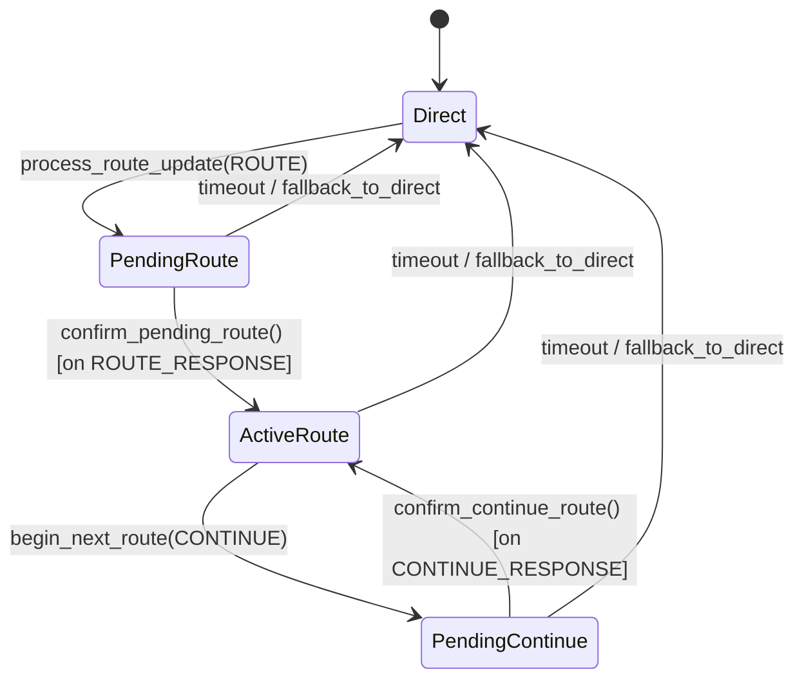
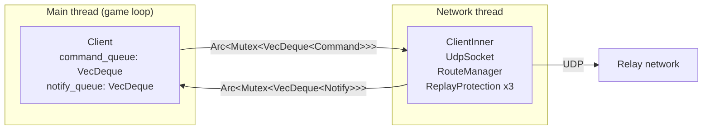
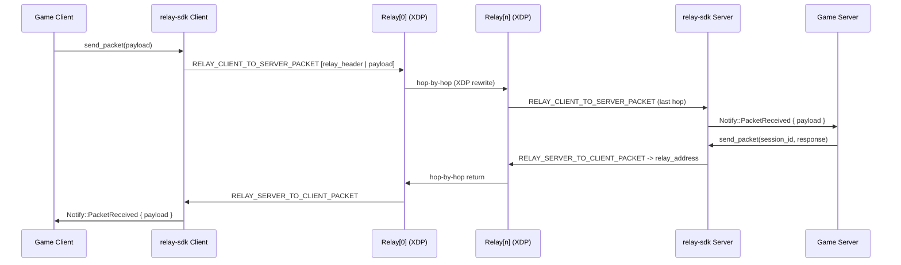

# Architecture: relay-sdk

Pure Rust SDK for game clients/servers connecting to the relay-xdp network.
Wire-compatible with `relay-xdp` (XDP relay node) and `relay-xdp-common` (shared types).

---

## Goals

| Goal | Detail |
|---|---|
| **Wire-compatible** | Packet bytes match 100% with relay-xdp eBPF + userspace |
| **Memory-safe** | No `unsafe` outside the final FFI export layer |
| **Pure Rust** | SHA-256 (sha2), XChaCha20-Poly1305 (chacha20poly1305) - no libsodium |
| **Cross-platform** | Linux / Windows / macOS, compiled via `cargo` |
| **C ABI export** | `mod ffi` exports `relay_client_t` / `relay_server_t` via `extern "C"` |

---

## Crate structure

```
relay-sdk/
+-- Cargo.toml          # crate name = "relay-sdk", crate-type = [cdylib, staticlib, rlib]
+-- build.rs            # runs cbindgen -> generates relay_generated.h
+-- cbindgen.toml       # cbindgen configuration
+-- include/
|   +-- relay_generated.h   # generated by cbindgen
+-- src/
|   +-- lib.rs          # re-exports all public modules
|   +-- address/        # Address enum - rewritten to use RELAY_ADDRESS_IPV4/V6
|   +-- bitpacker/      # BitWriter / BitReader - copied from rust-sdk
|   +-- stream/         # WriteStream / ReadStream + serialize macros - copied from rust-sdk
|   +-- read_write.rs   # WriteBuf / ReadBuf (byte-level helpers) - copied from rust-sdk
|   +-- crypto/         # SHA-256 + XChaCha20-Poly1305 - rewritten (subset of rust-sdk)
|   +-- tokens/         # RouteToken, ContinueToken encrypt/decrypt - rewritten
|   +-- packets/        # 14 packet types (ID 1-14) encode/decode - rewritten
|   +-- route/
|   |   +-- mod.rs      # RouteManager state machine - rewritten (pittle/chonkle copied)
|   |   +-- trackers.rs # ReplayProtection, PingHistory, BandwidthLimiter - copied from rust-sdk
|   +-- client/         # ClientInner + Client handle - new
|   +-- server/         # ServerInner + Server handle (final destination) - new
|   +-- platform/       # time() monotonic clock - copied from rust-sdk
|   +-- ffi/            # #[no_mangle] extern "C" exports - stub
+-- tests/
    +-- wire_compat.rs  # byte-for-byte comparison with relay-xdp/tests/wire_compat.rs
```

---

## Module origin map

| Module | Origin | Notes |
|---|---|---|
| `bitpacker` | Copied from `rust-sdk` | Unchanged - 7 tests passing |
| `stream` | Copied from `rust-sdk` | Unchanged - 7 tests passing |
| `read_write` | Copied from `rust-sdk` | Unchanged - 5 tests passing |
| `platform` | Copied from `rust-sdk` | Unchanged |
| `route/trackers` | Copied from `rust-sdk` | Unchanged - 8 tests passing |
| `address` | Rewritten | rust-sdk uses bitstream; relay-sdk uses byte LE + RELAY_ADDRESS_* |
| `crypto` | Rewritten (subset) | Only SHA-256 + XChaCha20-Poly1305; removed NaCl/BLAKE2/Ed25519/KX |
| `tokens` | Rewritten | Uses relay-xdp-common::RouteToken/ContinueToken; XChaCha20 encrypt |
| `packets` | Rewritten | 14 types (ID 1-14); encode/decode LE byte-level, no bitstream |
| `route/mod` | Rewritten (pittle/chonkle copied) | HeaderData layout matches relay-xdp-common; state machine logic preserved |
| `client` | New | RouteToken -> ROUTE_REQUEST -> forward payload hop-chain |
| `server` | New | Final destination - receives from last relay hop |
| `ffi` | New (stub) | C ABI exports + cbindgen |

---

## Inter-module dependency diagram

```
ffi
 +-> client -----------------------------------------------+
 +-> server -----------------------------------------------+
          +-> route (RouteManager) ----------------------- |
          |         +-> route/trackers                     |
          +-> tokens                                       |
          +-> packets -------------------------------------|
          +-> crypto                                       |
          +-> address <------------------------------------|
          +-> stream <- bitpacker
          +-> read_write
          +-> platform
```

Principle: lower-level modules do not import upward.
`bitpacker` and `platform` are leaves - they depend on no other module in the crate.

---

## Module descriptions

### `mod address`

```rust
pub enum Address {
    None,
    V4 { octets: [u8; 4], port: u16 },
    V6 { words: [u16; 8], port: u16 },
}
```

Serialized as byte-level LE: `address_type(u8)` + `ip(4 or 16 bytes, network order)` + `port(u16 LE)`.
Constants from `relay-xdp-common`: `RELAY_ADDRESS_NONE = 0`, `RELAY_ADDRESS_IPV4 = 1`, `RELAY_ADDRESS_IPV6 = 2`.
Implements: `encode(&mut Writer)`, `decode(&mut Reader)`, `Display`, `FromStr`, `From<SocketAddr>`.

---

### `mod crypto`

Two functions only:

| Function | Crate | Description |
|---|---|---|
| `hash_sha256(data) -> [u8; 32]` | `sha2::Sha256` | Used for HeaderData verification in write_header/read_header |
| `xchacha20poly1305_encrypt(msg, nonce, key) -> Vec<u8>` | `chacha20poly1305::XChaCha20Poly1305` | Token encryption (nonce 24B, key 32B, tag 16B appended) |
| `xchacha20poly1305_decrypt(ciphertext, nonce, key) -> Result<Vec<u8>>` | `chacha20poly1305::XChaCha20Poly1305` | Token decryption - matches kfunc `bpf_relay_xchacha20poly1305_decrypt` |

No KX keypair, no secretbox, no Ed25519.

---

### `mod tokens`

Uses structs from `relay-xdp-common` directly:

| Token | Plaintext size | Encrypted size | Encryption key |
|---|---|---|---|
| `RouteToken` | 71 bytes | 111 bytes (`RELAY_ENCRYPTED_ROUTE_TOKEN_BYTES`) | `relay_backend_public_key` |
| `ContinueToken` | 17 bytes | 57 bytes (`RELAY_ENCRYPTED_CONTINUE_TOKEN_BYTES`) | `session_private_key` |

Each token: `fn encrypt(token: &T, nonce: &[u8;24], key: &[u8;32]) -> [u8; ENCRYPTED_SIZE]`
and `fn decrypt(data: &[u8], nonce: &[u8;24], key: &[u8;32]) -> Result<T>`.

---

### `mod packets`

14 packet types from `relay-xdp-common`, encoded/decoded using `encoding::Writer`/`Reader` (little-endian).
No bitstream (`WriteStream`/`ReadStream`).

| ID | Constant | Struct |
|---|---|---|
| 1 | `RELAY_ROUTE_REQUEST_PACKET` | `RouteRequestPacket` |
| 2 | `RELAY_ROUTE_RESPONSE_PACKET` | `RouteResponsePacket` |
| 3 | `RELAY_CLIENT_TO_SERVER_PACKET` | `ClientToServerPacket` |
| 4 | `RELAY_SERVER_TO_CLIENT_PACKET` | `ServerToClientPacket` |
| 5 | `RELAY_SESSION_PING_PACKET` | `SessionPingPacket` |
| 6 | `RELAY_SESSION_PONG_PACKET` | `SessionPongPacket` |
| 7 | `RELAY_CONTINUE_REQUEST_PACKET` | `ContinueRequestPacket` |
| 8 | `RELAY_CONTINUE_RESPONSE_PACKET` | `ContinueResponsePacket` |
| 9 | `RELAY_CLIENT_PING_PACKET` | `ClientPingPacket` |
| 10 | `RELAY_CLIENT_PONG_PACKET` | `ClientPongPacket` |
| 11 | `RELAY_PING_PACKET` | `PingPacket` |
| 12 | `RELAY_PONG_PACKET` | `PongPacket` |
| 13 | `RELAY_SERVER_PING_PACKET` | `ServerPingPacket` |
| 14 | `RELAY_SERVER_PONG_PACKET` | `ServerPongPacket` |

Wire format: `[packet_id: u8][pittle: 2 bytes][chonkle: 15 bytes][body: LE bytes]`
Total header prefix = **18 bytes** (matches `RELAY_HEADER_BYTES = 25` minus 7 bytes for IP/UDP header portion).

---

### `mod route`

#### `mod route::trackers` (copied from rust-sdk)

| Struct | Purpose |
|---|---|
| `ReplayProtection` | Ring buffer of 1024 entries, detects replayed packets |
| `PacketLossTracker` | Ring buffer counting gaps in sequence numbers |
| `PingHistory` | 1024-entry ping/pong history, computes RTT / jitter / loss |
| `BandwidthLimiter` | EMA bits/sec, enforces bandwidth limits |

#### `mod route` (RouteManager)

**Mapping procedure before copying:**
1. Map `HeaderData` from `relay-xdp-common` into `write_header`/`read_header`:
   - `session_private_key [32]` + `packet_type u8` + `packet_sequence u64` + `session_id u64` + `session_version u8`
   - SHA-256(`HeaderData`) -> first 8 bytes = header HMAC
2. Copy `generate_pittle`, `generate_chonkle`, `fnv1a_64` unchanged from `rust-sdk/src/route/mod.rs`
3. Rewrite `write_header`/`read_header` using the layout above

**State machine (logic preserved from rust-sdk):**



| Function | Description |
|---|---|
| `update(type, tokens, key, magic)` | Dispatches on UPDATE_TYPE_ROUTE / UPDATE_TYPE_CONTINUE |
| `prepare_send_packet(seq, payload)` | Wraps payload -> RELAY_CLIENT_TO_SERVER_PACKET with relay header |
| `process_server_to_client_packet(data)` | Unwraps RELAY_SERVER_TO_CLIENT_PACKET -> original payload |
| `send_route_request(socket, addr)` | Sends RELAY_ROUTE_REQUEST_PACKET to relay[0] |
| `check_for_timeouts(time)` | Falls back to Direct on expiry |

---

### `mod client`

**Two-half design, 1 network thread:**



**Command** (main -> inner): `OpenSession { server_addr, client_secret_key }`, `CloseSession`, `RouteUpdate { update_type, tokens, magic, client_external_address }`, `Tick { delta_time }`, `SendPacket { payload }`, `Destroy`

**Notify** (inner -> main): `PacketReceived { payload, via_relay }`, `RouteChanged { has_relay_route, fallback_to_direct, flags }`, `SendRaw { to, data }`

**Packet send flow:**
- With route (ActiveRoute): `route_manager.prepare_send_packet()` -> UDP to relay[0]
- Direct fallback: `[RELAY_CLIENT_TO_SERVER_PACKET header | payload]` -> UDP to server_address

---

### `mod server`

**Server is the final destination** - receives payload forwarded from the last relay hop.
Not a relay node - no BPF session_map.

**ServerSession** - per-client state:

```rust
struct SessionInfo {
    session_id:          u64,
    session_version:     u8,
    session_private_key: [u8; 32],   // from RouteToken (pushed by backend HTTP)
    relay_address:       Address,    // last relay hop - send SERVER_TO_CLIENT here
    send_sequence:       u64,
    replay_protection:   ReplayProtection,
}
```

**Receive packet (ClientToServer):**
```
UDP datagram arrives at server port
  +-> read packet_type = RELAY_CLIENT_TO_SERVER_PACKET
  +-> iterate sessions to find matching private key
  +-> read_header() + SHA-256 verify with session_private_key
  +-> ReplayProtection check + advance_sequence()
  +-> payload -> push Notify::PacketReceived
```

**Send packet back (ServerToClient):**
```
Server::send_packet(session_id, payload)
  +-> lookup session -> get relay_address
  +-> write_header() with RELAY_SERVER_TO_CLIENT_PACKET
  +-> stamp_packet() fills pittle + chonkle
  +-> push Notify::SendRaw { to: relay_address, data }
```

**Session provisioning:**
- `session_private_key` comes from `RouteToken` pushed to the game server by `relay-backend` via HTTP
- Game server calls `server.register_session(session_id, session_version, session_private_key, relay_address)`
- Sessions are expired explicitly via `server.expire_session(session_id)`

---

### `mod ffi`

C ABI exports, `cbindgen` generates `include/relay_generated.h`:

```c
// Client
relay_client_t* relay_client_create(const char* bind_address);
void            relay_client_destroy(relay_client_t*);
void            relay_client_open_session(relay_client_t*, const char* server_address,
                                          const uint8_t* client_secret_key);
void            relay_client_close_session(relay_client_t*);
void            relay_client_send_packet(relay_client_t*, const uint8_t* data, int bytes);
int             relay_client_recv_packet(relay_client_t*, uint8_t* out, int max_bytes);

// Server
relay_server_t* relay_server_create(const char* bind_address);
void            relay_server_destroy(relay_server_t*);
void            relay_server_register_session(relay_server_t*, uint64_t session_id,
                                              uint8_t session_version,
                                              const uint8_t* session_private_key,
                                              const char* relay_address);
void            relay_server_expire_session(relay_server_t*, uint64_t session_id);
void            relay_server_send_packet(relay_server_t*, uint64_t session_id,
                                         const uint8_t* data, int bytes);
int             relay_server_recv_packet(relay_server_t*, uint64_t* out_session_id,
                                         uint8_t* out, int max_bytes);
```

Every entry point: `catch_unwind` prevents Rust panics from crossing the FFI boundary.

---

## End-to-end data flow



---

## Dependency map (crate-level)

```
relay-sdk
+-- relay-xdp-common   # shared types: RouteToken, ContinueToken, HeaderData, packet IDs
+-- chacha20poly1305   0.10   # XChaCha20-Poly1305 AEAD
+-- sha2               0.10   # SHA-256 for header verification
+-- rand               0.8    # random nonce generation
+-- zeroize            1      # zero secret keys on drop
+-- thiserror          1      # error derive
+-- anyhow             1      # Result in userspace paths
```

Build deps: `cbindgen 0.27`.
Dev deps: `hex-literal 0.4` (golden vector tests).

---

## Wire compatibility testing

`tests/wire_compat.rs` is written in parallel with the implementation.
Each packet type needs one test case comparing byte-for-byte output of `relay-sdk::packets::encode()`
against golden bytes taken from `relay-xdp/tests/wire_compat.rs`.

Run: `cargo test -p relay-sdk` after each module implementation.

---

## Status

| Module | Origin | Status | Tests |
|---|---|---|---|
| `bitpacker` | Copied | Done | 7 |
| `stream` | Copied | Done | 7 |
| `read_write` | Copied | Done | 5 |
| `platform` | Copied | Done | - |
| `route/trackers` | Copied | Done | 8 |
| `address` | Rewritten | Done | 7 |
| `crypto` | Rewritten | Done | 6 |
| `tokens` | Rewritten | Done | 6 |
| `packets` | Rewritten | Done | 16 |
| `route/mod` | Rewritten | Done | 13 |
| `client` | New | Done | 8 |
| `server` | New | Done | 9 |
| `ffi` | New | Stub | - |
